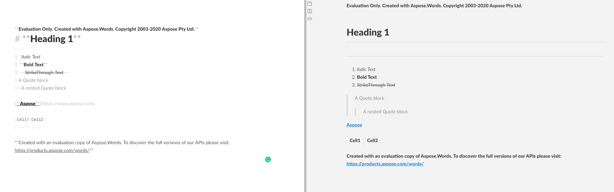

---
title: Convert a Document to Markdown in C++
articleTitle: Convert a Document to Markdown
linktitle: Convert a Document to Markdown
type: docs
description: "Aspose.Words for C++ provides the ability to convert a document in any supported load format to Markdown and vice versa – Aspose.Words also supports the most popular save formats. Markdown is easy to work with and can be converted to other formats quite simply."
keywords: how to convert a document to markdown c++, Convert doc to MD C++, convert DOCX to Markdown C++
weight: 40
url: /cpp/convert-a-document-to-markdown/
---

Markdown is a popular format used to markup text and its further converting to HTML, PDF, DOCX, or other formats. Many developers choose this format for writing documentation, preparing articles for publication on blogs, describing projects, and so on.

Markdown is so popular because it is easy to work with this format, as well as it can be quite simply converted to other formats. For this reason, Aspose.Words provides the ability to convert a document in [any supported load format](https://apireference.aspose.com/words/cpp/namespace/aspose.words#loadformat) to Markdown and vice versa – Aspose.Words also supports the most popular [save formats](https://apireference.aspose.com/words/cpp/namespace/aspose.words#saveformat).

Now the functionality for working with the Markdown format is being actively developed to provide you with more opportunities for convenient and comfortable work with documents.

## Convert a Document

To convert a document to Markdown, you just need to load a document in any supported format or create a new one programmatically. Then you need to save the document to Markdown format.

The following code example shows how to convert DOCX to Markdown:



You can also specify the physical folder in which you want to save images when exporting a document to Markdown format. By default, Aspose.Words saves images in the same folder where the document file is saved, but you can override this behavior using the [ImagesFolder](https://apireference.aspose.com/words/cpp/class/aspose.words.saving.markdown_save_options#get_imagesfolder_const) property.

Specifying a folder via **ImagesFolder** is also useful if you save a document to a stream and Aspose.Words does not have a folder for saving images.

If the specified **ImagesFolder** does not exist, it will be created automatically.

The following code example shows how to specify a folder for images when saving a document to a stream:



## Specify Save Options when Converting to Markdown

Aspose.Words provides the ability to use the [MarkdownSaveOptions](https://apireference.aspose.com/words/cpp/class/aspose.words.saving.markdown_save_options) class to work with advanced options when saving a document to Markdown format. Most properties are inheriting or overloading properties that already exist within other [Aspose.Words.Saving](https://apireference.aspose.com/words/cpp/namespace/aspose.words.saving) Namespace classes. In addition to them, a number of properties that are specific for Markdown format have also been added. For example, the [TableContentAlignment](https://apireference.aspose.com/words/cpp/class/aspose.words.saving.markdown_save_options#get_tablecontentalignment_const) property to control the alignment of content in tables, or [ImageSavingCallback](https://apireference.aspose.com/words/cpp/class/aspose.words.saving.i_image_saving_callback) and [ImagesFolder](https://apireference.aspose.com/words/cpp/class/aspose.words.saving.markdown_save_options#get_imagesfolder_const) to control how images are saved upon converting a document to Markdown format.

## Supported Markdown Features

Aspose.Words currently supports the following Markdown features, which mostly follow the CommonMark specification in the Aspose.Words API and are represented as appropriate styles or direct formatting:

* Headings are paragraphs with Heading 1 – Heading 6 styles
* Blockquotes are paragraphs with “Quote” in the style name
* IndentedCode are paragraphs with "IndentedCode" in the style name
* FencedCode are paragraphs with "FencedCode" in the style name
* InlineCode are runs with "InlineCode" in the Font style name
* Horizontal rules are paragraphs with the HorizontalRule shape
* Bold emphasis
* Italic emphasis
* StrikeThrough formatting
* Lists are numbered or bulleted paragraphs
* Tables are represented with the Table class
* Links are represented as the FieldHyperlink class

The following example shows how to create a document with some styles and save it to Markdown:



The result of this code example is shown below.

## Useful Tips

There are several nuances and interesting cases, having learned which you can work with Markdown files more flexibly and conveniently. For example, there is the ability to use:

* SetextHeading that allows you to create multi-line headings in Markdown, while regular headings in Markdown can only be single-line. SetextHeading is based on a "Heading N" style, and its level can only be 1 or 2. If N in "Heading N" is greater than or equal to 2, then the corresponding SetextHeading is based on "Heading 2", otherwise on "Heading 1".
* Different markers for the first level of bulleted lists ("-", "+" or "*", the default marker is “-”.) and different types of numbering for ordered lists ("." or ")", the default marker is ".").
