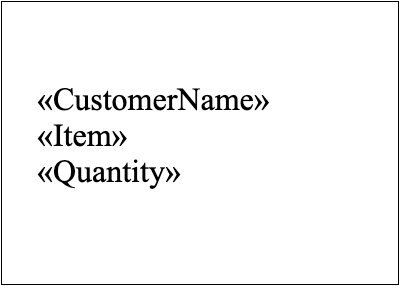
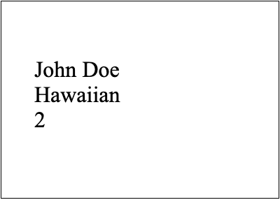
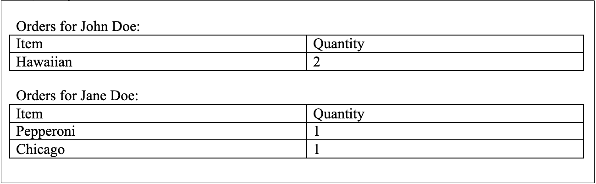

---
title: Types of Mail Merge Operation in C++
articleTitle: Types of Mail Merge Operation
linktitle: Types of Mail Merge Operation
type: docs
aliases:
 - /cpp/how-to-execute-mail-merge/
description: "Aspose.Words for C++ enables you to perform two different types of mail merge operations: simple mail merge and mail merge with regions. Simple mail merge repeats the entire document per each data source record, whereas mail merge with regions repeats only designated regions per record."
keywords: "how to execute mail merge c++"
weight: 20
url: /cpp/types-of-mail-merge-operations/
---

The main idea of mail merge is to automatically create a document or several documents based on your template and data fetched from your data source. Aspose.Words enables you to perform two different types of mail merge operations: simple mail merge and mail merge with regions.

The most common example of using simple mail merge is when you want to send a document for different clients by including their names at the beginning of the document. To do this, you need to create merge fields such as *First Name* and *Last Name* in your template, and then fill them in with data from your data source. Whereas the most common example of using mail merge with regions is when you want to send a document that includes specific orders with the list of all items within each order. To do this, you will need to create merge regions inside your template – own region for each order, in order to fill it with all required data for the items.

The main difference between both merge operations is that simple mail merge (without regions) repeats the entire document per each data source record, whereas mail merge with regions repeats only designated regions per record. You can think of a simple mail merge operation as a particular case of merge with regions where the only region is the whole document.

{}

The [MailMerge](https://apireference.aspose.com/words/cpp/class/aspose.words.mail_merging.mail_merge) class represents a mail merge functionality. With its properties, you can customize the required behavior before executing a mail merge operation.

{}

## Simple Mail Merge Operation

A simple mail merge is used to fill the mail merge fields inside your template with the required data from your data source (single table representation). So it is similar to the classic mail merge in Microsoft Word.

You can add one or more merge fields in your template and then execute the simple mail merge operation. It is recommended to use it if your template does not contain any merge regions.

The main limitation of using this type is the whole document content will be repeated for each record in the data source.

### How to Execute a Simple Mail Merge Operation

Once your template is ready, you can start performing the simple mail merge operation. Aspose.Words allows you to execute a simple mail merge operation using different [Execute](https://apireference.aspose.com/words/cpp/class/aspose.words.mail_merging.mail_merge#execute_stringarray_objectarray) methods that accept various data objects as the data source.

The following code example shows how to execute a simple mail merge operation using one of the [Execute](https://apireference.aspose.com/words/cpp/class/aspose.words.mail_merging.mail_merge#execute_stringarray_objectarray) method:


// For complete examples and data files, please go to https://github.com/aspose-words/Aspose.Words-for-C
// Include the code for our template.
auto doc = MakeObject<Document>();
auto builder = MakeObject<DocumentBuilder>(doc);

// Create Merge Fields.
builder->InsertField(u" MERGEFIELD CustomerName ");
builder->InsertParagraph();
builder->InsertField(u" MERGEFIELD Item ");
builder->InsertParagraph();
builder->InsertField(u" MERGEFIELD Quantity ");

auto boxHelper =  { return ObjectExt::Box<String>(value);};

// Fill the fields in the document with user data.
doc->get_MailMerge()->Execute(
    MakeArray<String>({u"CustomerName", u"Item", u"Quantity"}),
    MakeArray<SharedPtr<Object>>(
        {boxHelper(u"John Doe"), boxHelper(u"Hawaiian"), boxHelper(u"2")}));

doc->Save(u"MailMerge.Simple.docx");


You can notice the difference between the document before executing simple mail merge:

And after executing simple mail merge:

### How to Create Multiple Merged Documents

In Aspose.Words, the standard mail merge operation fills only a single document with content from your data source. So, you will need to execute the mail merge operation many times to create a few merged documents as an output.

The following code example shows how to generate a few merged documents during a mail merge operation with [SQLiteCpp](https://github.com/SRombauts/SQLiteCpp):


class CustomersRowMailMergeDataSource : public MailMerging::IMailMergeDataSource
{
public:
    CustomersRowMailMergeDataSource(SQLite::Statement& query) : mQuery(query) {}

	  String get_TableName() override
	{
	    return u"customers";
	}
	
	bool GetValue(String fieldName, SharedPtr<Object>& fieldValue) override
	{
	    auto boxHelper =  { return ObjectExt::Box<String>(String::FromUtf8(value)); };
	
	    if (fieldName == u"CustomerName")
	    {
	        fieldValue = boxHelper(mQuery.getColumn(0).getString());
	        return true;
	    }
	
	    if (fieldName == u"Item")
	    {
	        fieldValue = boxHelper(mQuery.getColumn(1).getString());
	        return true;
	    }
	
	    if (fieldName == u"Quantity")
	    {
	        fieldValue = ObjectExt::Box<int32_t>(mQuery.getColumn(2).getInt());
	        return true;
	    }
	
	    fieldValue.reset();
	    return false;
	}
	
	bool MoveNext() override
	{
	    if (!isInitialized)
	    {
	        isInitialized = true;
	        return true;
	    }
	    return false;
	}
	
	SharedPtr<IMailMergeDataSource> GetChildDataSource(String tableName) override
	{
	    return nullptr;
	}
	
	void Reset()
	{
	    isInitialized = false;
	}

private:
    SQLite::Statement& mQuery;
    bool isInitialized = false;
};

void MultipleDocumentsMailMerge()
{
    // Include the code for our template.
    auto doc = MakeObject<Document>();
    auto builder = MakeObject<DocumentBuilder>(doc);

    // Create Merge Fields.
    builder->InsertField(u" MERGEFIELD CustomerName ");
    builder->InsertParagraph();
    builder->InsertField(u" MERGEFIELD Item ");
    builder->InsertParagraph();
    builder->InsertField(u" MERGEFIELD Quantity ");
    
    // Fill the fields in the document with user data.
    SQLite::Database db{"customers.db3"};
    SQLite::Statement query{db, "SELECT * FROM customers"};
    auto dataSource = MakeObject<CustomersRowMailMergeDataSource>(query);
    
    int32_t counter = 1;
    while (query.executeStep())
    {
          auto dstDoc = doc->Clone();
        dataSource->Reset();
        dstDoc->get_MailMerge()->Execute(dataSource);
        dstDoc->Save(String{u"TestFile_out"} + Convert::ToString(counter++) + u".docx");
    }
}


## Mail Merge with Regions

You can create different regions in your template to have special areas that you can simply fill with your data. Use the mail merge with regions if you want to insert tables, rows with repeating data to make your documents dynamically grow by specifying those regions within your template.

You can create nested (child) regions as well as merge regions. The main advantage of using this type is to dynamically increase parts inside a document. See more details in the next article "Nested Mail Merge with Regions".

{}

Information about a mail merge region can be obtained using the [MailMergeRegionInfo](https://apireference.aspose.com/words/cpp/class/aspose.words.mail_merging.mail_merge_region_info) class.

{}

### How to Execute Mail Merge with Regions

A mail merge region is a specific part inside a document that has a start point and an end point. Both points are represented as mail merge fields that have specific names *"TableStart:XXX"* and *"TableEnd:XXX"*. All content that is included in a mail merge region will automatically be repeated for every record in the data source.

Aspose.Words allows you to execute mail merge with regions using one of the [ExecuteWithRegions](https://apireference.aspose.com/words/cpp/class/aspose.words.mail_merging.mail_merge#executewithregions_imailmergedatasource) methods that accept [IMailMergeDataSource](https://apireference.aspose.com/words/cpp/class/aspose.words.mail_merging.i_mail_merge_data_source) custom data source.

The following code example shows how to execute mail merge with regions from sqlite database with [SQLiteCpp](https://github.com/SRombauts/SQLiteCpp):


class OrdersDataSourceSQLite : public MailMerging::IMailMergeDataSource
{
public:
    OrdersDataSourceSQLite(SQLite::Database& database, int32_t customerID)
        : mDatabase(database)
        , mQuery(mDatabase, "SELECT ItemName, Quantity FROM Orders WHERE CustomerID = ?")
    {
	    mQuery.bind(1, customerID);
    }

    String get_TableName() override
    {
        return u"Orders";
    }
    
    bool GetValue(String fieldName, SharedPtr<Object>& fieldValue) override
    {
    
        if (fieldName == u"ItemName")
        {
            fieldValue = ObjectExt::Box<String>(String::FromUtf8(mQuery.getColumn(0).getString()));
            return true;
        }
    
        if (fieldName == u"Quantity")
        {
            fieldValue = ObjectExt::Box<int32_t>(mQuery.getColumn(1).getInt());
            return true;
        }
    
        fieldValue.reset();
        return false;
    }
    
    bool MoveNext() override
    {
    	return mQuery.executeStep();
    }
    
    SharedPtr<IMailMergeDataSource> GetChildDataSource(String tableName) override
    {
        return nullptr;
    }

private:
    SQLite::Database& mDatabase;
    SQLite::Statement mQuery;
};

class CustomersDataSourceSQLite : public MailMerging::IMailMergeDataSource
{
public:
    CustomersDataSourceSQLite(SQLite::Database& database)
        : mDatabase{database}
		, mQuery{mDatabase, "SELECT CustomerID, CustomerName FROM Customers"}
    {
    }

    String get_TableName() override
    {
        return u"Customers";
    }
    
    bool GetValue(String fieldName, SharedPtr<Object>& fieldValue) override
    {
        if (fieldName == u"CustomerName")
        {
            fieldValue = ObjectExt::Box<String>(String::FromUtf8(mQuery.getColumn(1).getString()));
            return true;
        }
    
        fieldValue.reset();
        return false;
    }
    
    bool MoveNext() override
    {
        return mQuery.executeStep();
    }
    
    SharedPtr<IMailMergeDataSource> GetChildDataSource(String tableName) override
    {
        if (tableName == u"Orders")
        {
    	    return MakeObject<OrdersDataSourceSQLite>(mDatabase, mQuery.getColumn(0).getInt());
        }
        return nullptr;
    }
private:
    SQLite::Database& mDatabase;
    SQLite::Statement mQuery;
};

void MailMergeWithRegionsSQLite()
{
    auto doc = MakeObject<Document>();
    auto builder = MakeObject<DocumentBuilder>(doc);

    // The start point of mail merge with regions the dataset.
    builder->InsertField(u" MERGEFIELD TableStart:Customers");
    // Data from rows of the "CustomerName" column of the "Customers" table will go in this MERGEFIELD.
    builder->Write(u"Orders for ");
    builder->InsertField(u" MERGEFIELD CustomerName");
    builder->Write(u":");
    
    // Create column headers
    builder->StartTable();
    builder->InsertCell();
    builder->Write(u"Item");
    builder->InsertCell();
    builder->Write(u"Quantity");
    builder->EndRow();
    
    // We have a second data table called "Orders", which has a many-to-one relationship with "Customers"
    // picking up rows with the same CustomerID value.
    builder->InsertCell();
    builder->InsertField(u" MERGEFIELD TableStart:Orders");
    builder->InsertField(u" MERGEFIELD ItemName");
    builder->InsertCell();
    builder->InsertField(u" MERGEFIELD Quantity");
    builder->InsertField(u" MERGEFIELD TableEnd:Orders");
    builder->EndTable();
    
    // The end point of mail merge with regions.
    builder->InsertField(u" MERGEFIELD TableEnd:Customers");
    
    // Pass our dataset to perform mail merge with regions.
    SQLite::Database database{"customers.db3"};
    auto dataSource = System::MakeObject<CustomersDataSourceSQLite>(database);
    doc->get_MailMerge()->ExecuteWithRegions(dataSource);
    
    // Save the result
    doc->Save(u"MailMerge.ExecuteWithRegions.docx");
}


You can notice the difference between the document before executing mail merge with regions:

And after executing mail merge with regions:

### Limitations of Mail Merge with Regions

There are some important points that you need to consider when performing a mail merge with regions:

* The start point *TableStart:Orders* and the end point *TableEnd:Orders* both need to be in the same row or cell. For example, if you start a merge region in a cell of a table, you must end the merge region in the same row as the first cell.
  The merge field name must match the column name in your DataTable. Unless you specify mapped fields, mail merge with regions will not succeed for any merge field that has a name other than the column name.
* Aspose.Words for C++ only supports [IMailMergeDataSource](https://apireference.aspose.com/words/cpp/class/aspose.words.mail_merging.i_mail_merge_data_source) and [IMailMergeDataSourceRoot](https://apireference.aspose.com/words/cpp/class/aspose.words.mail_merging.i_mail_merge_data_source_root) based data sources. Unlike .NET and Java, C++ does not have a generally accepted cross-platform API for working with databases (like ADODB, ODBC, or JDBC). In order to work with a specific data source, you have to implement [IMailMergeDataSource](https://apireference.aspose.com/words/cpp/class/aspose.words.mail_merging.i_mail_merge_data_source) or [IMailMergeDataSourceRoot](https://apireference.aspose.com/words/cpp/class/aspose.words.mail_merging.i_mail_merge_data_source_root) interface.

If one of these rules is broken, you will get unexpected results or an exception may be thrown.

{}

If you do not use mail merge regions, then it will be similar to Microsoft Word mail merge, and the whole document content will be repeated for each record in the data source.

{}

