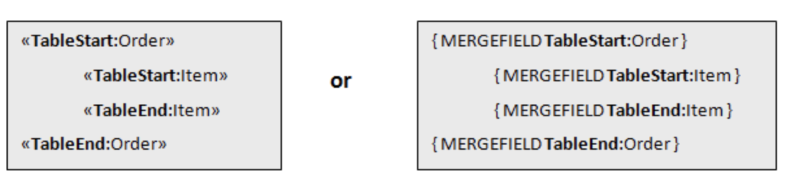

---
title: Nested Mail Merge with Regions in C++
second_title: Aspose.Words for C++
articleTitle: Nested Mail Merge with Regions
linktitle: Nested Mail Merge with Regions
type: docs
description: "Perform a mail merge operation with nested regions using C++. Nested merge is a feature that enables you to merge hierarchical data from your data source into your merge template."
keywords: "mail merge with nested regions c++"
weight: 10
url: /cpp/nested-mail-merge-with-regions/
---

In some scenarios, you may need to use nested mail merge with regions. Nested merge is a feature that allows you to merge hierarchical data from your data source into your merge template to easily populate your document. Basically, the hierarchical data is represented as a set of data items, and hierarchical relationships describe how the data items are related to each other (one item of data is the parent of another one).

Aspose.Words enables you to perform a mail merge operation with nested regions. You can use this feature if you have a data source that is organized into a tree-like structure and you want to execute a mail merge operation to populate a template with hierarchical data.

{}

Nested mail merge is relevant only when performing a mail merge with regions.

{}

## What is a Nested Mail Merge

The mail merge region is called nested if you have two or more mail merge regions where one of them is inside the other in a hierarchical form. Note that each region contains data from one table.

The most common example of a nested mail merge is an order that contains a few items where you need to link many data tables and present the information in a template.

The picture below shows two nested regions where the *Order* mail merge region is the parent of the *Item* mail merge region.

## How to Process Mail Merge with Nested Regions

The data to be merged into a template can come from various sources, mainly relational databases or XML documents. In our example, we are going to use an [SQLite](https://www.sqlite.org/index.html) database to store our data and load it with custom data source implementation.

The image below demonstrates how the data from the *Order* table passed to the nested merge regions will be linked to the *Item* table, as well as the output generated during the merge operation.

As you can see from the output document, each order from the **Order** table is inserted into the merge template with all order’s related items from the **Item** table. The next order will be inserted along with their items until all the orders and items are listed. The order of nesting mail merge with regions in the template must match the data relationships between the tables in the data source.

## How to Create Data Relations from a Custom Data Source

Implement the [IMailMergeDataSource](https://reference.aspose.com/words/cpp/aspose.words.mailmerging/imailmergedatasource/) interface to create relationships in the parent-child structure of your custom data source. Use the [GetChildDataSource](https://reference.aspose.com/words/cpp/aspose.words.mailmerging/imailmergedatasource/getchilddatasource/) method to return the relevant child data of a current parent record.

The following code example demonstrates how to generate an invoice using nested mail merge with regions from [SQLite](https://www.sqlite.org/index.html) database with [SQLiteCpp](https://github.com/SRombauts/SQLiteCpp):


namespace NestedMailMerge
{
class OrdersDataSource : public MailMerging::IMailMergeDataSource
{
public:
    OrdersDataSource(SQLite::Database& database, int32_t id)
	    : mQuery(database, "SELECT Name, Quantity FROM Order WHERE ID = ?")
    {
	    mQuery.bind(1, id);
    }

    String get_TableName() override
    {
        return u"Order";
    }
    
    bool GetValue(String fieldName, SharedPtr<Object>& fieldValue) override
    {
    
        if (fieldName == u"Name")
        {
            fieldValue = ObjectExt::Box<String>(String::FromUtf8(mQuery.getColumn(0).getString()));
            return true;
        }
    
        if (fieldName == u"Quantity")
        {
            fieldValue = ObjectExt::Box<int32_t>(mQuery.getColumn(1).getInt());
            return true;
        }
    
        fieldValue.reset();
        return false;
    }
    
    bool MoveNext() override
    {
    	return mQuery.executeStep();
    }
    
    SharedPtr<IMailMergeDataSource> GetChildDataSource(String tableName) override
    {
        return nullptr;
    }

private:
    SQLite::Statement mQuery;
};

class CustomersDataSource : public MailMerging::IMailMergeDataSource
{
public:
    CustomersDataSource(SQLite::Database& database)
        : mDatabase{database}
		, mQuery{mDatabase, "SELECT ID, FullName, Address FROM Customer"}
    {
    }

    String get_TableName() override
    {
        return u"Customer";
    }
    
    bool GetValue(String fieldName, SharedPtr<Object>& fieldValue) override
    {
        if (fieldName == u"FullName")
        {
            fieldValue = ObjectExt::Box<String>(String::FromUtf8(mQuery.getColumn(1).getString()));
            return true;
        }
    
        if (fieldName == u"Address")
        {
            fieldValue = ObjectExt::Box<String>(String::FromUtf8(mQuery.getColumn(2).getString()));
            return true;
        }
    
        fieldValue.reset();
        return false;
    }
    
    bool MoveNext() override
    {
        return mQuery.executeStep();
    }
    
    SharedPtr<IMailMergeDataSource> GetChildDataSource(String tableName) override
    {
        if (tableName == u"Order")
        {
    	    return MakeObject<OrdersDataSource>(mDatabase, mQuery.getColumn(0).getInt());
        }
        return nullptr;
    }
private:
    SQLite::Database& mDatabase;
    SQLite::Statement mQuery;
};
}

void CustomMailMerge()
{
    auto doc = MakeObject<Document>();
    auto builder = MakeObject<DocumentBuilder>(doc);
    builder->InsertField(u" MERGEFIELD TableStart:Customer");

    builder->Write(u"Full name:\t");
    builder->InsertField(u" MERGEFIELD FullName ");
    builder->Write(u"\nAddress:\t");
    builder->InsertField(u" MERGEFIELD Address ");
    builder->Write(u"\nOrders:\n");
    
    builder->InsertField(u" MERGEFIELD TableStart:Order");
    
    builder->Write(u"\tItem name:\t");
    builder->InsertField(u" MERGEFIELD Name ");
    builder->Write(u"\n\tQuantity:\t");
    builder->InsertField(u" MERGEFIELD Quantity ");
    builder->InsertParagraph();
    
    builder->InsertField(u" MERGEFIELD TableEnd:Order");
    
    builder->InsertField(u" MERGEFIELD TableEnd:Customer");
    
    SQLite::Database database{"customers.db3"};
    // To be able to mail merge from your data source,
    // it must be wrapped into an object that implements the IMailMergeDataSource interface.
    auto customersDataSource = MakeObject<NestedMailMerge::CustomersDataSource>(database);
    
    doc->get_MailMerge()->ExecuteWithRegions(customersDataSource);
    
    doc->Save(u"NestedMailMergeCustom.CustomMailMerge.docx");
}
