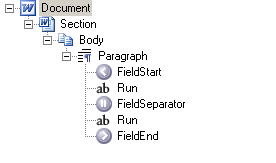

Replacing fields is often required when you wish to save your document as a static copy. For example, when sending as an attachment in an e-mail. Converting fields such as DATE or TIME to static text will allow the document to display the same date as when it was sent. Also, in some situations, you may need to remove the conditional IF fields from your document and replace them with the most recent text result instead. For example, converting the result of the IF field to static text so it will no longer dynamically change its value when fields in the document are updated.

The diagram below shows how the IF field is stored in a document:

* the text is surrounded by the special field nodes – [FieldStart](https://reference.aspose.com/words/cpp/aspose.words.fields/field/get_fieldstart/) and [FieldEnd](https://reference.aspose.com/words/cpp/aspose.words.fields/field/get_fieldend/)
* the [FieldSeparator](https://reference.aspose.com/words/cpp/aspose.words.fields/field/get_separator/) node separates the text within the field into the field code and field result
* the field code defines the general behavior of the field, while the field result retains the most recent result when this field is updated using Microsoft Word or Aspose.Words
* the field result is what is stored in the field and displayed in the document when viewed

The structure can also be seen below in hierarchical form using the demo project *“DocumentExplorer”*.

## Fields That Cannot be Replaced by Text

Replacing a field with static text does not work properly for some fields in a header or footer.

For example, trying to convert the PAGE field in a header or footer to static text will result in the same value being displayed on all pages. This is because headers and footers are repeated across multiple pages, and when they remain as fields, they are handled especially so they display the correct result for each page.

However, in the header, the PAGE field translates well to static run of text. This run of text will be evaluated as if it were the last page in the section, which will cause any PAGE field in the header to display the last page over all pages.

The following code example shows how to replace the field with its most recent result:



## Convert Certain Field Types in Specific Document Parts

Since the **ConvertFieldsToStaticText** method accepts two parameters – the [CompositeNode](https://reference.aspose.com/words/cpp/aspose.words/compositenode/) ptoperties and the [FieldType](https://reference.aspose.com/words/cpp/aspose.words.fields/fieldtype/) enumeration, it is possible to pass any composite node to this method. This allows fields to be converted to static text only in specific parts of the document.

For example, you can pass a [Document](https://reference.aspose.com/words/cpp/aspose.words/document/) object and convert fields of the specified type from the entire document to static text, or you can pass a [Body](https://reference.aspose.com/words/cpp/aspose.words/body/) object of a section and only convert the fields found in that body.

{}

When passing a block-level node such as a [Paragraph](https://reference.aspose.com/words/cpp/aspose.words/paragraph/), be aware that in some cases, fields can span across multiple paragraphs. If this happens it is recommended to pass the parent of the composite instead to avoid this.

{}

The [FieldType](https://reference.aspose.com/words/cpp/aspose.words.fields/fieldtype/) enumeration passed to the **ConvertFieldsToStaticText** method specifies what type of fields should be convert to static text. Any other field type found in the document will remain unchanged.

The following code example shows how to select fields of a specific type – *targetFieldType* in a specific node – *compositeNode* and then convert them to static text:



The following code example shows how to convert all IF fields in a document to static text:



The following code  example shows how to convert all PAGE fields in a Body of a document to static text:



The following code  example shows how to convert all IF fields in the last paragraph to static text:

