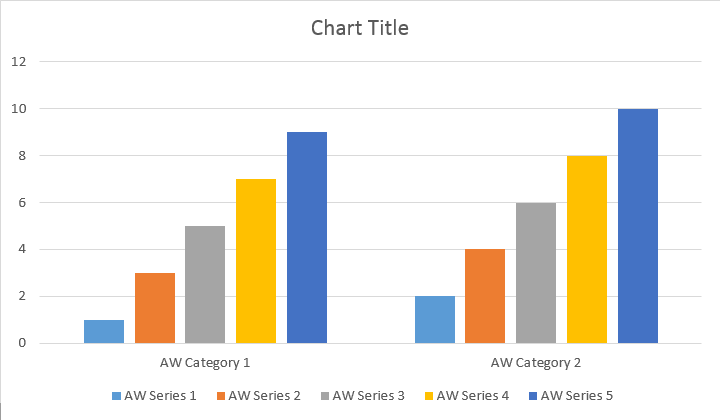

## Creating OOXML Charts from Scratch using Aspose.Words

Aspose.Words provides the InsertChart method which was added into the DocumentBuilder class. So, let's see how to insert a simple column chart into the document using DocumentBuilder->InsertChart method:

### How to Insert Column chart

The code example given below shows how to insert a column chart.



The code produces the following result:

There are four different overloads for series Add method, which was exposed to cover all possible variants of data sources for all chart types:



The code produces the following result:

### How to InsertScatterChart

The code example given below shows how to insert a scatter chart.



The code produces the following result:

### How to Insert Area Chart

The code example given below shows how to insert an area chart.



The code produces the following result:

### How to Insert Bubble Chart

The code example given below shows how to insert a bubble chart.



The code produces the following result:

