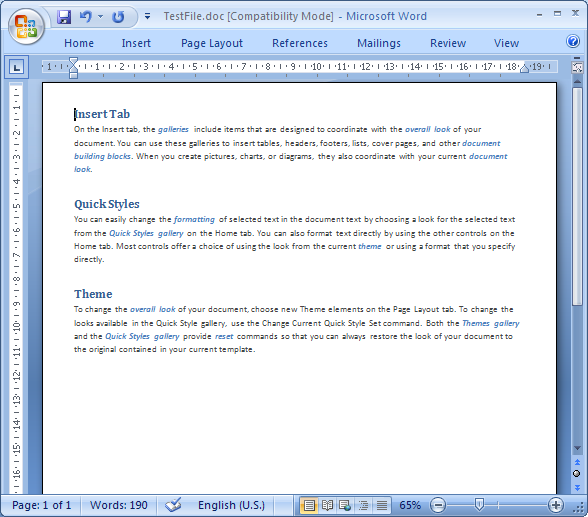
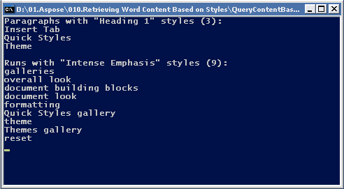

The [StyleCollection](https://reference.aspose.com/words/cpp/class/aspose.words.style_collection) class is used to manage built-in and apply user-defined settings to styles.

## How to Extract Content Based on Styles

At a simple level, retrieving the content based on styles from a Word document can be useful to identify, list and count paragraphs and runs of text formatted with a specific style. For example, you may need to identify particular kinds of content in the document, such as examples, titles, references, keywords, figure names, and case studies.

To take this a few steps further, this can also be used to leverage the structure of the document, defined by the styles it uses, to re-purpose the document for another output, such as HTML. This is in fact how the Aspose documentation is built, putting Aspose.Words to the test. A tool built using Aspose.Words takes the source Word documents and splits them into topics at certain heading levels. An XML file is produced using Aspose.Words which is used to build the navigation tree you can see on the left. And then Aspose.Words converts each topic into HTML.

The solution for retrieving text formatted with specific styles in a Word document is typically economical and straightforward using Aspose.Words.

### The Solution

To illustrate how easily Aspose.Words handles retrieving content based on styles, let’s look at an example. In this example, we’re going to retrieve text formatted with a specific paragraph style and a character style from a sample Word document. At a high level, this will involve:
- Opening a Word document using the `Document` class.
- Getting collections of all paragraphs and all runs in the document.
- Selecting only the required paragraphs and runs. Specifically, we’ll retrieve text formatted with the ‘Heading 1’ paragraph style and the ‘Intense Emphasis’ character style from this sample Word document.

In this sample document, the text formatted with the ‘Heading 1’ paragraph style is ‘Insert Tab’, ‘Quick Styles’ and ‘Theme’, and the text formatted with the ‘Intense emphasis’ character style is the several instances of blue, italicized, bold text such as ‘galleries’ and ‘overall look’.

### The Code

The implementation of a style-based query is quite simple in the Aspose.Words document object model, as it simply uses tools that are already in place. Two class methods are implemented for this solution:# **ParagraphsByStyleName** – This method retrieves an array of those paragraphs in the document that have a specific style name.# **RunsByStyleName** – This method retrieves an array of those runs in the document that have a specific style name. Both these methods are very similar, the only differences being the node types and the representation of the style information within the paragraph and run nodes. Here is an implementation of ParagraphsByStyleName. Below example find all paragraphs formatted with the specified style.



{}

This implementation also uses the `Document.GetChildNodes` method of the `Document` class, which returns a collection of all nodes with the specified type, which in this case in all paragraphs.

Note that the second parameter of the **Document.GetChildNodes** method is set to true. This forces the **Document.GetChildNodes** method to select from all child nodes recursively, rather than selecting the immediate children only.

{}

It’s also worth pointing out that the paragraphs collection does not create an immediate overhead because paragraphs are loaded into this collection only when you access items in them. Then, all you need to do is to go through the collection, using the standard for each operator and add paragraphs that have the specified style to the paragraphsWithStyle array. The Paragraph style name can be found in the Style. Name property of the `Paragraph.ParagraphFormat` object. The implementation of RunsByStyleName is almost the same, although we’re obviously using `NodeType.Run` to retrieve run nodes. The `Font.Style` property of a `Run` object is used to access style information in the **Run** nodes. The below code example find all runs formatted with the specified style.



When both queries are implemented, all you need to do is to pass a document object and specify the style names of the content you want to retrieve: Below example run queries and display results. You can download the template file of this example from here.



#### End Result

When everything is done, running the sample will display the following output: 

As you can see, this is a very simple example, showing the number and text of the collected paragraphs and runs in the sample Word document.

## How-to Insert and Work with the Table of Contents Field

Often you will work with documents containing a table of contents (TOC). Using Aspose.Words you can insert your own table of contents or completely rebuild the existing table of contents in the document using just a few lines of code. This article outlines how to work with the table of contents field and demonstrates:

- How to insert a brand new TOC
- Update new or existing TOCs in the document.
- Specify switches to control the formatting and overall structure f the TOC.
- How to modify the styles and appearance of the table of contents.
- How to remove an entire `TOC` field along with all entries from the document.

### Insert TC Fields

Often a specific line of text is designated for the TOC and is marked with a `TC` field.  The easy way to do this in MS Word is to highlight the text and press *ALT+SHIFT+O*. This automatically creates a `TC` field using the selected text. The same technique can be accomplished through code. The code below will find text matching the input and insert a `TC` field in the same position as the text. The code is based on the same technique used in the article. Below example shows how to find and insert a `TC` field at the text in a document.





### Modify a Table of Contents

#### Change the Formatting of Styles

The formatting of entries in the TOC does not use the original styles of the marked entries, instead, each level is formatted using an equivalent TOC style. For example, the first level in the TOC is formatted with the **TOC1** style, the second level formatted with the **TOC2** style and so on. This means that to change the look of the TOC these styles must be modified. In Aspose.Words these styles are represented by the locale independent `StyleIdentifier.TOC1` through to `StyleIdentifier.TOC9` and can be retrieved from the `Document.Styles` collection using these identifiers. Once the appropriate style of the document has been retrieved the formatting for this style can be modified. Any changes to these styles will be automatically reflected on the TOCs in the document. The below code example changes a formatting property used in the first level TOC style.



It is also useful to note that any direct formatting of a paragraph (defined on the paragraph itself and not in the style) marked to be included the TOC will be copied over in the entry in the TOC. For example, if the Heading 1 style is used to mark content for the TOC and this style has Bold formatting while the paragraph also has italic formatting directly applied to it. The resulting TOC entry will not be bold as that is part of style formatting however it will be italic as this is directly formatted on the paragraph. You can also control the formatting of the separators used between each entry and the page number. By default, this is a dotted line that is spread across to the page numbering using a tab character and a right tab stop lined up close to the right margin.

Using the `Style` class retrieved for the particular TOC level you want to modify, you can also modify how these appear in the document. To change how this appears firstly `Style.ParagraphFormat` must be called to retrieve the paragraph formatting for the style. From this, the tab stops can be retrieved by calling `ParagraphFormat.TabStops` and the appropriate tab stop modified. Using this same technique the tab itself can be moved or removed altogether. The below code example shows how to modify the position of the right tab stop in TOC related paragraphs. You can download the template file of this example from here.



### Removing a Table of Contents from the Document

A table of contents can be removed from the document by removing all nodes found between the FieldStart and FieldEnd node of the `TOC` field. The code below demonstrates this. The removal of the `TOC` field is simpler than a normal field as we do not keep track of nested fields. Instead, we check the FieldEnd node is of type `FieldType.FieldTOC` which means we have encountered the end of the current TOC. This technique can be used in this case without worrying about any nested fields as we can assume that any properly formed document will have no fully nested `TOC` field inside another `TOC` field. Firstly the FieldStart nodes of each TOC are collected and stored. The specified TOC is then enumerated so all nodes within the field are visited and stored. The nodes are then removed from the document. The below code example demonstrates how to remove a specified TOC from a document. You can download the template file of this example from here.



## Insert Style Separator to Put Different Paragraph Styles

The style separator can be added to the end of a paragraph using the Ctrl + Alt + Enter Keyboard Shortcut into MS Word. This feature allows for two different paragraph styles used in one logical printed paragraph. If you want to some text from the beginning of a particular heading to appear in a Table of Contents but don't want the entire heading in the Table of Contents, you can use this feature. The below code example shows how to insert a style separator to put different paragraph styles. 



## Copy All Styles from Template

There are cases when you want to copy all styles from one document into another. You can use the `Document.CopyStylesFromTemplate` method to copy styles from the specified template to a document. When styles are copied from a template to a document, like-named styles in the document are redefined to match the style descriptions in the template. Unique styles from the template are copied to the document. Unique styles in the document remain intact. The below code example shows how to copy styles from one document into another.


