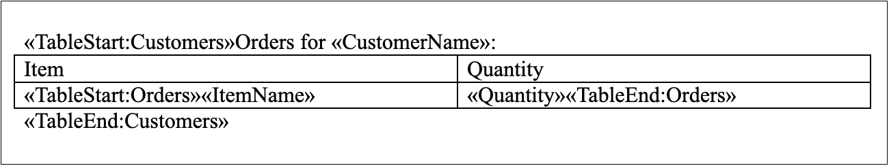
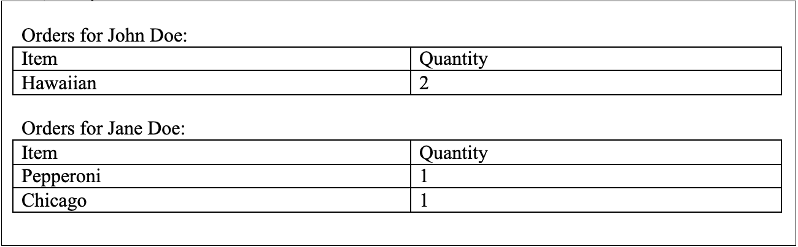

You can create different regions in your template to have special areas that you can simply fill with your data. Use the mail merge with regions if you want to insert tables, rows with repeating data to make your documents dynamically grow by specifying those regions within your template.

You can create nested (child) regions as well as merge regions. The main advantage of using this type is to dynamically increase parts inside a document. See more details in the next article "Nested Mail Merge with Regions".

{}

Information about a mail merge region can be obtained using the [MailMergeRegionInfo](https://reference.aspose.com/words/cpp/aspose.words.mailmerging/mailmergeregioninfo/) class.

{}

## How to Execute Mail Merge with Regions

A mail merge region is a specific part inside a document that has a start point and an end point. Both points are represented as mail merge fields that have specific names *"TableStart:XXX"* and *"TableEnd:XXX"*. All content that is included in a mail merge region will automatically be repeated for every record in the data source.

Aspose.Words allows you to execute mail merge with regions using one of the [ExecuteWithRegions](https://reference.aspose.com/words/cpp/aspose.words.mailmerging/mailmerge/executewithregions/) methods that accept [IMailMergeDataSource](https://reference.aspose.com/words/cpp/aspose.words.mailmerging/imailmergedatasource/) custom data source.

The following code example shows how to execute mail merge with regions from sqlite database with [SQLiteCpp](https://github.com/SRombauts/SQLiteCpp):



You can notice the difference between the document before executing mail merge with regions:

And after executing mail merge with regions:

## Limitations of Mail Merge with Regions

There are some important points that you need to consider when performing a mail merge with regions:

* The start point *TableStart:Orders* and the end point *TableEnd:Orders* both need to be in the same row or cell. For example, if you start a merge region in a cell of a table, you must end the merge region in the same row as the first cell.
  The merge field name must match the column name in your DataTable. Unless you specify mapped fields, mail merge with regions will not succeed for any merge field that has a name other than the column name.
* Aspose.Words for C++ only supports [IMailMergeDataSource](https://reference.aspose.com/words/cpp/aspose.words.mailmerging/imailmergedatasource/) and [IMailMergeDataSourceRoot](https://reference.aspose.com/words/cpp/aspose.words.mailmerging/imailmergedatasourceroot/) based data sources. Unlike .NET and Java, C++ does not have a generally accepted cross-platform API for working with databases (like ADODB, ODBC, or JDBC). In order to work with a specific data source, you have to implement [IMailMergeDataSource](https://reference.aspose.com/words/cpp/aspose.words.mailmerging/imailmergedatasource/) or [IMailMergeDataSourceRoot](https://reference.aspose.com/words/cpp/aspose.words.mailmerging/imailmergedatasourceroot/) interface.

If one of these rules is broken, you will get unexpected results or an exception may be thrown.

{}

If you do not use mail merge regions, then it will be similar to Microsoft Word mail merge, and the whole document content will be repeated for each record in the data source.

{}

