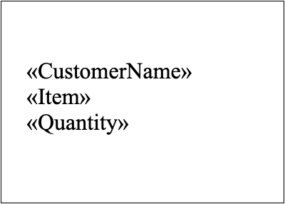

A simple Mail Merge is used to fill the Mail Merge fields inside your template with the required data from your data source (single table representation). So it is similar to the classic Mail Merge in Microsoft Word.

You can add one or more merge fields in your template and then execute the simple Mail Merge operation. It is recommended to use it if your template does not contain any merge regions.

The main limitation of using this type is the whole document content will be repeated for each record in the data source.

## How to Execute a Simple Mail Merge Operation

Once your template is ready, you can start performing the simple Mail Merge operation. Aspose.Words allows you to execute a simple Mail Merge operation using different [Execute](https://reference.aspose.com/words/cpp/aspose.words.mailmerging/mailmerge/execute/) methods that accept various data objects as the data source.

The following code example shows how to execute a simple Mail Merge operation using one of the [Execute](https://reference.aspose.com/words/cpp/aspose.words.mailmerging/mailmerge/execute/) method:



You can notice the difference between the document before executing simple mail merge:

And after executing simple mail merge:

## How to Create Multiple Merged Documents

In Aspose.Words, the standard Mail Merge operation fills only a single document with content from your data source. So, you will need to execute the Mail Merge operation many times to create a few merged documents as an output.

The following code example shows how to generate a few merged documents during a Mail Merge operation with [SQLiteCpp](https://github.com/SRombauts/SQLiteCpp):


