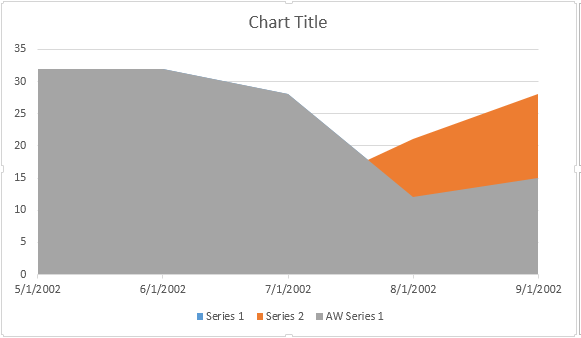
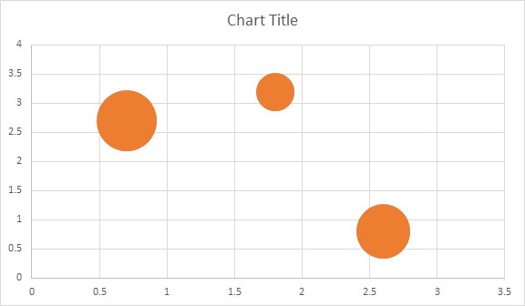

New [InsertChart](https://reference.aspose.com/words/cpp/aspose.words/documentbuilder/insertchart/) method was added into the [DocumentBuilder](https://reference.aspose.com/words/cpp/aspose.words/documentbuilder/) class. So, let's see how to insert a simple column chart into the document using the [InsertChart](https://reference.aspose.com/words/cpp/aspose.words/documentbuilder/insertchart/) method.

## How to Insert a Chart

In this section we will learn how to insert a chart into a document.

### Insert Column Chart

The following example shows how to insert column chart:

There are four different overloads for series Add method, which was exposed to cover all possible variants of data sources for all chart types:

### Insert Scatter Chart

The following example shows how to insert a scatter chart:

### Insert Area Chart

The following example shows how to insert an area chart:

### Insert Bubble Chart

The following example shows how to insert a bubble chart:

## See Also

For more information, see also the child articles.
