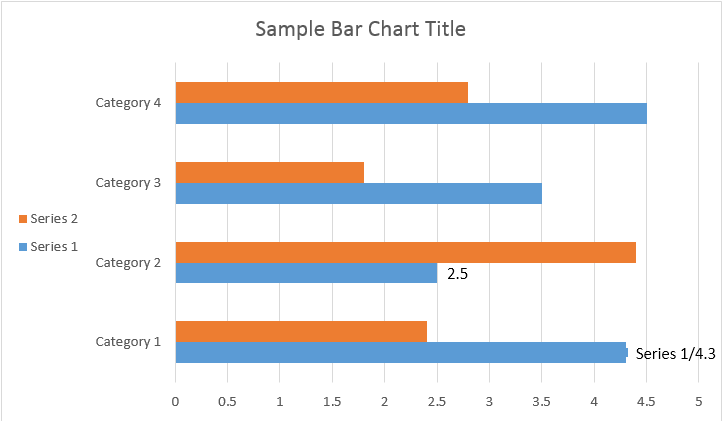

Aspose.Words allows users to work with ChartDataLabel an various ways.

## How to Format Number of Chart Data Label

Using [NumberFormat](https://reference.aspose.com/words/cpp/aspose.words.drawing.charts/chartdatalabel/get_numberformat/) you can specify number formatting of a single data label of the chart.

The following code example shows how to format a number of the data label:



## How to Work With Chart Data Label

Using [ChartDataLabel](https://reference.aspose.com/words/cpp/aspose.words.drawing.charts/chartdatalabel/) you are able to specify the formatting of a single data label of the chart series, like show/hide LegendKey, CategoryName, SeriesName, Value etc:



Please see the result below:

