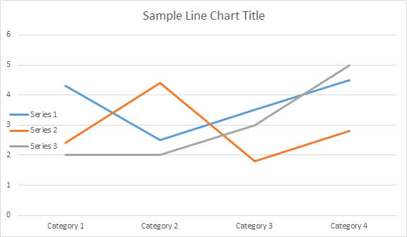

Once the chart was inserted and filled with data, you are able to change its appearance. `Shape.Chart` property contains all chart related options available through the public API.

For example, let's change the Chart title or legend behavior:



The code generates the followings results:

