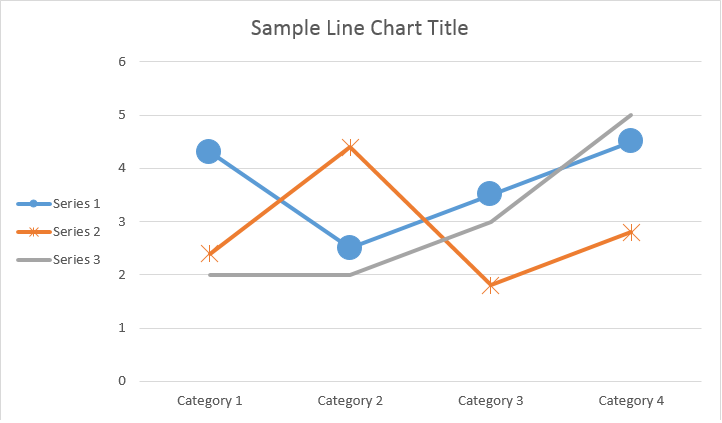

Aspose.Words allows users to work with ChartSeriesCollection in a few ways.

## Working with ChartSeriesCollection of Chart

Let’s look into [ChartSeries](https://reference.aspose.com/words/cpp/aspose.words.drawing.charts/chartseries/) collection. All chart series are available through [ChartSeriesCollection](https://reference.aspose.com/words/cpp/aspose.words.drawing.charts/chartseriescollection/):



## Working with Single ChartSeries Class

Here is how to work with a particular series:



Please see the result below:

All single [ChartSeries](https://reference.aspose.com/words/cpp/aspose.words.drawing.charts/chartseries/) have default [ChartDataPoint](https://reference.aspose.com/words/cpp/aspose.words.drawing.charts/chartseries/get_datapoints/) options, please try using the following code to change them:



## How to Work with Single ChartDataPoint of a `ChartSeries` 

Using [ChartDataPoint](https://reference.aspose.com/words/cpp/aspose.words.drawing.charts/chartdatapoint/) you can customize the formatting of a single data point of the chart series:



Please see the result below:

