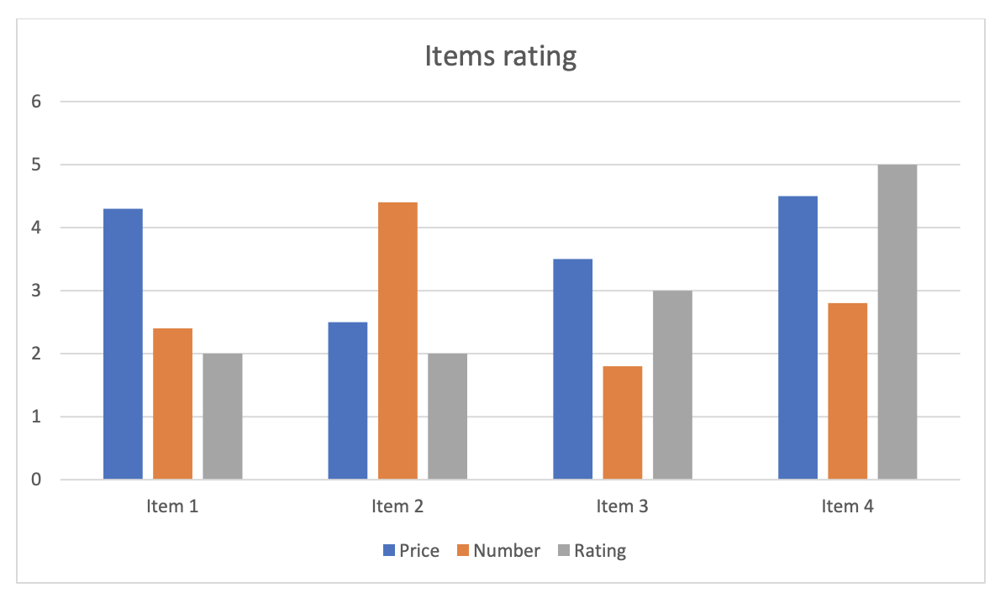
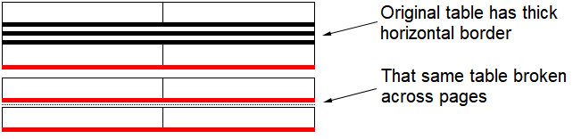

Creating a page layout can be a costly procedure, both in terms of speed and memory. This is due to several reasons:

- The document may have a large amount of content, which may need to be displayed on thousands of pages. The geometry of every object on every page would need to be described, consuming memory resources.
- The document may have many rules, placing constraints on geometry. Considerable computational time may be spent, ensuring every constraint is satisfied. 
- Some document features, for example, the `NUMPAGES` field, create recursive dependencies for future property values, which are not available at the time of computation. This leads to repetitive calculations and adds up in computation time.

Due to the aforementioned reasons, Aspose.Words will create a page layout only when it is necessary. A typical reason for this would be a request to render document pages or to obtain a field value that depends on the information available in page layout. A less obvious reason could be exporting a document to HTML. Even though HTML is not a fixed-page format and it does not describe the geometry of the content objects, it still supports images. Such images may be in the form of shapes created in Microsoft Word with a text inside them. For example, a chart with axis labels can be exported into HTML as an image, but before this can be done Aspose.Words needs to render that image and hence needs to know where to display the label. See the chart example below:

## Non-Geometric Properties

In addition to handling geometric information, a page layout is also responsible for calculating colors and border styles. In Microsoft Word, text color can be specified as automatic, implying that the color selection should be based on the shading color of the cell or paragraph, or based on the color of the page, where the text appears.

Page layout computes where the text will appear and what content will be rendered behind it, enabling color calculation. There are other specific calculations performed by the page layout. For instance, a horizontal border in a table depends on whether a table row is last in a column of text, and whether it is broken across columns. If a row is rendered last in a column, the bottom border is used instead of horizontal.

In Aspose.Words, a user can request whether to build a new page layout, or update an existing one. Both of these can be performed by the [UpdatePageLayout](https://reference.aspose.com/words/cpp/aspose.words/document/updatepagelayout/) method, provided by the [Document](https://reference.aspose.com/words/cpp/aspose.words/document/) class. If a page layout does not exist, but there is a need for it (for example, when the document is exported to a fixed-page format), Aspose.Words will automatically call this method. However, if a page layout does already exists, Aspose.Words will use the existing one, in order to avoid consuming the resources necessary to update it. In this case, the user needs to call the `UpdatePageLayout` method, in order to ensure that the page layout is up to date with the document model.

## Dynamic Structure

The process of creation of page layout comprises of the following steps:

- *Conversion* – enumerating content of the document model and preparing corresponding layout objects.
- *Build* – arranging layout objects to represent the content of the document on pages.
- *Reflow* – updating objects arrangement to satisfy geometry constraints.
- *Projecting layout objects into fixed page presentation and finalizing color information*.
- *Building and reflowing of shape content* – a step required if the document contains shapes with nested text content.

Note, that the page layout is a dynamic structure, which can be partially rebuilt. This is especially needed when it is impossible to calculate field values without rebuilding the document layout structure. The field can reference the location of an object on a page, and at the same time, the field value itself is also rendered on the page, affecting the location of the referenced object. A page layout cannot be built in one go, because field values may not yet be available at the time of positioning on a page.

Consider the typical scenario when the `NUMPAGES` field appears in the footer of the first page in the document. The value of this field is the total number of pages. In order to position the field on a page, its value should be known. If only the first page is being currently built then the total number of pages is not yet known. In this case, the page layout has to use the default value and later come back to that field and change its value according to actual computations. However, changing the field value may affect other document content on a page and ultimately cause a new page to be appended or an existing page removed, thus making the computed value outdated. This issue can be solved by making it possible to update the existing page layout.

When creating a layout, it is also possible to set up [LayoutOptions](https://reference.aspose.com/words/cpp/aspose.words.layout/layoutoptions/) properties that affect the output of the document on pages.
