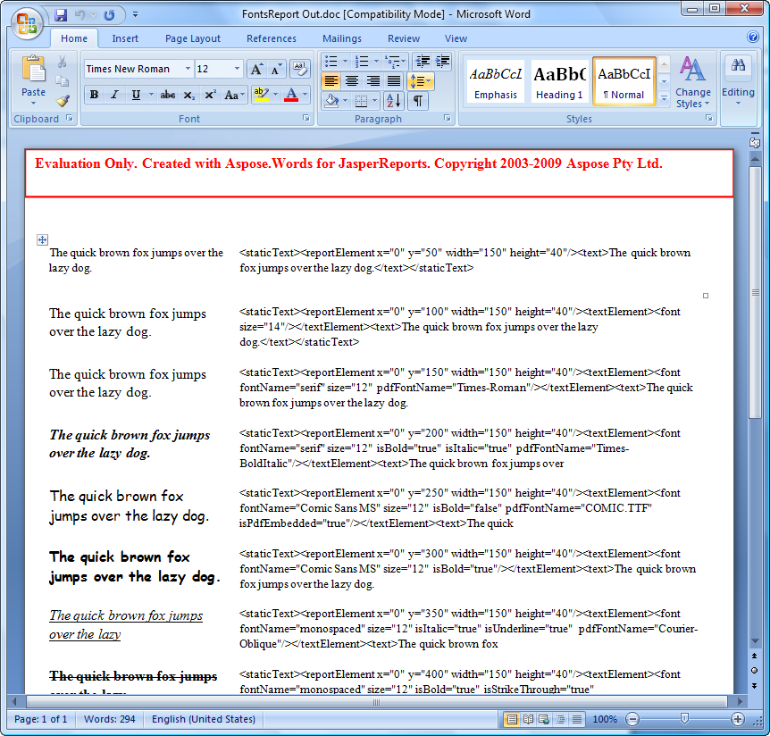

{}

You can easily download Aspose.Words for JasperReports for evaluation from the [downloads page](https://releases.aspose.com/words/jasperreports/). The evaluation download is same as the purchased download. The evaluation version simply becomes licensed after applying a license.

{}

The evaluation version of Aspose.Words for JasperReports (without a license specified) inserts an evaluation watermark at the top of the document on save, and limits the maximum document size to several hundred paragraphs. When you have bought a license, simply reference the license in the code to apply it.

## Temporary License

If you want to test Aspose.Words without the evaluation version limitations, [request a 30-day temporary license](https://purchase.aspose.com/temporary-license/).

**Aspose.Words for JasperReports injects a watermark when working in evaluation mode**

