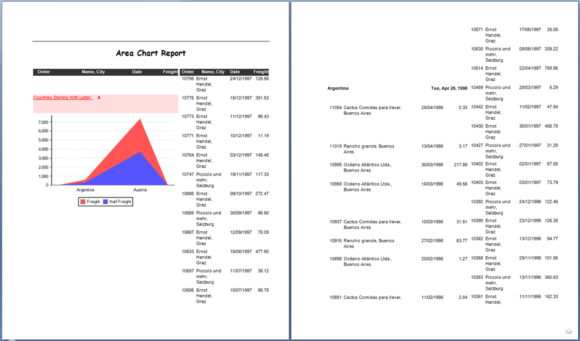

{}

[JasperReports](https://sourceforge.net/projects/jasperreports/) and [JasperServer](https://sourceforge.net/projects/jasperserver/) do not have built-in abilities to export reports as Microsoft Word documents (apart from the RTF format that uses positioned items), but using Aspose.Words for JasperReports, you will get access to the following additional export formats:

- DOC – Word document via Aspose.Words 
- DOCX – Office Open XML (OOXML) document via Aspose.Words 
- RTF – Rich Text Format via Aspose.Words 
- ODT – OpenDocument Text via Aspose.Words 
- HTML – Web page via Aspose.Words 
- TXT – Plain text via Aspose.Words 

Aspose.Words for JasperReports is built on top of Aspose.Words for Java, the world-class library for server-side Microsoft Word documents processing. 

**A sample report exported as a Microsoft Word (DOC) document.**

{}
