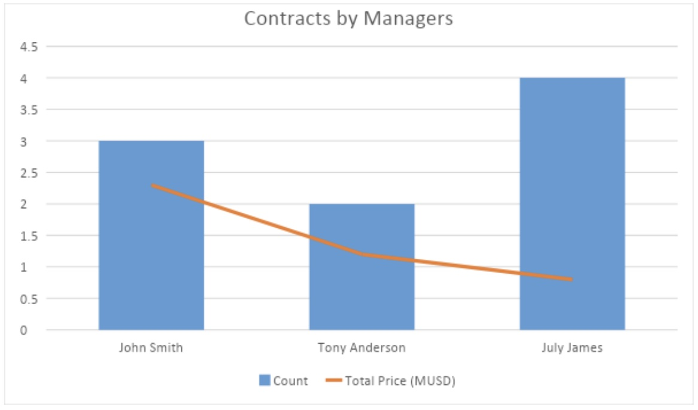
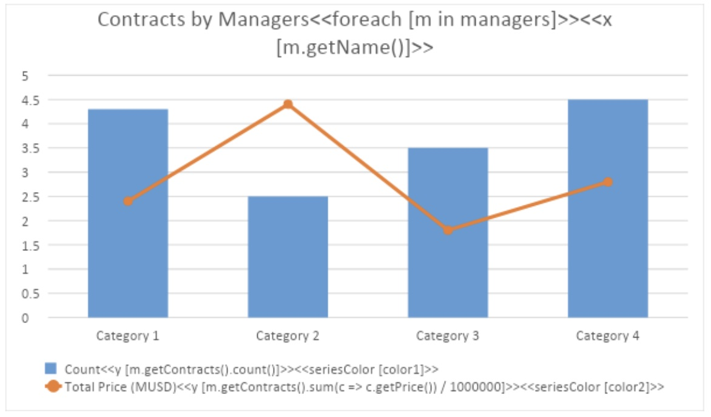

LINQ Reporting Engine enables you to use charts to represent your sequential data. To declare a chart that is going to be populated with data dynamically within your template, do the following steps:

1. Add a chart to your template at the place where you want it to appear in a result document.
1. Configure the appearance of the chart.
1. Add required chart series and configure their appearance as well.
1. Add a title to the chart, if missing.
1. Add an opening `foreach` tag to the chart title.
1. Depending on the type of the chart, add `x` tags to the chart title or chart series’ names as follows. 
	<<x [x_value_expression>>
	- For a scatter or bubble chart, you can go one of the following ways:
		- To use the same x-value expression for all chart series, add a single `x` tag to the chart title after the corresponding `foreach` tag.
		- To use different x-value expressions for every chart series, add multiple `x` tags to chart series’ names – one for each chart series. 
	An x-value expression for a scatter or bubble chart must return a numeric value.
	- For a chart of another type, add a single `x` tag to the chart title after the corresponding `foreach` tag. In this case, an x-value expression must return a numeric, date, or string value.
1. For a chart of any type, add `y` tags to chart series’ names as follows. 
<<y [y_value_expression]>>
	An y-value expression must return a numeric value.
1. For a bubble chart, add `size` tags to chart series’ names as follows. 
<<size [bubble_size_expression]>>
	A bubble-size expression must return a numeric value. 

**Note –** A closing `foreach` tag is not used for a chart.

While composing expressions for `x`, `y`, and `size` tags, you can normally reference an iteration variable declared at the corresponding `foreach` tag in a chart title in the same way as if you intended to output results of expressions within a data band.

**Note –** You can normally use charts with dynamic data within data bands.

During runtime, a chart with a `foreach` tag in its title is processed by the engine as follows:

1. A sequence expression declared at the `foreach` tag is evaluated and iterated.
1. For every sequence item, expressions declared at `x`, `y`, and `size` tags are evaluated.
1. Results of these expressions are used to populate corresponding chart series.
1. All `foreach`, `x`, `y`, and `size` tags are removed from the chart title and chart series’ names.

Consider the following example. Assume that you have the `Manager` and `Contract` classes defined in your application as follows.


public class Manager
{
   public String getName getName() { ... }
   public Iterable<Contract> getContracts() { ... }
   ...
}

public class Contract
{
   public float getPrice() { ... }
   ...
}


Given that `managers` is an enumeration of `Manager` instances, you can use the following template to represent total contract prices achieved by managers in a column chart.

In this case, the engine produces a report as follows.

For more examples of templates for typical scenarios involving charts, see “ REF typicalTemplates Appendix C. Typical Templates”.

## Including Chart Series Dynamically

For a chart with dynamic data, you can select which series to include into it dynamically based upon conditions. In particular, this feature is useful when you need to restrict access to sensitive data in chart series for some users of your application. To use the feature, do the following steps:

1. Declare a chart with dynamic data in the usual way.
1. For series to be removed from the chart based upon conditions dynamically, define the conditions in names of these series using `removeif` tags having the following syntax.

<<removeif [conditional_expression]>>


**Note –** A conditional expression must return a Boolean value.

During runtime, series with `removeif` tags, for which conditional expressions return `true`, are removed from corresponding charts. The rest of the series are kept and populated with data as usual. In either case, `removeif` tags themselves are removed.

Consider the following example. Given the previous definition of `managers` and that `accessLevel` is an integer value representing an access level of a user, you can use the following chart template to make numbers of contracts be available for all users whereas financial contract data be available only for users having an access level of zero.

If `accessLevel` is equal to zero, the engine produces a report as follows.

If `accessLevel` is not equal to zero, the engine produces a report as follows.

## Setting Chart Series Colors Dynamically

For a chart with dynamic data, you can set colors of chart series dynamically based upon expressions. To use the feature, do the following steps:

1. Declare a chart with dynamic data in the usual way.
1. For chart series to be colored dynamically, define corresponding color expressions in names of these series using `seriesColor` tags having the following syntax.

<<seriesColor [color_expression]>>


A color expression must return a value of one of the following types:

- A string containing the name of a known color, that is, the case-insensitive name of a member of the [KnownColor](https://docs.microsoft.com/en-us/dotnet/api/system.drawing.knowncolor?view=net-6.0) enumeration such as “red”.
- A string containing an HTML color code such as “#F08080” (light coral).
- An integer value defining RGB (red, green, blue) components of the color such as 0xFFFF00 (yellow).
- A value of the [Color](https://docs.oracle.com/javase/7/docs/api/java/awt/Color.html) type.

During runtime, expressions declared within `seriesColor` tags are evaluated and corresponding chart series are colored accordingly. The `seriesColor` tags are removed then.

Consider the following example. Given the previous definition of `managers` and that `color1` and `color2` are color values of supported types, you can use the following chart template to set its series colors dynamically.

In this case, the engine produces a report as follows.

## Setting Chart Series Point Colors Dynamically

For a chart with dynamic data, you can set colors of individual chart series points dynamically based upon expressions. To use the feature, do the following steps:

1. Declare a chart with dynamic data in the usual way.
1. For chart series with points to be colored dynamically, define corresponding color expressions in names of these series using `pointColor` tags having the following syntax.
	<<pointColor [color_expression]>>

A color expression must return a value of one of the following types:

- A string containing the name of a known color, that is, the case-insensitive name of a member of the [KnownColor](https://docs.microsoft.com/en-us/dotnet/api/system.drawing.knowncolor?view=net-6.0) enumeration such as “red”.
- A string containing an HTML color code such as “#F08080” (light coral).
- An integer value defining RGB (red, green, blue) components of the color such as 0xFFFF00 (yellow).
- A value of the [Color](https://docs.oracle.com/javase/7/docs/api/java/awt/Color.html) type.

During runtime, expressions declared within `pointColor` tags are evaluated and corresponding chart series points are colored accordingly. The `pointColor` tags are removed then.

Consider the following example. Assume that you have the `ColoredItem` class defined in your application as follows.


public class ColoredItem
{
	public String getName() { ... }
	public float getPrice() { ... }
	public Color getColor() { ... }
	...
}


Given that `items` is an enumeration of `ColoredItem` instances, you can use the following chart template to set its series point colors dynamically.

The series name for the template chart is defined as follows.

In this case, the engine produces a report as follows.

## Setting Chart Title, Series Names, and Axis Titles Dynamically

You can normally use common expression tags in chart titles, series names, and axis titles, thus forming their contents dynamically. This feature can be used for any chart defined in a template even for the one that is not populated with data dynamically like in the following example.

Given that `chartTitle`, `seriesName`, and `axisName` are strings taking values “Chart Title”, “Series Name”, and “Axis Title” respectively, you can use the following chart template to set the chart’s title, series name, and axis title dynamically.

In this case, the engine produces a report as follows.

**Note –** You can normally apply this approach to a chart dynamically populated with data.

The following code example demonstrates how to set chart series names dynamically.

