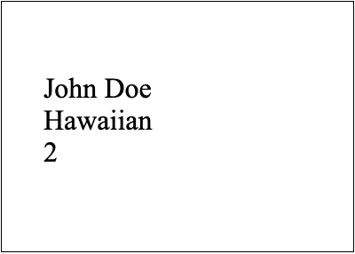

The main idea of Mail Merge is to automatically create a document or multiple documents based on your template and data fetched from your data source. Aspose.Words allows you to perform two different types of Mail Merge operations: simple Mail Merge and Mail Merge with regions.

The most common example of using simple Mail Merge is when you want to send a document for different clients by including their names at the beginning of the document. To do this, you need to create merge fields such as *First Name* and *Last Name* in your template, and then fill them in with data from your data source. Whereas the most common example of using Mail Merge with regions is when you want to send a document that includes specific orders with the list of all items within each order. To do this, you will need to create merge regions inside your template – own region for each order, in order to fill it with all required data for the items.

The main difference between both merge operations is that simple Mail Merge (without regions) repeats the entire document per each data source record, whereas Mail Merge with regions repeats only designated regions per record. You can think of a simple Mail Merge operation as a particular case of merge with regions where the only region is the whole document.

{}

The [MailMerge](https://reference.aspose.com/words/java/com.aspose.words/mailmerge/) class represents a Mail Merge functionality. With its properties, you can customize the required behavior before executing a Mail Merge operation.

{}

## Simple Mail Merge Operation {#simple-mail-merge-operation}

A simple Mail Merge is used to fill the Mail Merge fields inside your template with the required data from your data source (single table representation). So it is similar to the classic Mail Merge in Microsoft Word.

You can add one or more merge fields in your template and then execute the simple Mail Merge operation. It is recommended to use it if your template does not contain any merge regions.

The main limitation of using this type is the whole document content will be repeated for each record in the data source.

### How to Execute a Simple Mail Merge Operation {#how-to-execute-a-simple-mail-merge-operation}

Once your template is ready, you can start performing the simple Mail Merge operation. Aspose.Words allows you to execute a simple Mail Merge operation using different [Execute methods](https://reference.aspose.com/words/java/com.aspose.words/mailmerge/#execute-com.aspose.words.IMailMergeDataSource) that accept various data objects as the data source.

The following code example shows how to execute a simple Mail Merge operation using one of the [Execute](https://reference.aspose.com/words/java/com.aspose.words/mailmerge/#execute-java.lang.String---java.lang.Object) method:



You can notice the difference between the document before executing simple mail merge:

And after executing simple mail merge:

### How to Create Multiple Merged Documents

In Aspose.Words, the standard Mail Merge operation fills only a single document with content from your data source. So, you will need to execute the Mail Merge operation multiple times to create multiple merged documents as an output.

The following code example shows how to generate multiple merged documents during a Mail Merge operation:



{}

You can download the sample file of this example from [Aspose.Words GitHub](https://github.com/aspose-words/Aspose.Words-for-Java/tree/master/Examples/src/main/resources/MailMerge).

{}

## Mail Merge with Regions

You can create different regions in your template to have special areas that you can simply fill with your data. Use the Mail Merge with regions if you want to insert tables, rows with repeating data to make your documents dynamically grow by specifying those regions within your template.

You can create nested (child) regions as well as merge regions. The main advantage of using this type is to dynamically increase parts inside a document. See more details in the next article "Nested Mail Merge with Regions".

{}

Information about a Mail Merge region can be obtained using the [MailMergeRegionInfo](https://reference.aspose.com/words/java/com.aspose.words/mailmergeregioninfo/) class.

{}

### How to Execute Mail Merge with Regions

A Mail Merge region is a specific part inside a document that has a start point and an end point. Both points are represented as Mail Merge fields that have specific names *"TableStart:XXX"* and *"TableEnd:XXX"*. All content that is included in a Mail Merge region will automatically be repeated for every record in the data source.

Aspose.Words allows you to execute Mail Merge with regions using different [Execute methods](https://reference.aspose.com/words/net/aspose.words.mailmerging/mailmerge/executewithregions/#executewithregions/) that accept various data objects as the data source.

As a first step, we need to create the `DataSet` to pass it later as an input parameter to the `ExecuteWithRegions` method:



The following code example shows how to execute Mail Merge with regions using the [ExecuteWithRegions(DataSet)](https://reference.aspose.com/words/java/com.aspose.words/mailmerge/#executeWithRegions-com.aspose.words.net.System.Data.DataSet) method:



You can notice the difference between the document before executing Mail Merge with regions:

And after executing Mail Merge with regions:

### Limitations of Mail Merge with Regions

There are some important points that you need to consider when performing a Mail Merge with regions:

* The start point *TableStart:Orders* and the end point *TableEnd:Orders* both need to be in the same row or cell. For example, if you start a merge region in a cell of a table, you must end the merge region in the same row as the first cell.
* The merge field name must match the column’s name in your DataTable. Unless you have specified mapped fields, the Mail Merge with regions will not be successful for any merge field that has a different name than the column’s name.

If one of these rules is broken, you will get unexpected results or an exception may be thrown.

{}

If you do not use Mail Merge regions, then it will be similar to the Microsoft Word mail merge, and the whole document content will be repeated for each record in the data source.

{}

