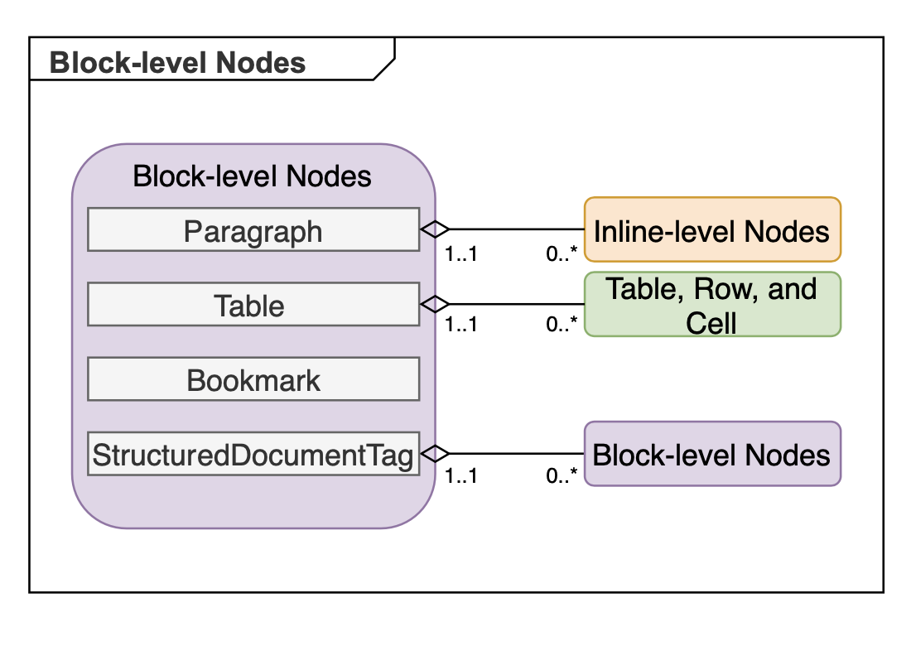
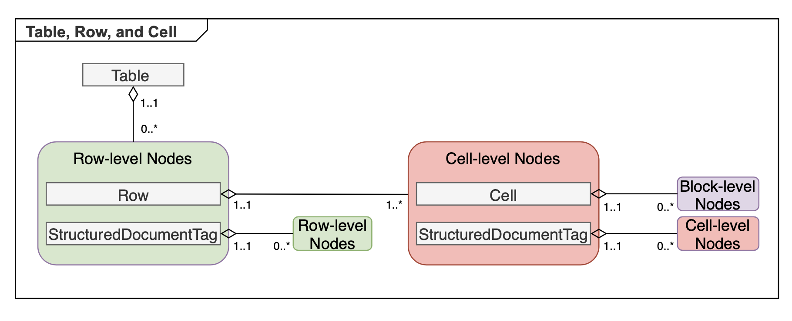

This documentation sometimes refers to a group of node classes as belonging to a "level" in a document, such as "block-level", "inline-level" (also known as "inline"), or “row-level” nodes. These levels in a document are differentiated purely logically and are not explicitly expressed by inheritance or other Aspose.Words DOM means. The node level is used to describe the place in the document tree where the node would typically occur.

In the previous article, we already talked about the relationship between nodes and the fact that not all nodes are allowed to be a child of any nodes. For example, Cell can only be a Row child, and a Row can only be a Table child, and so on. These relationships are also applicable for the logical division of nodes into levels in the document.

The following sections describe the logical levels of nodes in Aspose.Words and the classes that belong to each level.

## Document and Section Logical Level

A Word document consists of one or more sections, represented by the [Section](https://reference.aspose.com/words/java/com.aspose.words/section/) class and separated by section breaks. A section can define its own page size, margins, orientation, number of text columns, and headers and footers.

[Document](https://reference.aspose.com/words/java/com.aspose.words/document/) and [Section](https://www.aspose.com/api/words/java/com.aspose.words/section) level nodes have the structure as shown in the following diagram.

A section contains the main text, as well as headers and footers for the first, even, and odd pages. These different “flows” of text are called *stories*.

In Aspose.Words, the **Section** node contains the [Body](https://reference.aspose.com/words/java/com.aspose.words/body/) and [HeaderFooter](https://reference.aspose.com/words/java/com.aspose.words/headerfooter/) story nodes. The **Body** object stores the main text. The **HeaderFooter** objects store the text for each header and footer. The text of any story consists of paragraphs and tables, respectively represented by the **Paragraph** and **Table** objects of the Block-level.

Additionally, each Word document can contain a glossary, which is represented by the [GlossaryDocument](https://reference.aspose.com/words/java/com.aspose.words/glossarydocument/) node in Aspose.Words. A glossary document contains [BuildingBlocks](https://reference.aspose.com/words/java/com.aspose.words/buildingblock/), [AutoText](https://reference.aspose.com/words/java/com.aspose.words/buildingblocktype/#AUTO-TEXT), and [AutoCorrect](https://reference.aspose.com/words/java/com.aspose.words/buildingblocktype/#AUTO-CORRECT) entries.

**GlossaryDocument** includes [BuildingBlock](https://reference.aspose.com/words/java/com.aspose.words/buildingblock/) nodes representing different types of glossary document entries. Each **BuildingBlock** contains sections that can be inserted, removed, and copied into documents.

## Block Logical Level

Block-level nodes represent containers for content and content controls, and can occur in the document tree child nodes in the following nodes:

- Body
- Header
- Footer
- Footnote
- Comment
- Shape
- GroupShape
- Cell
- StructuredDocumentTag

Block-level nodes are represented by the following classes:

- [Tables](https://reference.aspose.com/words/java/com.aspose.words/table/) and [Paragraphs](https://reference.aspose.com/words/java/com.aspose.words/paragraph/), which are the most important block-level nodes
- Bookmarks, which occurs both at the block-level and at the inline-level
- [StructuredDocumentTag](https://reference.aspose.com/words/java/com.aspose.words/structureddocumenttag/), which represent custom markup and can contain both content and content controls

The following diagram shows the block-level elements.

## Inline Logical Level

Inline-level nodes represent the actual content of the document and can be contained in the following containers:

- Paragraph – the most common container
- [SmartTag](https://reference.aspose.com/words/java/com.aspose.words/smarttag/)
- StructuredDocumentTag

Inline-level elements are represented by the following classes:

- [Run](https://reference.aspose.com/words/java/com.aspose.words/run/) – runs of text formatted differently
- [BookmarkStart](https://reference.aspose.com/words/java/com.aspose.words/bookmarkstart/) and [BookmarkEnd](https://reference.aspose.com/words/java/com.aspose.words/bookmarkend/) represent bookmarks
- [CommentRangeStart]https://reference.aspose.com/words/java/com.aspose.words/comment/RangeStart), [CommentRangeEnd](https://reference.aspose.com/words/java/com.aspose.words/commentrangeend/), [Comment](https://reference.aspose.com/words/java/com.aspose.words/comment/) and [Footnote](https://reference.aspose.com/words/java/com.aspose.words/footnote/) represent annotations
- [FieldStart](https://reference.aspose.com/words/java/com.aspose.words/fieldstart/), [FieldChar](https://reference.aspose.com/words/java/com.aspose.words/fieldchar/), [FieldSeparator](https://reference.aspose.com/words/java/com.aspose.words/fieldseparator/) and [FieldEnd](https://reference.aspose.com/words/java/com.aspose.words/fieldend/) that represent field characters, and [FormField](https://reference.aspose.com/words/java/com.aspose.words/formfield/) represent Word fields
- [SpecialChar](https://reference.aspose.com/words/java/com.aspose.words/specialchar/) represents special characters in the document
- [Shape](https://reference.aspose.com/words/java/com.aspose.words/shape/) and [GroupShape](https://reference.aspose.com/words/java/com.aspose.words/groupshape/) represent shapes, drawings, images, etc.
- SmartTag and StructuredDocumentTag represent custom markup

The following diagram shows the inline-level nodes structure.

{}

Shapes in Microsoft Word include Office Art AutoShapes, text boxes, images, OLE objects, and ActiveX controls, all of which are represented using the `Shape` class. Some shapes can also contain text, so Shape nodes in Aspose.Words can contain block-level nodes.

Shapes can be grouped inside each other using GroupShape nodes.

{}

{}

Footnotes and comments can contain text, therefore Footnote and Comment nodes in Aspose.Words can contain block-level nodes.

{}

## Table, Row, and Cell Node Level

The table consists of nodes of rows and cells. Table elements are represented by the following classes:

- [Row](https://reference.aspose.com/words/java/com.aspose.words/row/) represents a table row
- [Cell](https://reference.aspose.com/words/java/com.aspose.words/cell/) represents a table cell
- StructuredDocumentTag represent custom markup

The following diagram shows the node structures of the Table, Row, and Cell levels.

