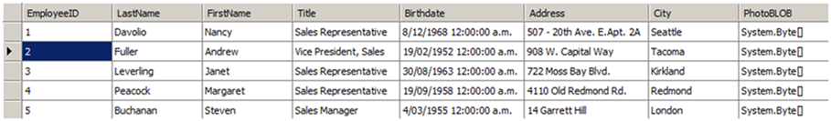

Often your application will pull data from a database and store it in the form of a **DataTable**. You may wish to easily insert this data into your document as a new table and quickly apply formatting to the whole table.

{}

Note that the preferred way of inserting data from a **DataTable** into a document table is by using [Mail Merge with Regions](/words/java/mail-merge-and-reporting/#aboutmailmerge-mailmergewithregionsexplained). The technique presented in this article is only suggested if you are unable to create a suitable template beforehand to merge data with, in other words, if you require everything to happen programmatically.

{}

Using Aspose.Words, you can easily retrieve data from a database and store it as a table:

1. Create a new [DocumentBuilder](https://reference.aspose.com/words/java/com.aspose.words/documentbuilder/) object on your [Document](https://reference.aspose.com/words/java/com.aspose.words/document/).
1. Start a new table using [DocumentBuilder](https://reference.aspose.com/words/java/com.aspose.words/documentbuilder/).
1. If we want to insert the names of each of the columns from our **DataTable** as a header row then iterate through each data column and write the column names into a row in the table.
1. Iterate through each **DataRow** in the **DataTable**:
   1. Iterate through each object in the **DataRow**.
   1. Insert the object into the document using [DocumentBuilder](https://reference.aspose.com/words/java/com.aspose.words/documentbuilder/). The method used depends on the type of the object being inserted e.g [DocumentBuilder.writeln()](https://reference.aspose.com/words/java/com.aspose.words/documentbuilder/#writeln()) for text and [DocumentBuilder.insertImage()](https://reference.aspose.com/words/java/com.aspose.words/documentbuilder/#insertImage(byte[])) for a byte array which represents an image.
   1. At the end of processing of the data row also end the row being created by the [DocumentBuilder](https://reference.aspose.com/words/java/com.aspose.words/DocumentBuilder) by using [DocumentBuilder.endRow()](https://reference.aspose.com/words/java/com.aspose.words/documentbuilder/#endRow).
1. Once all rows from the **DataTable** have been processed finish the table by calling [DocumentBuilder.endTable()](https://reference.aspose.com/words/java/com.aspose.words/documentbuilder/#endTable).
1. Finally, we can set the desired table style using one of the appropriate table properties such as [Table.getStyleIdentifier()](https://reference.aspose.com/words/java/com.aspose.words/tablestyle/#getStyleIdentifier) to automatically apply formatting to the entire table.
   The following data in our **DataTable** is used in this example: 

The following code example shows how to execute the above algorithm in Aspose.Words:



The method can then be easily called using your **DocumentBuilder** and data.

The following code example shows how to import the data from a `DataTable` and insert it into a new table in the document:



The table shown in the picture below is produced by running the above code.

