This article gives you an idea of getting started with Aspose.Words for Android via Java. It will demonstrate how to set up a new Android project from scratch, add a reference to the Aspose.Words JAR and create a new document which is saved to disk in DOCX format. This example uses [Android Studio](https://developer.android.com/studio/index.html) for development and the application is run on the Android Emulator. To get started with Aspose.Words for Android via Java, please follow this step-by-step tutorial to create an app which uses Aspose.Words for Android via Java:

1. Download and the [Android Studio](https://developer.android.com/studio/index.html) and install it to any location.
1. Run the Android Studio.
1. Create a new Android Application Project. 
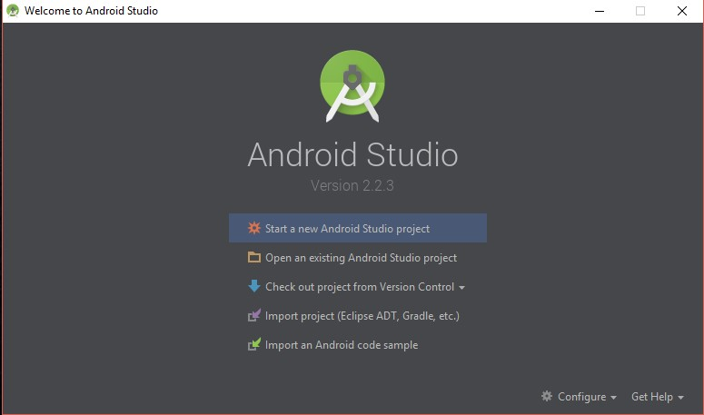 
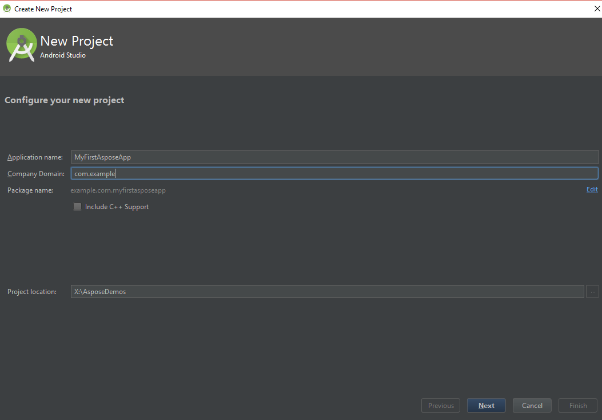 
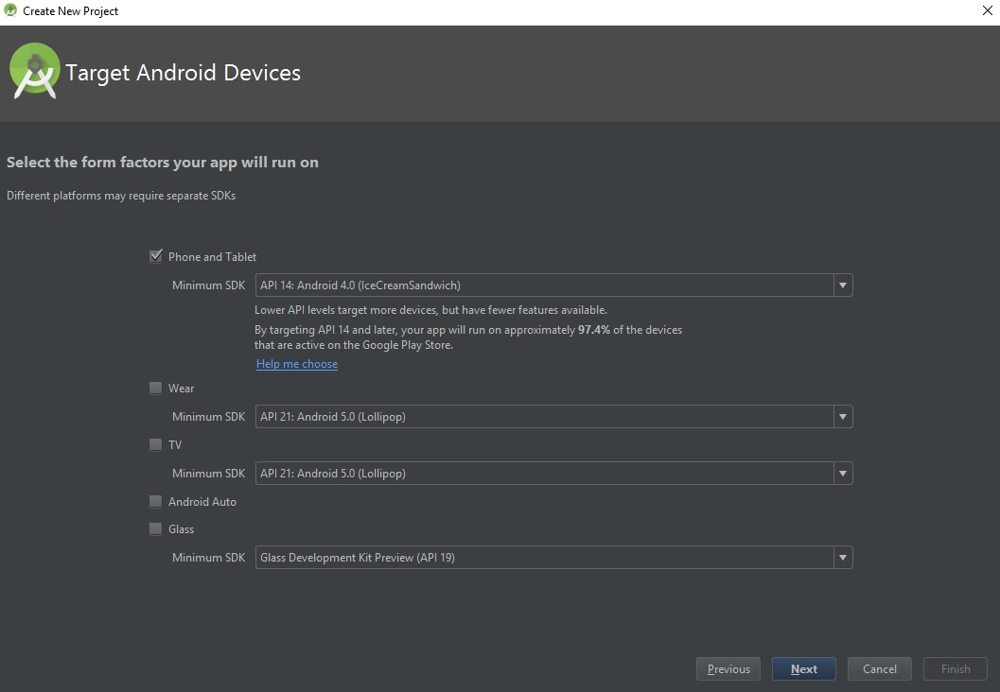 
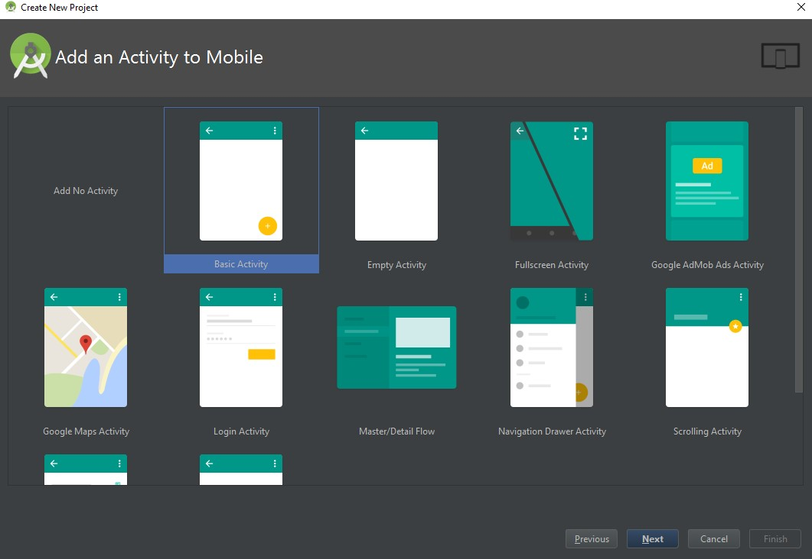 
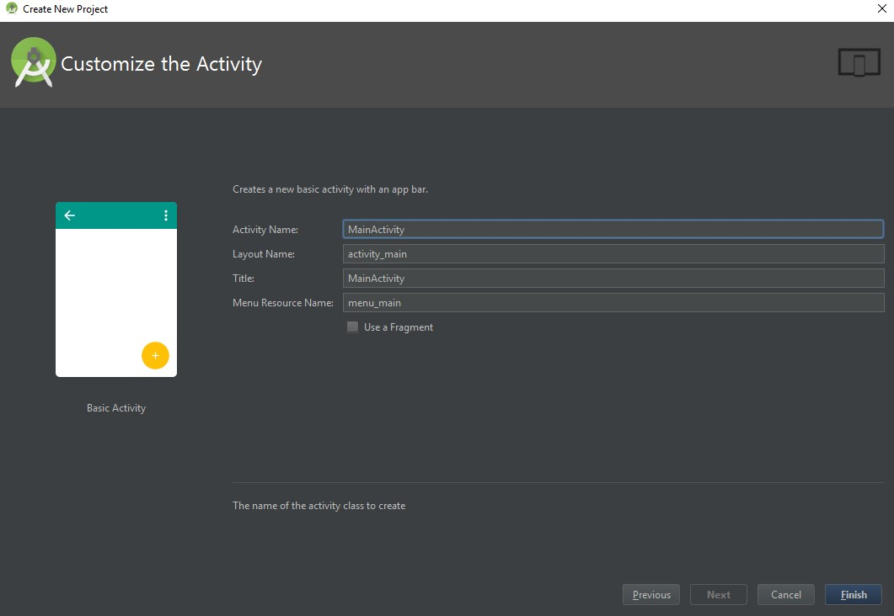 
1. Copy aspose-words-17.5-android.via.java.jar into your project’s libs/folder 
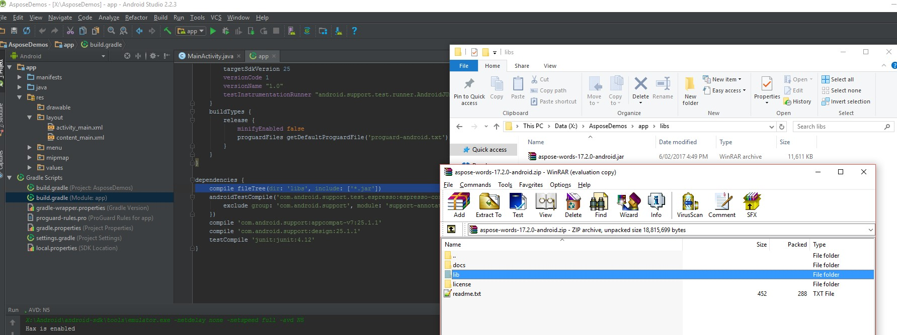
1. Select Project Section (from the file menu and click on the Dependencies tab.
   1. Click on the "+" button, select the file dependency option.
   1. Select Aspose.Words library from libs folder and click on OK. 
   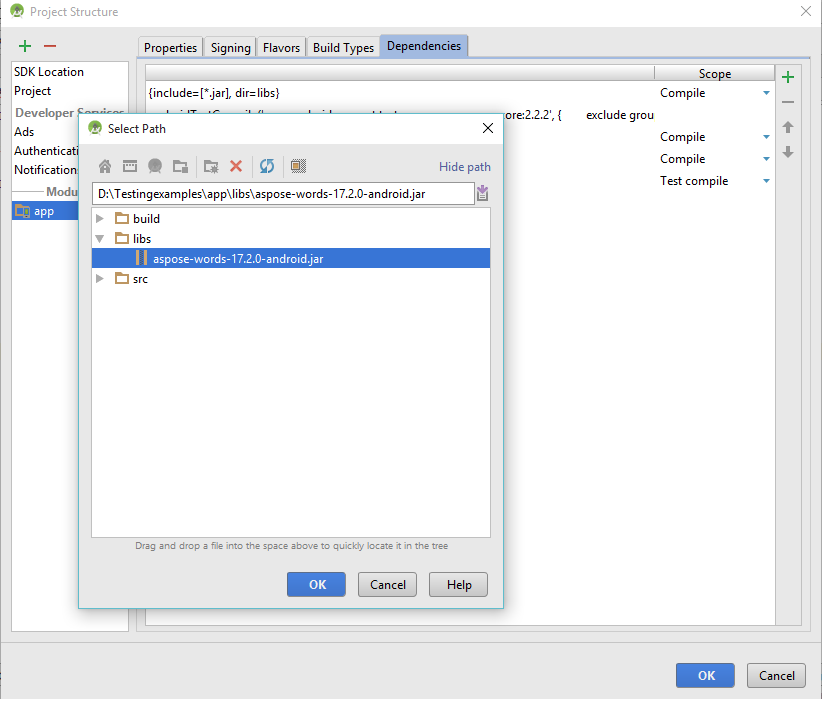
1. Sync the project with Gradle files if needed 
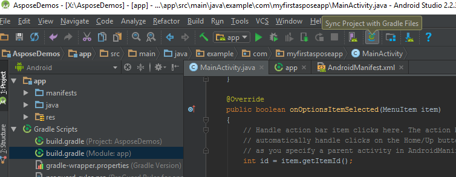
1. In order to access the SDcard special permissions must be added. Click on the AndroidManifest.xml file and choose the XML view. Add the following line to the file <uses-permission android:name="android.permission.WRITE_EXTERNAL_STORAGE" />  
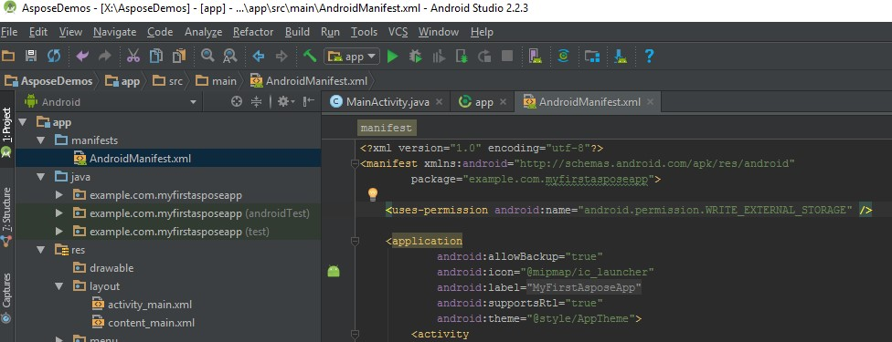
1. Navigate back to the code section of the app and add the following imports: 

import java.io.File;
import com.aspose.words.Document;
import com.aspose.words.DocumentBuilder;
import android.os.Environment; 
 
And then insert the following code in the body of the onCreate method to create a new document from scratch using Aspose.Words, 
insert some text and save it to the SDCard in DOCX format. 

try
{
   Document doc = new Document();
   DocumentBuilder builder = new DocumentBuilder(doc);
   builder.writeln("Hello World!");
   String sdCardPath = Environment.getExternalStorageDirectory().getPath() + File.separator;
   doc.save(sdCardPath + "Document Out.docx");
}
catch (Exception e)
{
   e.printStackTrace();
}
 
The full code should look like this: 
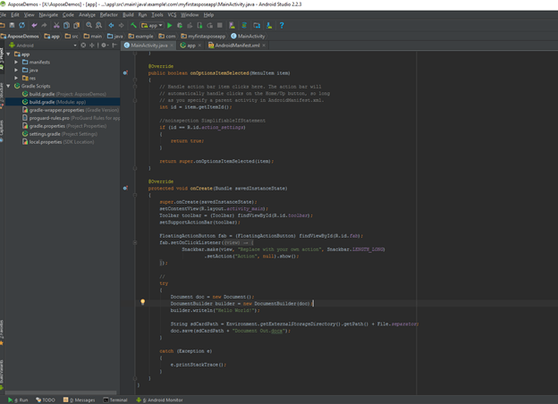
1. Now run the application again. This time the Aspose.Words code will run in the background and generate a document that is saved to the SDcard. 

1. To view the created document navigate to the Tools menu then choose Android and choose Android Device Monitor 
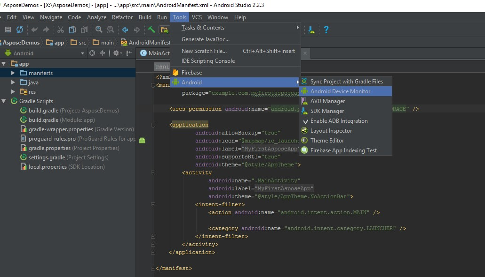 
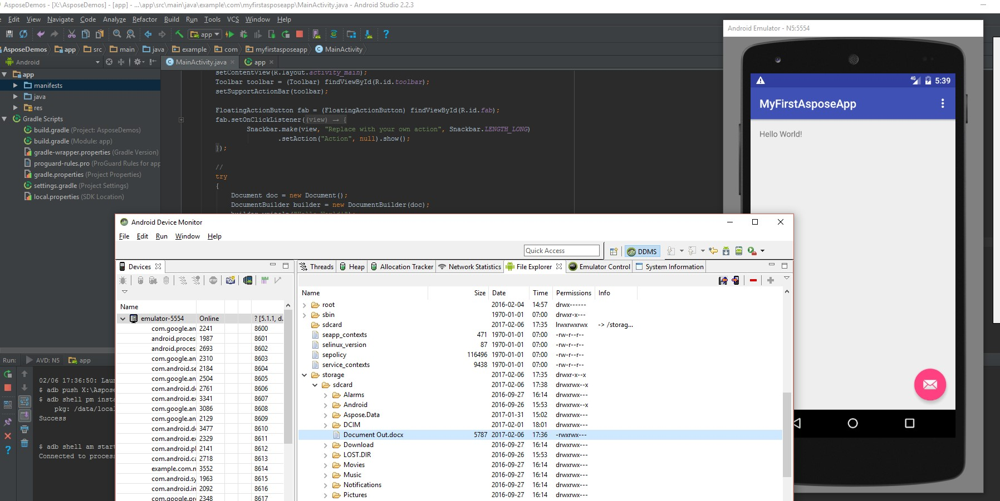
1. Use the default viewer to open the document. The output generated by the app with just a few lines of code looks like this: 
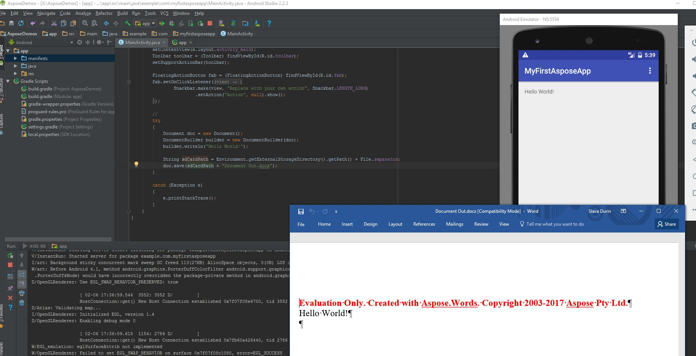