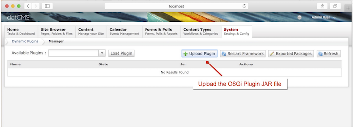
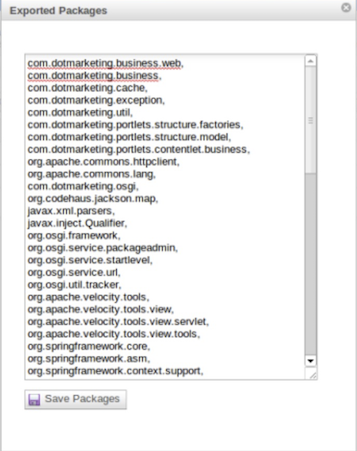

Export to Word Plugin for dotCMS allow users to export online content into Word Processing document using [Aspose.Words for Java](https://products.aspose.com/words/java/). It dynamically exports the content of the Web page to a Word Processing document and then automatically downloads the file to the disk location selected by the user in just couple of seconds. The generated Word processing document can then be opened using any Word Processing Application such as Microsoft Word or Apache OpenOffice etc.

## Supported Platforms

In order to deploy Export to Word OSGI/Dynamic Plugin you need to have the following requirements met:

- dotCMS 2.2 +

Please feel free to contact us if you wish to install this plugin on older versions of dotCMS.

## Downloading

You can download Export to Word plugin from one of the following locations

- [dotCMS Plugins Repository ](https://github.com/dotcms-plugins)
- [Github](https://github.com/aspose-words/Aspose.Words-for-Java/releases/tag/Aspose-dotCMS-Export-To-Word-v1.0.0)

## Installing

Once downloaded, please follow these steps to install the plugin into your dotCMS website:

1. Log into your site as either admin or another super-user level account.
1. Go to the dotCMS Dynamic Plugin portlet under the System tab and click on the "Upload Plugin" button and then choose the AsposeDotCMSExportToWord JAR file. 
 
OR 
Copy the AsposeDotCMSExportToWord JAR file inside the Felix OSGI container (dotCMS/felix/load).
1. Please add the following 2 exported packages either by changing the file: dotCMS/WEB-INF/felix/osgi-extra.conf or using the dotCMS UI (System -> Dynamic Plugins -> Exported Packages). 
   i. javax.xml.stream 
   ii. javax.xml.namespace 
   To add packages to the list:
   1. Add a comma to the last package in the list.
   1. Add each new package to the list, separating packages with commas.
   1. Press the Save Packages button. 
   Important: Selecting Save Packages will restart the OSGI framework. 

## Using

After you have installed the Export to Word OSGI plugin, it is really simple to start using it on your website. Please follow these simple steps to get started:

1. Make sure you are logged-in to dotCMS with a Host or Admin level account.
1. Navigate to the page whose content you want to export to a Word Processing document.
1. Add following HTML code in your page content. 

<form action="/app/exporttoword" method="POST">
    <input type="hidden" name="page_url" value=$dotPageContent.url />
    <input type="submit" value="Export to Word" style="float: right;" />
</form>
 
1. This will add **Export to Word** button on the page and clicking a button will dynamically exports the content of the page into a Word Processing document.

### How to apply Aspose License?

This Plugin uses an evaluation version of Aspose.Words. Once you are happy with your evaluation, you can purchase a license at the [Aspose website](https://purchase.aspose.com/pricing/words/family/).
To remove evaluation message and feature limitations, product license should be applied. You will receive a license file after you have purchased the product. Please follow the steps below to apply the license

- Make sure the license file is named as **Aspose.Words.Java.lic.**
- Place **Aspose.Words.Java.lic** file in the folder that contains the Aspose.Words.jar
- Use following code for activating the license:
- 
License license = new License();
license.setLicense("Aspose.Words.Java.lic");


Please check this [article](/words/java/licensing/#applying-a-license) for further details.

## Support, Extend and Contribute

### Support

From the very first days of Aspose, we knew that just giving our customers good products would not be enough. We also needed to deliver good service. We are developers ourselves and understand how frustrating it is when a technical issue or a quirk in the software stops you from doing what you need to do. We're here to solve problems, not create them.

This is why we offer free support. Anyone who uses our product, whether they have bought them or are using an evaluation, deserves our full attention and respect.

You can log any issues or suggestions related to Export to Word dotCMS plugin using any of the following platforms

- [Github](https://github.com/aspose-words/Aspose.Words-for-Java/issues)

### Extend and Contribute

Export to Word plugin for dotCMS is open source and its source code is available on the major social coding websites listed below. Developers are encouraged to download the source code and extend the functionality as per their own requirements.

#### Source Code

You can get the latest source code from one of the following locations

- [Github](https://github.com/aspose-words/Aspose.Words-for-Java/tree/master/Plugins/Aspose.Words%20Java%20for%20dotCMS/AsposeDotCMSExportToWord.servlet)

#### How to configure the source code

To be able to compile, deploy, and develop in dotCMS, you will need as an absolute minimum, the following tools:

- Java Development Kit (JDK)
- Eclipse
- Git client
