## Installing Aspose Words Java for IntelliJ IDEA - Maven

Steps below demonstrate how to install **Aspose.Words Java for IntelliJ IDEA (Maven)** plugin.

The plugin is listed on IntelliJ IDEA’s CE [official plugin website](https://plugins.jetbrains.com/plugin/7922-aspose-words-java-for-intellij-idea-maven/) - plugin repository as **Aspose Words Java for IntelliJ IDEA Maven**, so you don’t need to download it manually and install it from disk, but this extra option still exists in IntelliJ IDEA.

**Aspose.Words Java for IntelliJ IDEA (Maven)** plugin can be easily installed (without manual downloading) from within IntelliJ IDEA. To do it:

1. Select **Settings** from the **File** menu.
1. Click **Plugins**, then browse the repositories in IntelliJ IDEA. 

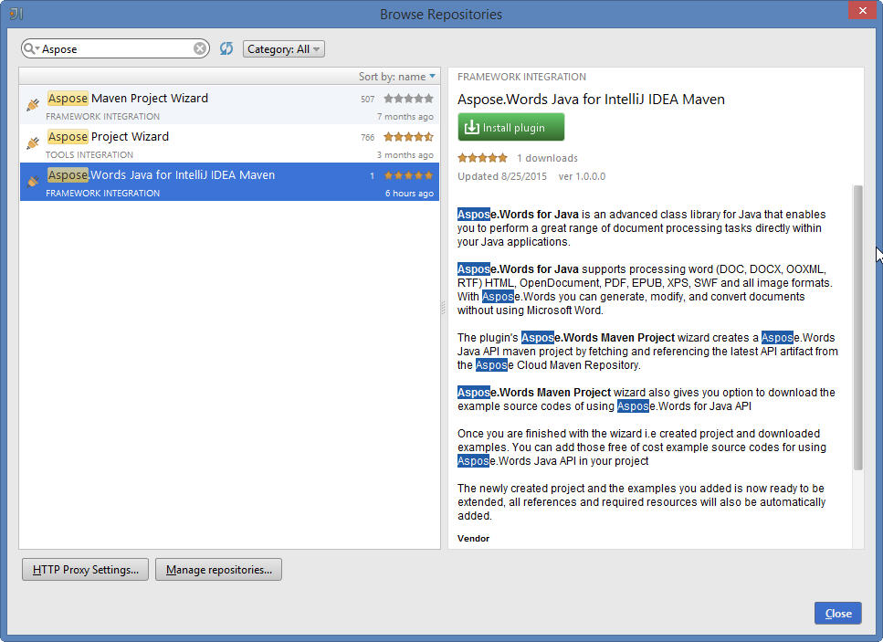

### Aspose.Words Maven Project Wizard

Installing this plugin will introduce a new project type – 

**Aspose.Words Maven Project** – into IntelliJ IDEA, which will enable you to create Aspose.Words Maven-based project for using [Aspose.Words for Java API](https://products.aspose.com/words/java/). 

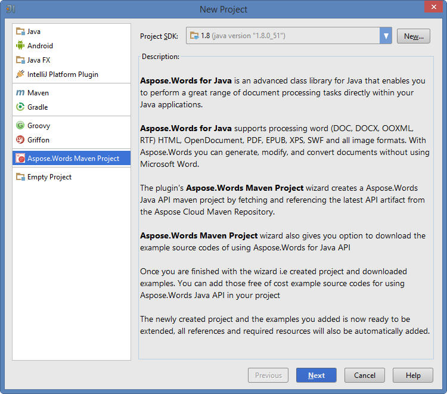

### Aspose.Words Examples Wizard

An option for creating [Source Code Examples of using Aspose.Words for Java API](https://github.com/aspose-words/Aspose.Words-for-Java/tree/master/Examples) inside the project, will also appear after the installation under "New" menu (using Right Click -> New **OR** File menu->New) – 

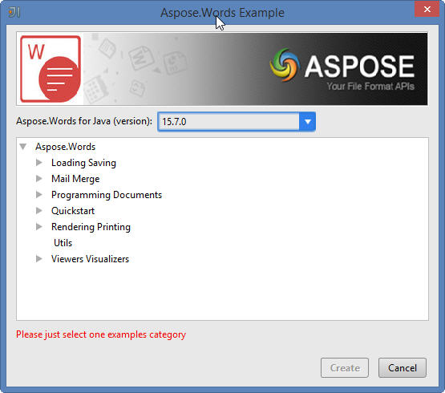

**Aspose.Words Examples**

## Using

### Using Aspose.Words Maven Project Wizard

To create Aspose.Words Maven project for using [Aspose.Words for Java API](https://products.aspose.com/words/java/) within IntelliJ IDEA, you need to have an internet connection.

Then follow the steps below:

1. Select **New Project**.
1. Select **Aspose.Words Maven Project** 
1. Click **Next**. 

1. Provide a **GroupId, ArtifactId** and **Version** for your maven project and click **Next.** 
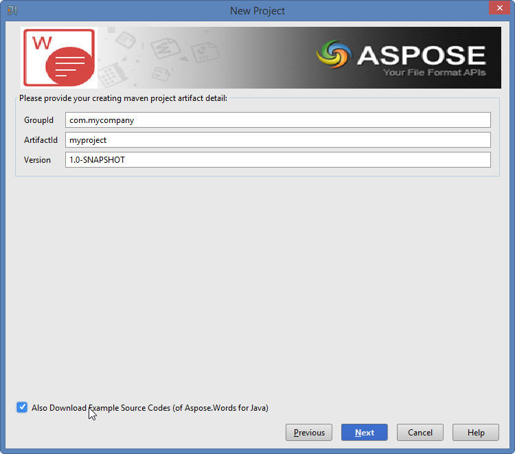 
You can select "Also Download Examples Source Code" checkbox to download the sample usage examples of the API (as shown in above snapshot)
1. Provide a **Project Name** and **Location** just like when creating any Java application 
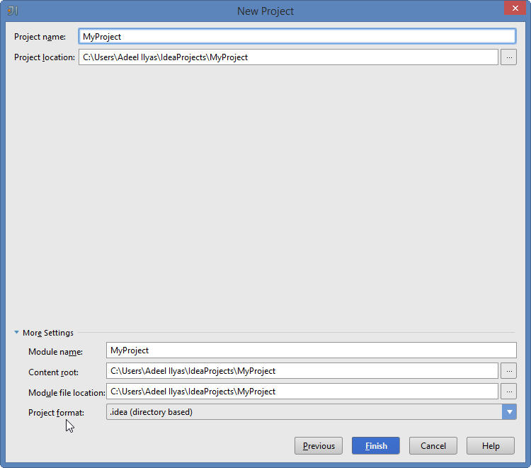
1. Click **Finish**. 
This will retrieve the [Aspose.Words for Java API](https://products.aspose.com/words/java/) latest maven dependency reference from Aspose Cloud Maven Repository and configure it in pom.xml 
If you have selected "Also Download Examples Source Code" checkbox. Downloading of the examples will also begin from the [Aspose.Words for Java API GitHub Repository](https://github.com/aspose-words/Aspose.Words-for-Java/tree/master/Examples) 
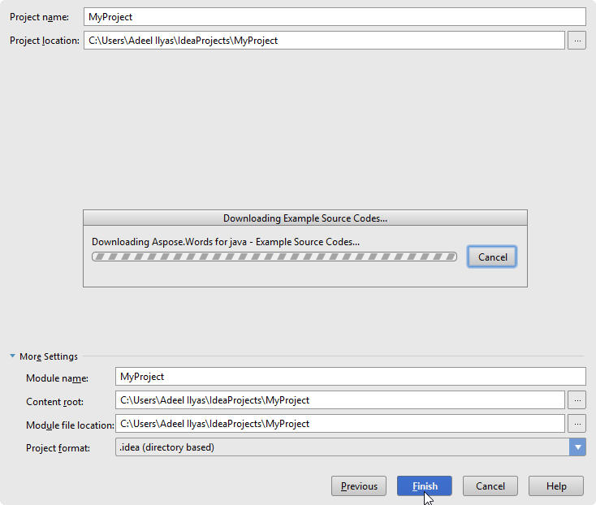 
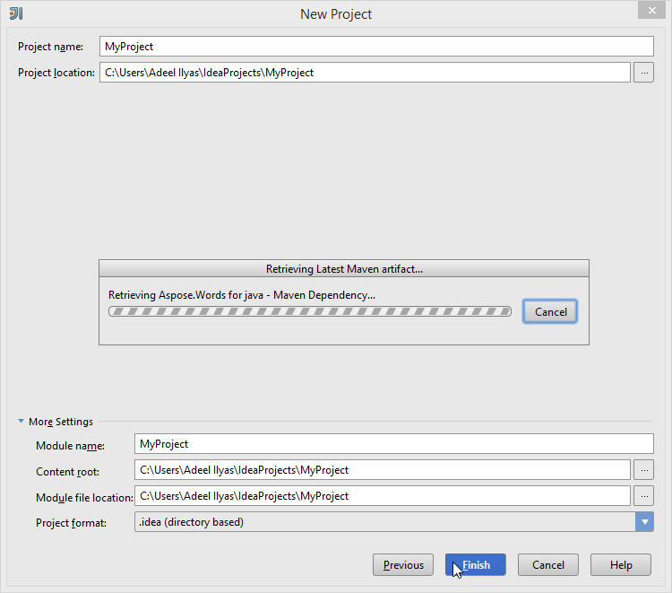 
Congratulations!  You have successfully created Aspose.Words Maven project for using [Aspose.Words for Java API](https://products.aspose.com/words/java/). 
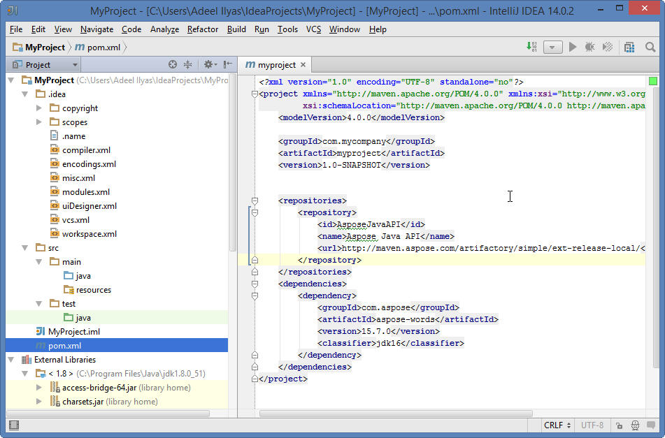 
The created Aspose.Words for Java API Maven project is ready to be modified as per your project’s requirements. 
If you have opted to download [Examples Source Codes](https://github.com/aspose-words/Aspose.Words-for-Java/tree/master/Examples), you can use [Aspose.Words Examples wizard](/words/java/installing-and-using-aspose-words-java-for-eclipse-maven/#installingandusingaspose-wordsjavaforeclipse-maven-aspose-wordscodeexample-wizard) to copy/create the downloaded examples into your project.

### Using Aspose.Words Examples Wizard

To create/copy [Examples Source Codes](https://github.com/aspose-words/Aspose.Words-for-Java/tree/master/Examples)into the project using **Aspose.Words Examples Wizard**, you need to first download the examples by opting  "Also Download Examples Source Code" on [Aspose.Words Maven Project Wizard.](/words/java/installing-and-using-aspose-words-java-for-eclipse-maven/#installingandusingaspose-wordsjavaforeclipse-maven-aspose-wordsmavenproject-wizard)

Then follow the steps below on IntelliJ IDEA:

1. Select **File** => **New -** As shown below: 
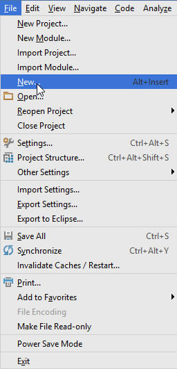 
-OR- **Right-Click** (on project window) => **New**  - As shown below: 

1. Select **Aspose.Words Example** Option from Menu - As shown below: 
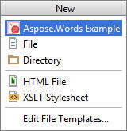 
The wizard will refresh/check for the latest available [Aspose.Words for Java API Examples](https://github.com/aspose-words/Aspose.Words-for-Java/tree/master/Examples) 
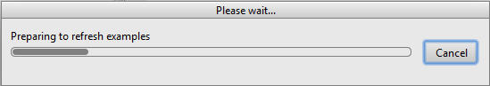
1. **Aspose.Words Examples wizard** dialog will appear, where you can select any examples category to create/copy the examples into your project 
Select any examples category and click **Create**: 
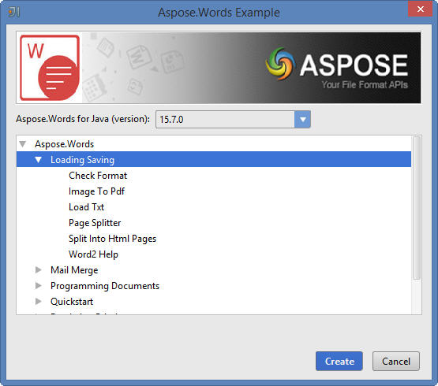
1. This will create/copy the selected category examples into the project under **com.aspose.words.examples** package. 
Also, any required resources for the execution of the examples will be copied to **src/main/resources** folder - As shown below: 
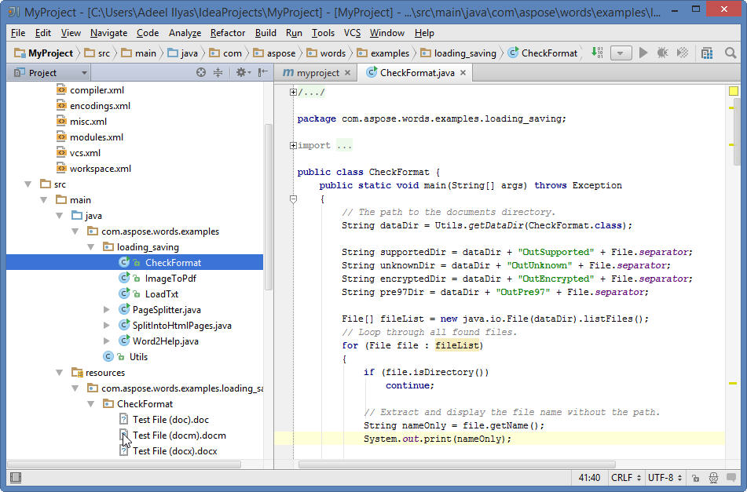 
Congratulations!  You have successfully done the following:
   1. You' have created Aspose.Words Maven Project using [Aspose.Words Maven Project Wizard](/words/java/installing-and-using-aspose-words-java-for-eclipse-maven/#installingandusingaspose-wordsjavaforeclipse-maven-aspose-wordsmavenproject-wizard),
   1. You have downloaded [Aspose.Words for Java API Examples Source Codes](https://github.com/aspose-words/Aspose.Words-for-Java/tree/master/Examples)
   1. You have created/copied Examples Source Codes into your project by using [Aspose.Words Examples Wizard](/words/java/installing-and-using-aspose-words-java-for-eclipse-maven/#installingandusingaspose-wordsjavaforeclipse-maven-aspose-wordscodeexample-wizard).
