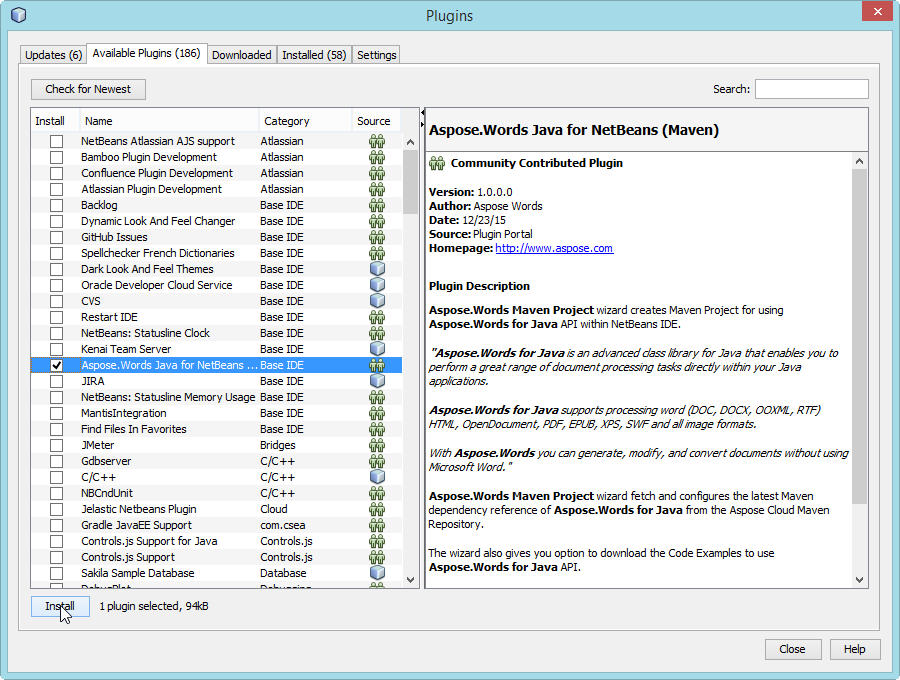
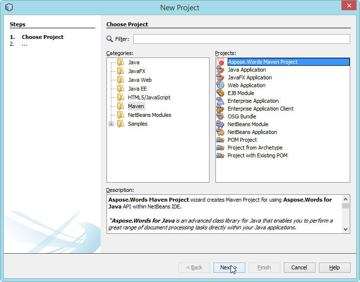
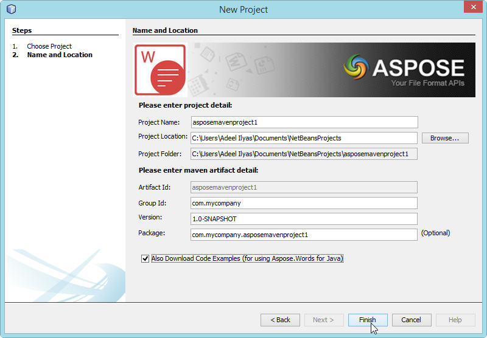
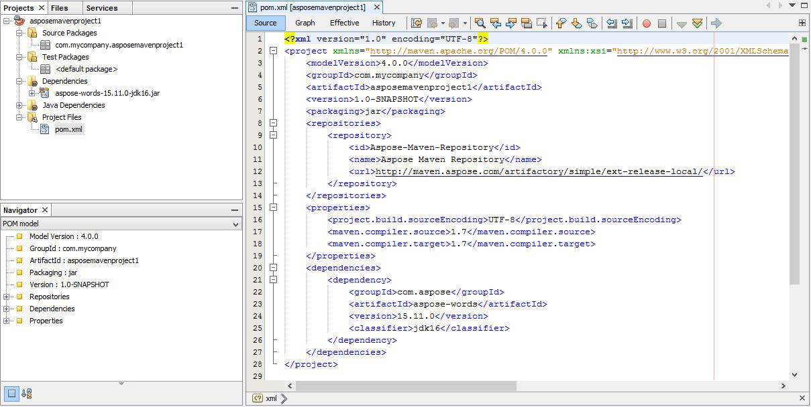
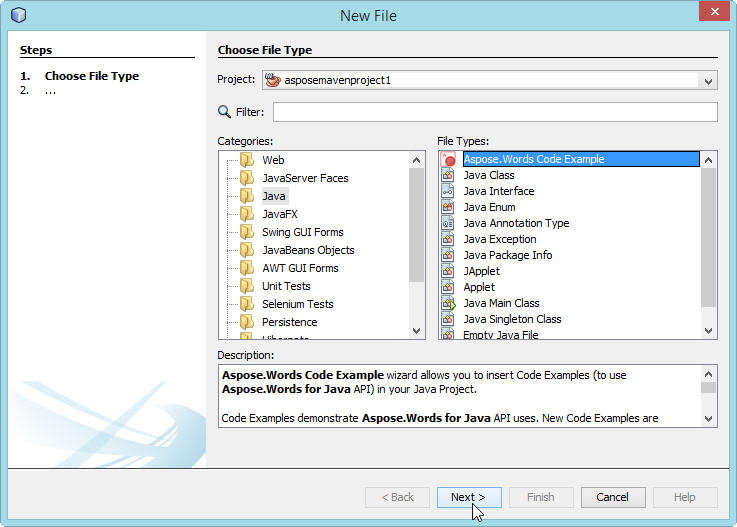
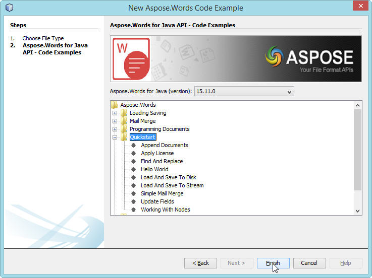
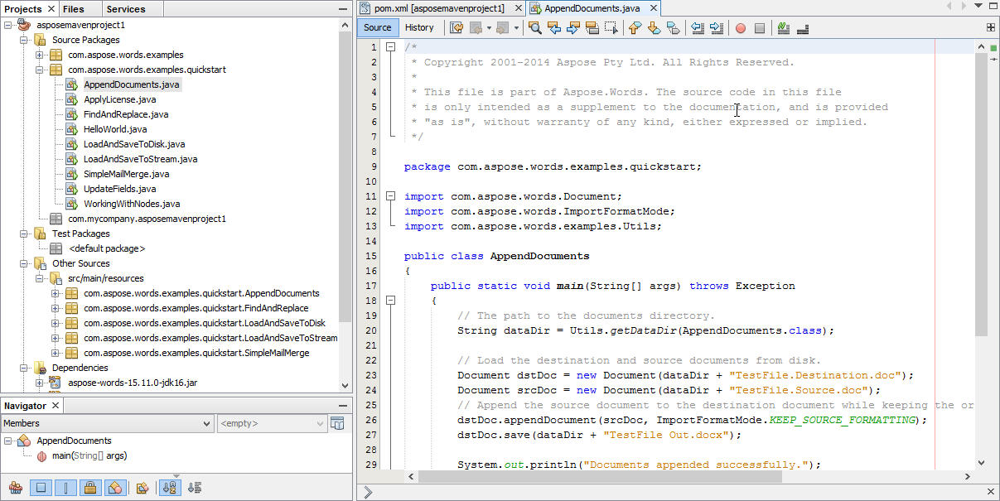

## Installing

**Aspose.Words Java for NetBeans (Maven)** plugin can be easily installed from the Available **Plugin** tab in the Plugin dialog.

- To open it, select **Plugins** from the **Tools** menu in NetBeans. 

- This adds the **Aspose.Words Maven Project** in New Project wizard and **Aspose.Words Code Example** in New File wizard of NetBeans IDE. 

## Using

### Aspose.Words Maven Project (wizard)

To create **Maven Project** by wizard for using [Aspose.Words for Java API](https://reference.aspose.com/words/java/):

1. Select **New Project**.
1. Select **Aspose.Words Maven Project** in the **Maven** category.
1. Click **Next**. 

1. Provide **Project Name, Location, GroupId, ArtifactId** and **Version** for your Maven Project and click **Finish.** 

1. This will retrieve the [Aspose.Words for Java](https://products.aspose.com/words/java/) latest Maven Dependency reference from [Aspose Cloud Maven Repository](https://releases.aspose.com/words/java/) and configure it in **pom.xml**. If you have opted for **Also Download Code Examples,** downloading of the **Code Examples** will also begin from the [Aspose.Words for Java API Examples Repository. ](https://github.com/aspose-words/Aspose.Words-for-Java/tree/master/Examples)
1. Following **Maven** Project will be created on your **NetBeans IDE** on completion of the wizard: 

1. The created **Maven Project** is configured to use **Aspose.Words for Java API** and ready to be enhanced as per your Project requirements. 
   If you have opted to download [Code Examples](https://github.com/aspose-words/Aspose.Words-for-Java/tree/master/Examples), you can use **Aspose.Words Code Example (wizard)** for importing needed **Code Examples** of [Aspose.Words for Java](https://products.aspose.com/words/java/) API into your project.

### Aspose.Words Code Example (wizard)

**Aspose.Words Code Example wizard** allows you to try out many samples provided for [Aspose.Words for Java](https://products.aspose.com/words/java/) API.

{}

To be able to use **Aspose.Words Code Example wizard** comfortably: it is recommended to always select **Also Download Code Examples** while creating **Maven Project** on **Aspose.Words Maven Project** **wizard**, 

{}

To use examples, just:

1. Click **New File** in **NetBeans**.
1. Choose your project and then select **Aspose.Words Code Example** in the **Java** category.
1. Click **Next**. 

1. Expand the tree to select **Code Example** category and click **Finish**. 

1. This will copy the selected category **Code Examples** Java files into the project under **com.aspose.words.examples** package. Also any required resources needed by the Code Examples will be copied into **src/main/resources** folder, as shown below: 

1. Review the example code, compile and run.
1. You can now test other examples and start building your own application using [Aspose.Words for Java API](https://reference.aspose.com/words/java/).
