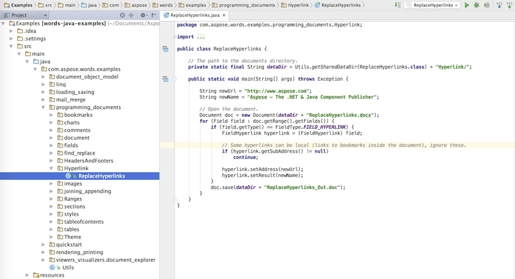

Aspose.Words for Java supports the following Java versions:

- J2SE 6.0 (1.6)
- J2SE 7.0 (1.7)
- J2SE 8.0 (1.8)
- J2SE 9.0 (1.9) and later

Aspose.Words for Java is written entirely in Java, depends only on the standard Java libraries, and can be used in any Java application on any platform supported by Java.

Aspose.Words for Java is provided as a ZIP download and contains the following: 

- Aspose.Words.jar libraries for different Java versions
- Demo projects
- Aspose.Words Documentation in HTML format

