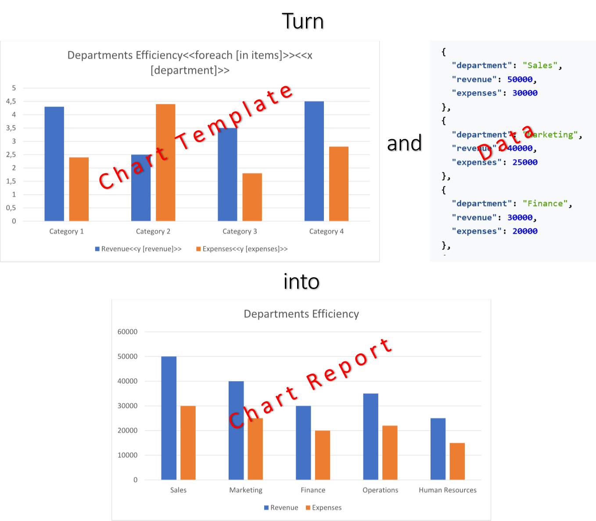

[Charts](https://en.wikipedia.org/wiki/Chart) transform complex data into visually engaging insights, making information
easier to digest and understand at a glance. By presenting trends and comparisons in a clear format, they empower
decision-makers to draw conclusions quickly and confidently. You can make a chart by filling a template document with
data using LINQ Reporting Engine in C#.\
\

To learn more on how to make a chart of a particular type with LINQ Reporting Engine in C# and use advanced features of
chart building, please refer to the following sections:



{}