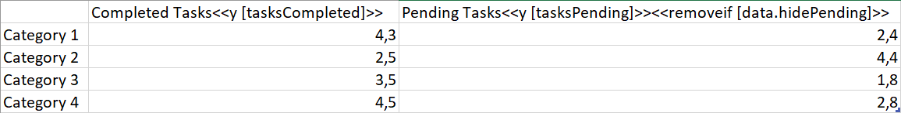
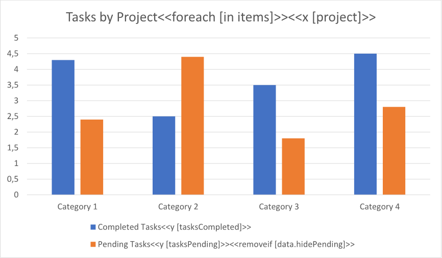
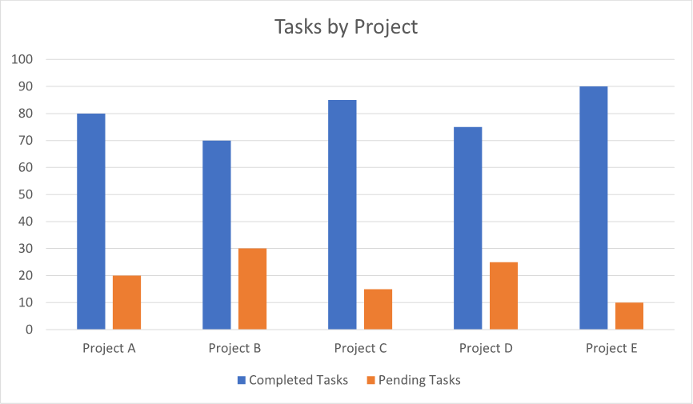
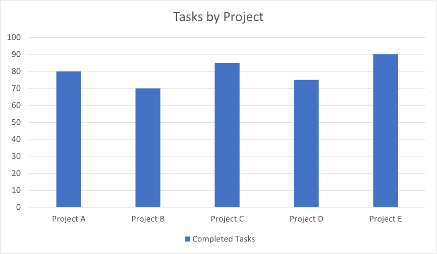

A chart with a variable number of series allows for flexible visualization of changing or diverse data sets, enabling
easy comparison and trend identification. It provides a comprehensive view of the data and enhances data analysis
capabilities. You can make a chart with a variable number of series using LINQ Reporting Engine in C#.

{}

Although this guide deals with a column chart, you can apply a similar approach to other chart types as well.

{}

## How to Build a Chart with a Variable Number of Series

1. Prepare data for your chart in one of [formats supported by LINQ Reporting Engine](),
for example, a JSON file as follows:




2. In Microsoft Word, [create a
chart](https://support.microsoft.com/en-us/office/add-a-chart-to-your-document-in-word-ff48e3eb-5e04-4368-a39e-20df7c798932)
and [format its
elements](https://support.microsoft.com/en-us/office/format-elements-of-a-chart-b6c787d5-f90a-41d2-a901-9d3ed9f0dbf0)
to use it as a template.

3. [Add or remove data
series](https://support.microsoft.com/en-us/office/add-a-data-series-to-your-chart-25340cfb-3fa3-428c-82cf-79983125df12)
to fit the maximum possible number of series as per your requirements and format the series as well.

4. Bind the chart to a data collection by adding a `foreach` tag to the end of the chart's title as per the example:

<<foreach [in items]>>


5. Bind categories of the chart to a value calculated upon an item of the collection by appending an `x` tag to
the chart's title, for instance, like so:

<<x [project]>>


6. For each of the chart's series, bind its data to a numeric value calculated upon an item of the collection by adding
a `y` tag to the series' name and optionally bind exclusion of the series to a Boolean value by adding a `removeif` tag
to the series' name similarly to the screenshot:\
\

7. Review your chart template before saving, it should look like this:\
\

8. Build your chart using LINQ Reporting Engine by running the following C# code:\


## Chart with a Variable Number of Series Report Example

After taking all the steps, LINQ Reporting Engine creates a chart report with all the series included as follows:\
\

Now, let us consider the alternative case where data for the chart implies exclusion of one of the series, for example,
like so:




After running the same code with the JSON file being used instead, LINQ Reporting Engine generates a chart report with
one of the series excluded like this:\
\

Thus, you can control which chart series to show or hide based on conditions.

{}

You can download the [template
](https://github.com/aspose-words/Aspose.Words-for-.NET/raw/ivan.lyagin/UEX-331/Examples/Data/LINQ/Chart%20with%20Variable%20Number%20of%20Series%20Template.docx)
and [data
](https://github.com/aspose-words/Aspose.Words-for-.NET/raw/ivan.lyagin/UEX-331/Examples/Data/LINQ/Chart%20with%20Variable%20Number%20of%20Series%20Data%201.json)
from the example, and try to make a chart with a variable number of series online for free by using one of the options:\
<a class="product-item docs-btn" href="https://products.aspose.app/words/assembly" >APP </a>
<a class="product-item docs-btn" href="https://products.aspose.com/words/net/report/" >.NET API </a>
<a class="product-item docs-btn" href="https://products.aspose.com/words/python-net/report/" >
PYTHON via <em class="docs-vianet">net</em> API</a>
 
 

{}

## See Also

- [Building Charts]()
- [Binding Collections]()
- [LINQ Reporting Engine]()
- [ReportingEngine Class](https://reference.aspose.com/words/net/aspose.words.reporting/reportingengine/)

{}