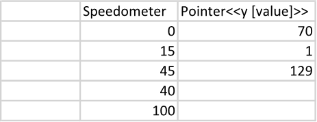

A gauge (or speedometer) chart is useful for visually representing a single value within a specific range, allowing
for quick and easy comparison to predefined thresholds or goals. It provides a clear and intuitive way to communicate
progress, performance, or status at a glance. You can make a gauge chart using LINQ Reporting Engine in C#.

{}
Although gauge charts are not natively supported by Microsoft Word, it is possible to mimic them using a combination of
donut and pie chart series as shown further in this guide.
{}

## How to Build a Gauge Chart

1. Prepare data for your gauge chart in one of [formats supported by LINQ Reporting Engine](),
for example, a JSON file as follows:




2. In Microsoft Word, start from [creating a donut
chart](https://support.microsoft.com/en-us/office/add-a-chart-to-your-document-in-word-ff48e3eb-5e04-4368-a39e-20df7c798932)
and take steps described at the video:

 

3. [Add a title to the
chart](https://support.microsoft.com/en-us/office/add-or-remove-titles-in-a-chart-4cf3c009-1482-4908-922a-997c32ea8250).

4. Bind the chart to an array of numbers representing the pointer series from the video by adding a `foreach` tag to
the end of the chart's title as per the example:

<<foreach [value in new double?[] { pointer, 1, 199 - pointer }]>>


5. Bind categories of the chart to *any* value - such as an empty string - by appending an `x` tag to the chart's title,
for instance, like so:

<<x [""]>>


6. Bind data of the pointer series to an item of the array by adding a `y` tag to the series' name similarly to the screenshot:\
\

7. Review your gauge chart template before saving, it should look like this:\
\

8. Build your gauge chart using LINQ Reporting Engine by running the following C# code:\


## Gauge Chart Report Example

After taking all the steps, LINQ Reporting Engine creates a gauge chart report as follows:\
\

{}

You can download the [template
](https://github.com/aspose-words/Aspose.Words-for-.NET/raw/ivan.lyagin/UEX-331/Examples/Data/LINQ/Gauge%20Chart%20Template.docx)
and [data
](https://github.com/aspose-words/Aspose.Words-for-.NET/raw/ivan.lyagin/UEX-331/Examples/Data/LINQ/Gauge%20Chart%20Data.json)
from the example, and try to make a gauge chart online for free by using one of the options:\
<a class="product-item docs-btn" href="https://products.aspose.app/words/assembly" >APP </a>
<a class="product-item docs-btn" href="https://products.aspose.com/words/net/report/" >.NET API </a>
<a class="product-item docs-btn" href="https://products.aspose.com/words/python-net/report/" >
PYTHON via <em class="docs-vianet">net</em> API</a>
 
 

{}

## See Also

- [Building Charts]()
- [Binding Collections]()
- [LINQ Reporting Engine]()
- [ReportingEngine Class](https://reference.aspose.com/words/net/aspose.words.reporting/reportingengine/)

{}