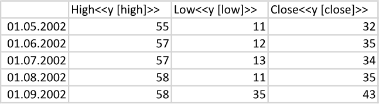
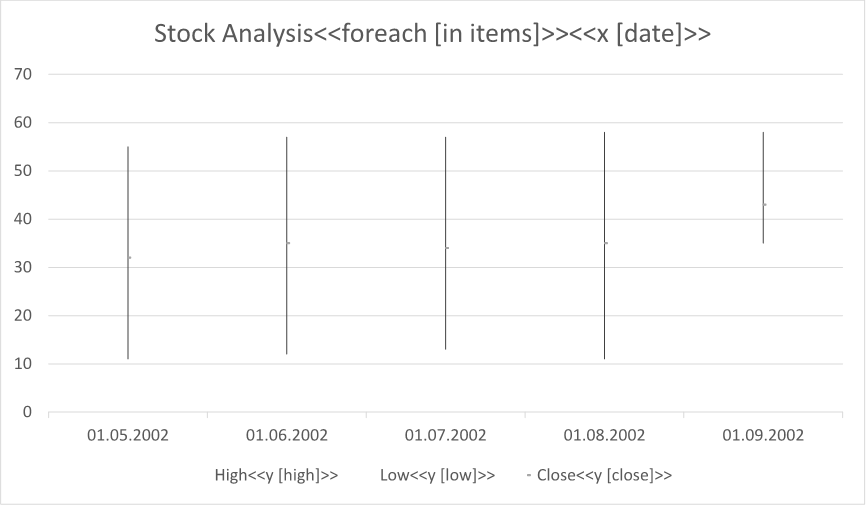
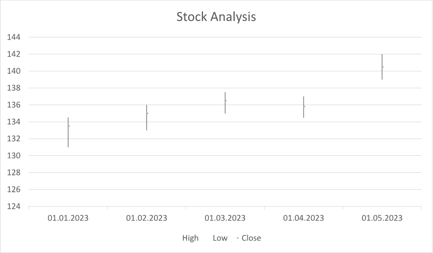

A [stock chart](https://en.wikipedia.org/wiki/Candlestick_chart) is useful for visualizing the historical performance
of a stock over time, allowing investors to identify trends and patterns. It can help investors make informed decisions
based on past price movements and predict potential future price movements. You can make a stock chart using LINQ Reporting
Engine in C#.

## How to Build a Stock Chart

1. Prepare data for your stock chart in one of [formats supported by LINQ Reporting Engine](),
for example, a JSON file as follows:




2. In Microsoft Word, [create a stock
chart](https://support.microsoft.com/en-us/office/add-a-chart-to-your-document-in-word-ff48e3eb-5e04-4368-a39e-20df7c798932)
and [format its
elements](https://support.microsoft.com/en-us/office/format-elements-of-a-chart-b6c787d5-f90a-41d2-a901-9d3ed9f0dbf0)
to use it as a template.

3. Bind the chart to a data collection by adding a `foreach` tag to the end of the chart's title as per the example:

<<foreach [in items]>>


4. Bind categories of the chart to a value calculated upon an item of the collection by appending an `x` tag to
the chart's title, for instance, like so:

<<x [date]>>


5. For each of the chart's series, bind its data to a numeric value calculated upon an item of the collection by adding
a `y` tag to the series' name similarly to the screenshot:\
\

6. Review your stock chart template before saving, it should look like this:\
\

7. Build your stock chart using LINQ Reporting Engine by running the following C# code:\


## Stock Chart Report Example

After taking all the steps, LINQ Reporting Engine creates a stock chart report as follows:\
\

{}

You can download the [template
](https://github.com/aspose-words/Aspose.Words-for-.NET/raw/ivan.lyagin/UEX-331/Examples/Data/LINQ/Stock%20Chart%20Template.docx)
and [data
](https://github.com/aspose-words/Aspose.Words-for-.NET/raw/ivan.lyagin/UEX-331/Examples/Data/LINQ/Stock%20Chart%20Data.json)
from the example, and try to make a stock chart online for free by using one of the options:\
<a class="product-item docs-btn" href="https://products.aspose.app/words/assembly" >APP </a>
<a class="product-item docs-btn" href="https://products.aspose.com/words/net/report/" >.NET API </a>
<a class="product-item docs-btn" href="https://products.aspose.com/words/python-net/report/" >
PYTHON via <em class="docs-vianet">net</em> API</a>
 
 

{}

## See Also

- [Building Charts]()
- [Binding Collections]()
- [LINQ Reporting Engine]()
- [ReportingEngine Class](https://reference.aspose.com/words/net/aspose.words.reporting/reportingengine/)

{}