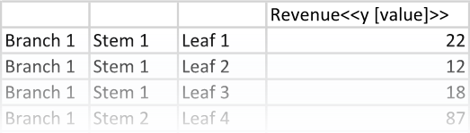
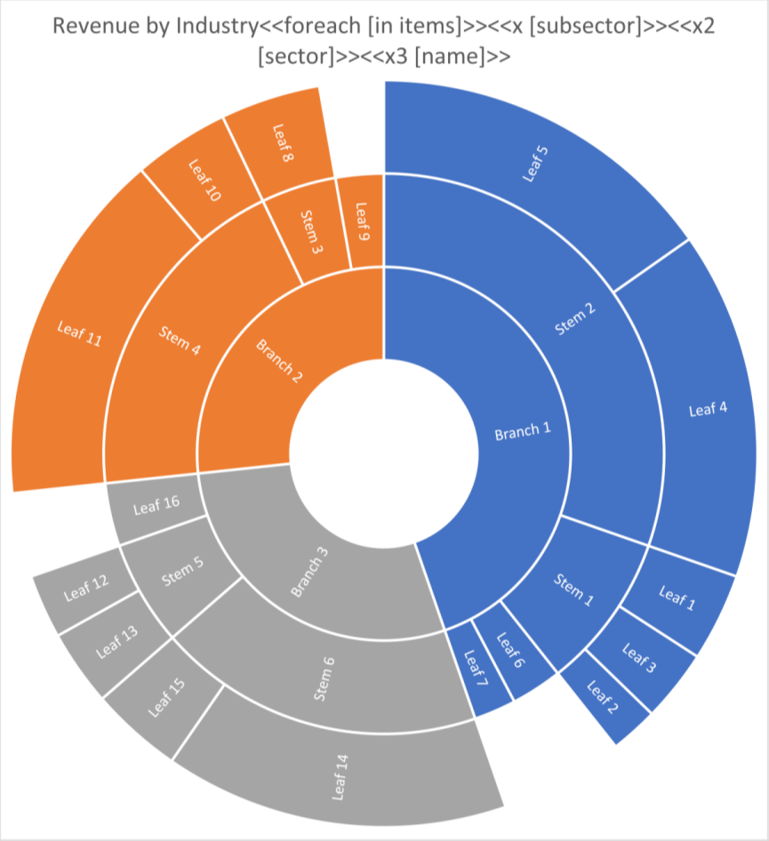
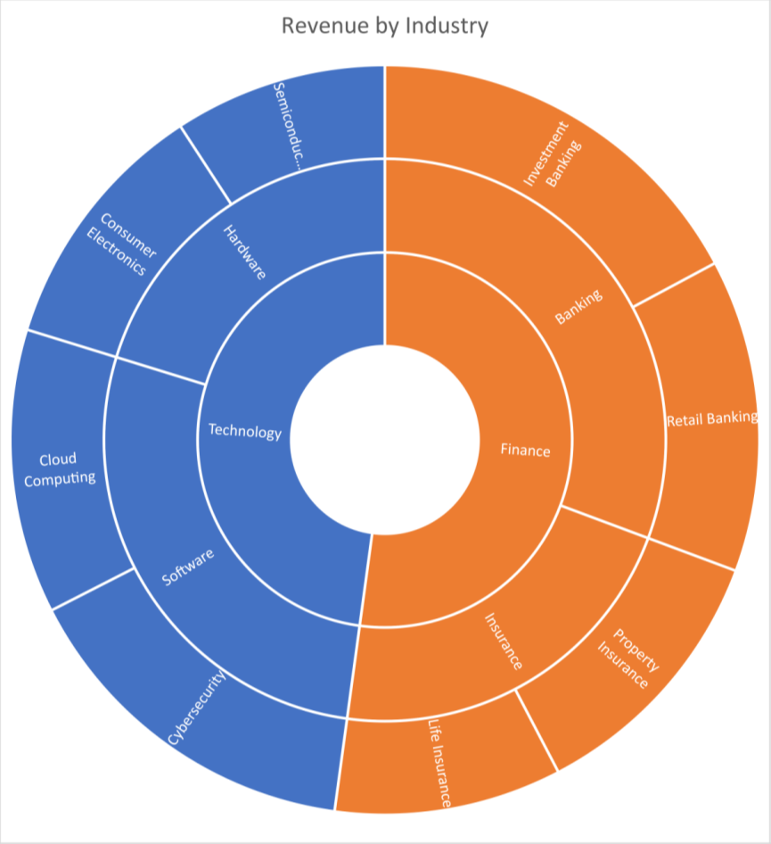

A [sunburst chart](https://en.wikipedia.org/wiki/Pie_chart#Ring) is useful for visualizing hierarchical data in a circular
format, showing how the data is divided into different levels. It allows users to easily see the overall structure of
the data and identify patterns and relationships between different categories. You can make a sunburst chart using LINQ
Reporting Engine in C#.

## How to Build a Sunburst Chart

1. Prepare data for your sunburst chart in one of [formats supported by LINQ Reporting Engine](),
for example, a JSON file as follows:




2. In Microsoft Word, [create a sunburst
chart](https://support.microsoft.com/en-us/office/add-a-chart-to-your-document-in-word-ff48e3eb-5e04-4368-a39e-20df7c798932)
and [format its
elements](https://support.microsoft.com/en-us/office/format-elements-of-a-chart-b6c787d5-f90a-41d2-a901-9d3ed9f0dbf0)
to use it as a template.

3. Bind the chart to a data collection by adding a `foreach` tag to the end of the chart's title as per the example:

<<foreach [in items]>>


4. Bind leaves, stems, and branches of the chart to string values calculated upon an item of the collection by appending
`x`, `x2`, and `x3` tags to the chart's title respectively, for instance, like so:

<<x [subsector]>><<x2 [sector]>><<x3 [name]>>


5. Bind data of the chart's series to a numeric value calculated upon an item of the collection by adding
a `y` tag to the series' name similarly to the screenshot:\
\

6. Review your sunburst chart template before saving, it should look like this:\
\

7. Build your sunburst chart using LINQ Reporting Engine by running the following C# code:\


## Sunburst Chart Report Example

After taking all the steps, LINQ Reporting Engine creates a sunburst chart report as follows:\
\

{}

You can download the [template
](https://github.com/aspose-words/Aspose.Words-for-.NET/raw/ivan.lyagin/UEX-331/Examples/Data/LINQ/Sunburst%20Chart%20Template.docx)
and [data
](https://github.com/aspose-words/Aspose.Words-for-.NET/raw/ivan.lyagin/UEX-331/Examples/Data/LINQ/Sunburst%20Chart%20Data.json)
from the example, and try to make a sunburst chart online for free by using one of the options:\
<a class="product-item docs-btn" href="https://products.aspose.app/words/assembly" >APP </a>
<a class="product-item docs-btn" href="https://products.aspose.com/words/net/report/" >.NET API </a>
<a class="product-item docs-btn" href="https://products.aspose.com/words/python-net/report/" >
PYTHON via <em class="docs-vianet">net</em> API</a>
 
 

{}

## See Also

- [Building Charts]()
- [Binding Collections]()
- [LINQ Reporting Engine]()
- [ReportingEngine Class](https://reference.aspose.com/words/net/aspose.words.reporting/reportingengine/)

{}