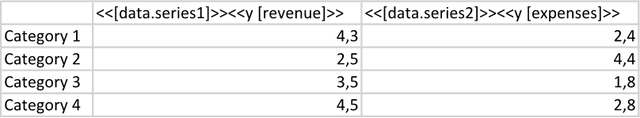
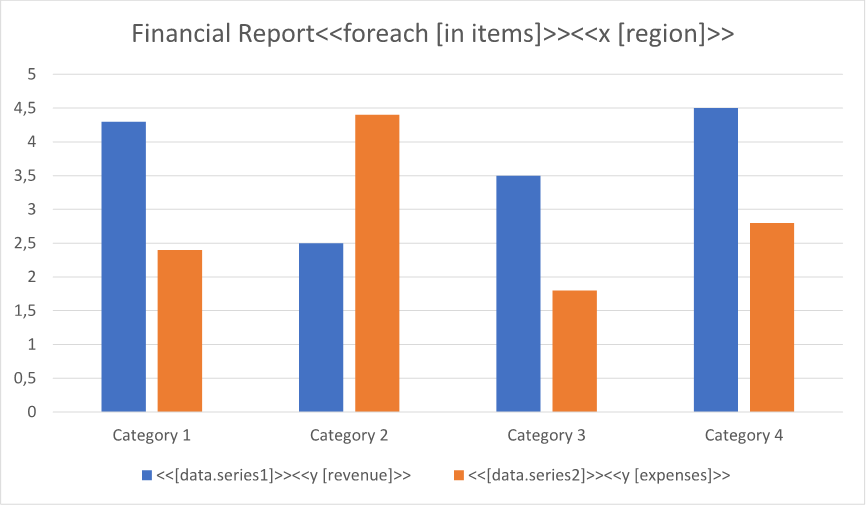
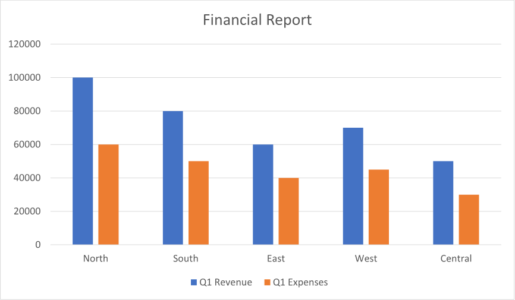

A chart with changing legend entries allows for easy identification of different data series as they are updated or modified.
This can help users track changes over time and make comparisons between different data sets more effectively. You can make
a chart with changing legend entries using LINQ Reporting Engine in C#.

{}

Although this guide deals with a column chart, you can apply a similar approach to other chart types as well.

{}

## How to Build a Chart with Changing Legend Entries

1. Prepare data for your chart in one of [formats supported by LINQ Reporting Engine](),
for example, a JSON file as follows:




2. In Microsoft Word, [create a
chart](https://support.microsoft.com/en-us/office/add-a-chart-to-your-document-in-word-ff48e3eb-5e04-4368-a39e-20df7c798932)
and [format its
elements](https://support.microsoft.com/en-us/office/format-elements-of-a-chart-b6c787d5-f90a-41d2-a901-9d3ed9f0dbf0)
to use it as a template.

3. [Add or remove data
series](https://support.microsoft.com/en-us/office/add-a-data-series-to-your-chart-25340cfb-3fa3-428c-82cf-79983125df12)
as per your requirements and format the series as well.

4. Bind the chart to a data collection by adding a `foreach` tag to the end of the chart's title as per the example:

<<foreach [in items]>>


5. Bind categories of the chart to a value calculated upon an item of the collection by appending an `x` tag to
the chart's title, for instance, like so:

<<x [region]>>


6. For each of the chart's series, bind its name to a value by replacing the default name with an expression tag and bind data
of the series to a numeric value calculated upon an item of the collection by adding a `y` tag to the series' name similarly
to the screenshot:\
\

7. Review your chart template before saving, it should look like this:\
\

8. Build your chart using LINQ Reporting Engine by running the following C# code:\


## Chart with Changing Legend Entries Report Example

After taking all the steps, LINQ Reporting Engine creates a chart report as follows:\
\

{}

You can download the [template
](https://github.com/aspose-words/Aspose.Words-for-.NET/raw/ivan.lyagin/UEX-331/Examples/Data/LINQ/Chart%20with%20Changing%20Legend%20Entries%20Template.docx)
and [data
](https://github.com/aspose-words/Aspose.Words-for-.NET/raw/ivan.lyagin/UEX-331/Examples/Data/LINQ/Chart%20with%20Changing%20Legend%20Entries%20Data.json)
from the example, and try to make a chart with changing legend entries online for free by using one of the options:\
<a class="product-item docs-btn" href="https://products.aspose.app/words/assembly" >APP </a>
<a class="product-item docs-btn" href="https://products.aspose.com/words/net/report/" >.NET API </a>
<a class="product-item docs-btn" href="https://products.aspose.com/words/python-net/report/" >
PYTHON via <em class="docs-vianet">net</em> API</a>
 
 

{}

## See Also

- [Building Charts]()
- [Binding Collections]()
- [LINQ Reporting Engine]()
- [ReportingEngine Class](https://reference.aspose.com/words/net/aspose.words.reporting/reportingengine/)

{}