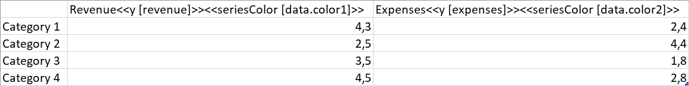
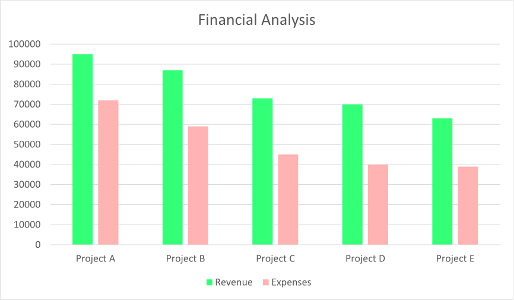

A chart with changing series colors can help distinguish between different data sets more easily, making it easier to
interpret the information being presented. It can also make the chart more visually appealing and engaging, helping to
draw the viewer's attention to key points or trends. You can make a chart with changing series colors using LINQ Reporting
Engine in C#.

{}

Although this guide deals with a column chart, you can apply a similar approach to other chart types as well.

{}

## How to Build a Chart with Changing Series Colors

1. Prepare data for your chart in one of [formats supported by LINQ Reporting Engine](),
for example, a JSON file as follows:




2. In Microsoft Word, [create a
chart](https://support.microsoft.com/en-us/office/add-a-chart-to-your-document-in-word-ff48e3eb-5e04-4368-a39e-20df7c798932)
and [format its
elements](https://support.microsoft.com/en-us/office/format-elements-of-a-chart-b6c787d5-f90a-41d2-a901-9d3ed9f0dbf0)
to use it as a template.

3. [Add or remove data
series](https://support.microsoft.com/en-us/office/add-a-data-series-to-your-chart-25340cfb-3fa3-428c-82cf-79983125df12)
as per your requirements and format the series as well.

4. Bind the chart to a data collection by adding a `foreach` tag to the end of the chart's title as per the example:

<<foreach [in items]>>


5. Bind categories of the chart to a value calculated upon an item of the collection by appending an `x` tag to
the chart's title, for instance, like so:

<<x [project]>>


6. For each of the chart's series, bind its data to a numeric value calculated upon an item of the collection by adding
a `y` tag to the series' name and optionally bind the color of the series to a [color value
]() by adding a `seriesColor` tag to the series' name similarly to the screenshot:\
\

7. Review your chart template before saving, it should look like this:\
\

8. Build your chart using LINQ Reporting Engine by running the following C# code:\


## Chart with Changing Series Colors Report Example

After taking all the steps, LINQ Reporting Engine creates a chart report as follows:\
\

{}

You can download the [template
](https://github.com/aspose-words/Aspose.Words-for-.NET/raw/ivan.lyagin/UEX-331/Examples/Data/LINQ/Chart%20with%20Changing%20Series%20Colors%20Template.docx)
and [data
](https://github.com/aspose-words/Aspose.Words-for-.NET/raw/ivan.lyagin/UEX-331/Examples/Data/LINQ/Chart%20with%20Changing%20Series%20Colors%20Data.json)
from the example, and try to make a chart with changing series colors online for free by using one of the options:\
<a class="product-item docs-btn" href="https://products.aspose.app/words/assembly" >APP </a>
<a class="product-item docs-btn" href="https://products.aspose.com/words/net/report/" >.NET API </a>
<a class="product-item docs-btn" href="https://products.aspose.com/words/python-net/report/" >
PYTHON via <em class="docs-vianet">net</em> API</a>
 
 

{}

{}

## See Also

- [Building Charts]()
- [Binding Collections]()
- [LINQ Reporting Engine]()
- [ReportingEngine Class](https://reference.aspose.com/words/net/aspose.words.reporting/reportingengine/)

{}