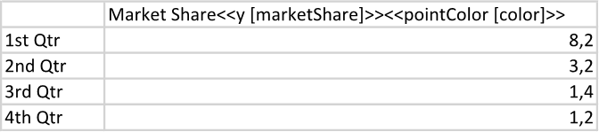
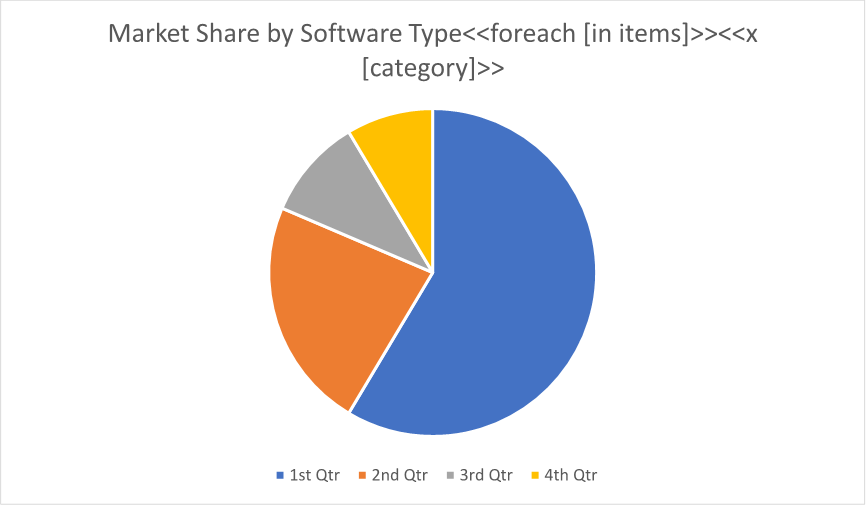
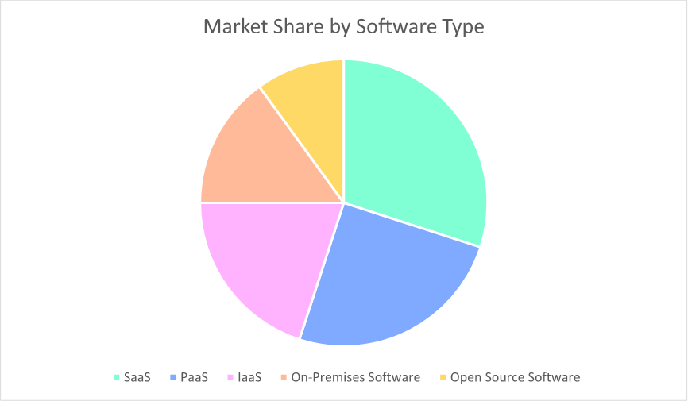

A chart with changing series point colors is useful for visually highlighting trends or patterns within the data, making
it easier for viewers to interpret and understand the information being presented. By using different colors for each series
point, the chart can help draw attention to specific data points or comparisons, enhancing the overall clarity and impact of
the visualization. You can make a chart with changing series point colors using LINQ Reporting Engine in C#.

{}

Although this guide deals with a pie chart, you can apply a similar approach to other chart types as well. The only exceptions
are histogram and box and whisker charts. Also, for treemap and sunburst charts, changing of series point colors works only
for leaves.

{}

## How to Build a Chart with Changing Series Point Colors

1. Prepare data for your chart in one of [formats supported by LINQ Reporting Engine](),
for example, a JSON file as follows:




2. In Microsoft Word, [create a
chart](https://support.microsoft.com/en-us/office/add-a-chart-to-your-document-in-word-ff48e3eb-5e04-4368-a39e-20df7c798932)
and [format its
elements](https://support.microsoft.com/en-us/office/format-elements-of-a-chart-b6c787d5-f90a-41d2-a901-9d3ed9f0dbf0)
to use it as a template.

3. [Add or remove data
series](https://support.microsoft.com/en-us/office/add-a-data-series-to-your-chart-25340cfb-3fa3-428c-82cf-79983125df12)
as per your requirements and format the series as well.

4. Bind the chart to a data collection by adding a `foreach` tag to the end of the chart's title as per the example:

<<foreach [in items]>>


5. Bind categories of the chart to a value calculated upon an item of the collection by appending an `x` tag to
the chart's title, for instance, like so:

<<x [category]>>


6. For each of the chart's series, bind its data to a numeric value calculated upon an item of the collection by adding
a `y` tag to the series' name and optionally bind the series' point colors to a [color value
]() also calculated upon an item of the collection by adding a `pointColor` tag to
the series' name similarly to the screenshot:\
\

7. Review your chart template before saving, it should look like this:\
\

8. Build your chart using LINQ Reporting Engine by running the following C# code:\


## Chart with Changing Series Point Colors Report Example

After taking all the steps, LINQ Reporting Engine creates a chart report as follows:\
\

{}

You can download the [template
](https://github.com/aspose-words/Aspose.Words-for-.NET/raw/ivan.lyagin/UEX-331/Examples/Data/LINQ/Chart%20with%20Changing%20Series%20Point%20Colors%20Template.docx)
and [data
](https://github.com/aspose-words/Aspose.Words-for-.NET/raw/ivan.lyagin/UEX-331/Examples/Data/LINQ/Chart%20with%20Changing%20Series%20Point%20Colors%20Data.json)
from the example, and try to make a chart with changing series point colors online for free by using one of the options:\
<a class="product-item docs-btn" href="https://products.aspose.app/words/assembly" >APP </a>
<a class="product-item docs-btn" href="https://products.aspose.com/words/net/report/" >.NET API </a>
<a class="product-item docs-btn" href="https://products.aspose.com/words/python-net/report/" >
PYTHON via <em class="docs-vianet">net</em> API</a>
 
 

{}

{}

## See Also

- [Building Charts]()
- [Binding Collections]()
- [LINQ Reporting Engine]()
- [ReportingEngine Class](https://reference.aspose.com/words/net/aspose.words.reporting/reportingengine/)

{}