This section contains examples of templates for typical scenarios. Every example is given using one of the following data source objects:

- `manager`, an instance of the `Manager` class
- `managers`, an enumeration of instances of the `Manager` class
- `contracts`, an enumeration of instances of the `Contract` class
- `clients`, an enumeration of instances of the `Client` class

The `Manager`, `Contract`, and `Client` classes are defined as follows.


public class Manager
{
	public String Name { get { ... } }
	public int Age { get { ... } }
	public byte[] Photo { get { ... } }
	public Country Country { get { ... } }
	public IEnumerable<Contract> Contracts { get { ... } }
	...
}

public class Country
{
	public String Name { get { ... } }
	...
}

public class Contract
{
	public Manager Manager { get { ... } }
	public Client Client { get { ... } }
	public float Price { get { ... } }
	public DateTime Date { get { ... } }
	...
}

public class Client
{
	public String Name { get { ... } }
	...
}


## Single-Row Template

### Template Example

|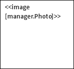 | Name: &lt;&lt;[manager.Name]&gt;&gt;   Age: &lt;&lt;[manager.Age]&gt;&gt; |
| :- | :- |

### Report Example

||Name: John Smith   Age: 37 |
| :- | :- |

## In-Paragraph List Template

### Template Example


We provide support for the following clients: <<foreach [in clients]>><<[IndexOf() != 0 ? “, ” : “”]>><<[Name]>><</foreach>>


### Report Example


We provide support for the following clients: A Company, B Ltd., C & D, E Corp., F & Partners, G & Co., H Group, I & Sons, J Ent.


## Bulleted List Template

### Template Example


We provide support for the following clients:
    * <<foreach [in clients]>><<[Name]>>
<</foreach>>


### Report Example


We provide support for the following clients:
    * A Company
    * B Ltd.
    * C & D
    * E Corp.
    * F & Partners
    * G & Co.
    * H Group
    * I & Sons
    * J Ent.


## Numbered List Template

### Template Example


We provide support for the following clients:
    1. <<foreach [in clients]>><<[Name]>>
<</foreach>>


### Report Example


We provide support for the following clients:
    1. A Company
    2. B Ltd.
    3. C & D
    4. E Corp.
    5. F & Partners
    6. G & Co.
    7. H Group
    8. I & Sons
    9. J Ent.


## Multicolored Numbered List Template

### Template Example

<table class="conditional block">
	<tbody>
		<tr>
      <td>
We provide support for the following clients:

1. &lt;&lt;foreach [in clients]>>&lt;&lt;if [IndexOf() % 2 == 0]>>&lt;&lt;[Name]>>

2. &lt;&lt;else>>&lt;&lt;[Name]>>

&lt;&lt;/if>>&lt;&lt;/foreach>>
</td>
		</tr>
	</tbody>
</table>

### Report Example

<table class="conditional block">
	<tbody>
		<tr>
      <td>
We provide support for the following clients:

1. A Company

2. B Ltd.

3. C & D

4. E Corp.

5. F & Partners

6. G & Co.

7. H Group

8. I & Sons

9. J Ent.
</td>
		</tr>
	</tbody>
</table>

## Common List Template

### Template Example

|&lt;&lt;foreach [in managers]&gt;&gt;   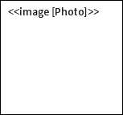   &lt;&lt;[Name()]&gt;&gt;   &lt;&lt;/foreach&gt;&gt;|
| :- |

### Report Example

|   John Smith      Tony Anderson      July James|
| :- |

## In-Table List Template

### Template Example

| Manager |Contract Price|
| :- | :- |
| <<foreach [in managers]>><<[Name()]>>  |  <<[Contracts().sum(c => c.Price())]>><</foreach>>  |
| Total:  |  <<[sum(m => m.Contracts().sum(c => c.Price()))]>>  |

### Report Example

| Manager |Contract Price|
| :- | :- |
| John Smith | 2300000 |
| Tony Anderson | 1200000 |
| July James | 800000 |
| Total: | 4300000 |

## In-Table List Template (Horizontal)

### Template Example

<table class="c-template">
	<tbody>
		<tr>
      <td><strong>Manager</strong></td>
      <td>&lt;&lt;foreach [in managers] -horz>>&lt;&lt;[Name]>></td>
      <td><strong>Total:</strong></td>
    </tr>
    <tr>
      <td><strong>Contract Price</strong></td>
      <td>&lt;&lt;[Contracts.Sum( c => c.Price)]>>&lt;&lt;/foreach>></td>
      <td>&lt;&lt;[Sum( m => m.Contracts.Sum( c => c.getPrice()))]>></td>
		</tr>
	</tbody>
</table>

### Report Example

| Manager |John Smith|Tony Anderson|July James|Total:|
| :- | :- | -- | -- | -- |
| **Contract Price** | 2300000 | 1200000 | 800000 | 4300000 |

## In-Table List Template with Running (Progressive) Total

### Template Example

<table class="c-template">
	<tbody>
		<tr>
      <td colspan="2">&lt;&lt;var [total = 0.0]>></td>
    </tr>
    <tr>
      <td><strong>Client</strong></td>
      <td><strong>Total Contract Price</strong></td>
    </tr>
    <tr>
      <td>&lt;&lt;foreach [in contracts]>>&lt;&lt;[Client.Name]>></td>
      <td>&lt;&lt;var [total = total + Price]>>&lt;&lt;[total]>>&lt;&lt;/foreach>></td>
		</tr>
	</tbody>
</table>

### Report Example

| Client |Total Contract Price|
| :- | :- |
|**A Company**|1200000|
|**B Ltd.**|1950000|
|**C & D**|2300000|
|**E Corp.**|2950000|
|**F & Partners**|3500000|
|**G & Co.**|3850000|
|**H Group**|4100000|
|**I & Sons**|4200000|
|**J Ent.**|4300000|

## In-Table List Template with Highlighted Rows

### Template Example

<table class="c-template">
	<tbody>
    <tr>
      <td><strong>Client</strong></td>
      <td><strong>Contract Price</strong></td>
    </tr>
    <tr>
      <td style="background-color: #ffff00">&lt;&lt;foreach [in contracts]>>&lt;&lt;if [Price >= 1000000]>>&lt;&lt;[Client.Name]>></td>
      <td style="background-color: #ffff00">&lt;&lt;[Price]>></td>
		</tr>
    <tr>
      <td>&lt;&lt;else>>&lt;&lt;[Client.Name]>></td>
      <td>&lt;&lt;[Price]>>&lt;&lt;/if>>&lt;&lt;/foreach>></td>
		</tr>
    <tr>
      <td>Total:</td>
      <td>&lt;&lt;[Sum(c => c.Price)]>></td>
		</tr>
	</tbody>
</table>

### Report Example

<table class="c-template">
	<tbody>
    <tr>
      <td><strong>Client</strong></td>
      <td><strong>Contract Price</strong></td>
    </tr>
    <tr>
      <td style="background-color: #ffff00">A Company</td>
      <td style="background-color: #ffff00">1200000</td>
		</tr>
    <tr>
      <td>B Ltd.</td>
      <td>750000</td>
		</tr>
    <tr>
      <td>C &amp; D</td>
      <td>350000</td>
		</tr>
    <tr>
      <td>E Corp.</td>
      <td>650000</td>
		</tr>
    <tr>
      <td>F &amp; Partners</td>
      <td>550000</td>
		</tr>
    <tr>
      <td>G &amp; Co.</td>
      <td>350000</td>
		</tr>
    <tr>
      <td>H Group</td>
      <td>250000</td>
		</tr>
    <tr>
      <td>I &amp; Sons</td>
      <td>100000</td>
		</tr>
    <tr>
      <td>J Ent.</td>
      <td>100000</td>
		</tr>
    <tr>
      <td>Total:</td>
      <td>4300000</td>
		</tr>
	</tbody>
</table>

## In-Table List Template (Horizontal) with Highlighted Columns

### Template Example

<table class="c-template">
	<tbody>
		<tr>
      <td><strong>Manager</strong></td>
      <td style="background-color: #ffff00">&lt;&lt;foreach [in managers] -horz>>&lt;&lt;if [Contracts.Sum( c => c.Price) >= 2000000] -horz>>&lt;&lt;[Name]>></td>
      <td>&lt;&lt;else>>&lt;&lt;[Name]>></td>
      <td><strong>Total:</strong></td>
    </tr>
    <tr>
      <td><strong>Contract Price</strong></td>
      <td style="background-color: #ffff00">&lt;&lt;[Contracts.Sum( c => c.Price)]>></td>
      <td>&lt;&lt;[Contracts.Sum( c => c.Price)]>>&lt;&lt;/if>>&lt;&lt;/foreach>></td>
      <td>&lt;&lt;[Sum( m => m.Contracts.Sum( c => c.Price))]>></td>
		</tr>
	</tbody>
</table>

### Report Example

<table class="c-template">
	<tbody>
		<tr>
      <td><strong>Manager</strong></td>
      <td style="background-color: #ffff00">John Smith</td>
      <td>Tony Anderson</td>
      <td>July James</td>
      <td><strong>Total:</strong></td>
    </tr>
    <tr>
      <td><strong>Contract Price</strong></td>
      <td style="background-color: #ffff00">2300000</td>
      <td>1200000</td>
      <td>800000</td>
      <td>4300000</td>
		</tr>
	</tbody>
</table>

## In-Table List Template with Alternate Content

### Template Example

<table class="c-template">
	<tbody>
    <tr>
      <td><strong>Client</strong></td>
      <td><strong>Contract Price</strong></td>
    </tr>
		<tr>
      <td colspan="2" style="text-align: center">&lt;&lt;if [!Any()]>>No data</td>
    </tr>
    <tr>
      <td>&lt;&lt;else>>&lt;&lt;foreach [in contracts]>>&lt;&lt;[Client.Name]>></td>
      <td>&lt;&lt;[Price]>>&lt;&lt;/foreach>></td>
		</tr>
    <tr>
      <td><strong>Total:</strong></td>
      <td>&lt;&lt;[Sum(c => c.Price)]>>&lt;&lt;/if>></td>
		</tr>
	</tbody>
</table>

### Report Example 1

<table class="c-template">
	<tbody>
    <tr>
      <td><strong>Client</strong></td>
      <td><strong>Contract Price</strong></td>
    </tr>
		<tr>
      <td colspan="2" style="text-align: center">No data</td>
    </tr>
	</tbody>
</table>

### Report Example 2

| Client |Contract Price|
| :- | :- |
|**A Company**|1200000|
|**B Ltd.**|750000|
|**C & D**|350000|
|**E Corp.**|650000|
|**F & Partners**|550000|
|**G & Co.**|350000|
|**H Group**|250000|
|**I & Sons**|100000|
|**J Ent.**|100000|
|**Total:**|4300000|

## In-Table List Template (Horizontal) with Alternate Content

### Template Example

<table class="c-template">
	<tbody>
		<tr>
      <td><strong>Manager</strong></td>
      <td rowspan="2" style="vertical-align: middle">&lt;&lt;if [!Any()] -horz>>No data</td>
      <td>&lt;&lt;else>>&lt;&lt;foreach [in managers] -horz>>&lt;&lt;[Name]>></td>
      <td><strong>Total:</strong></td>
    </tr>
    <tr>
      <td><strong>Contract Price</strong></td>
      <td>&lt;&lt;[Contracts.Sum( c => c.Price)]>>&lt;&lt;/foreach>></td>
      <td>&lt;&lt;[Sum( m => m.Contracts.Sum( c => c.Price))]>>&lt;&lt;/if>></td>
		</tr>
	</tbody>
</table>

### Report Example 1

<table class="c-template">
	<tbody>
    <tr>
      <td><strong>Client</strong></td>
      <td rowspan="2" style="vertical-align: middle">No data</td>
    </tr>
		<tr>
      <td><strong>Contract Price</strong></td>
    </tr>
	</tbody>
</table>

### Report Example 2

| Manager | John Smith | Tony Anderson | July James | Total:  |
| :----------------- | :--------- | ------------- | ---------- | ------- |
| **Contract Price** | 2300000    | 1200000       | 800000     | 4300000 |

## Common Master-Detail Template

### Template Example

|&lt;&lt;foreach [in managers]&gt;&gt;      &lt;&lt;[Name()]&gt;&gt;   Clients: &lt;&lt;foreach [in Contracts() ]&gt;&gt;&lt;&lt;[indexOf() != 0 ? ", " : ""]&gt;&gt;&lt;&lt;[Client().Name()]&gt;&gt;&lt;&lt;/foreach&gt;&gt;   &lt;&lt;/foreach&gt;&gt;|
| :- |

### Report Example

|   John Smith   Clients: A Company, B Ltd., C & D      Tony Anderson   Clients: E Corp., F & Partners      July James   Clients: G & Co., H Group, I & Sons, J Ent.|
| :- |

## In-Table Master-Detail Template

### Template Example

|Manager/Client|Contract Price|
| :- | :- |
| <<foreach [in managers]>><<[Name()]>>  |  <<[Contracts().sum(c => c.Price())]>> |
| <<foreach [in Contracts()]>> <<[Client().Name()]>>  |  <<[Price()]>><</foreach>><</foreach>> |
| Total:  |  <<[Sum(m => m.Contracts().Sum(c => c.Price()))]>>  |

### Report Example

| Manager/Client    | Contract Price |
| ----------------- | -------------- |
| **John Smith**    | 2300000        |
| *A Company*       | 1200000        |
| *B Ltd.*          | 750000         |
| *C & D*           | 350000         |
| **Tony Anderson** | 1200000        |
| *E Corp.*         | 650000         |
| *F & Partners*    | 550000         |
| **July James**    | 800000         |
| *G & Co.*         | 350000         |
| *H Group*         | 250000         |
| *I & Sons*        | 100000         |
| *J Ent.*          | 100000         |
| **Total:**        | 4300000        |

## Pie Chart Template

**Template Example**

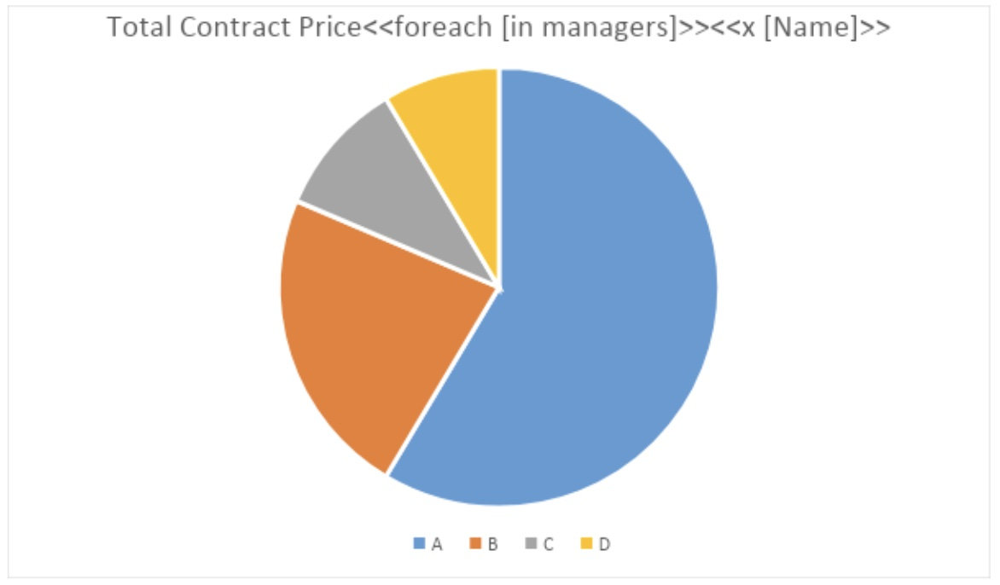

**Initial Chart Series Data**

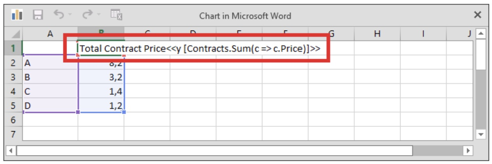

**Report Example**

## Sunburst Chart Template

**Template Example**

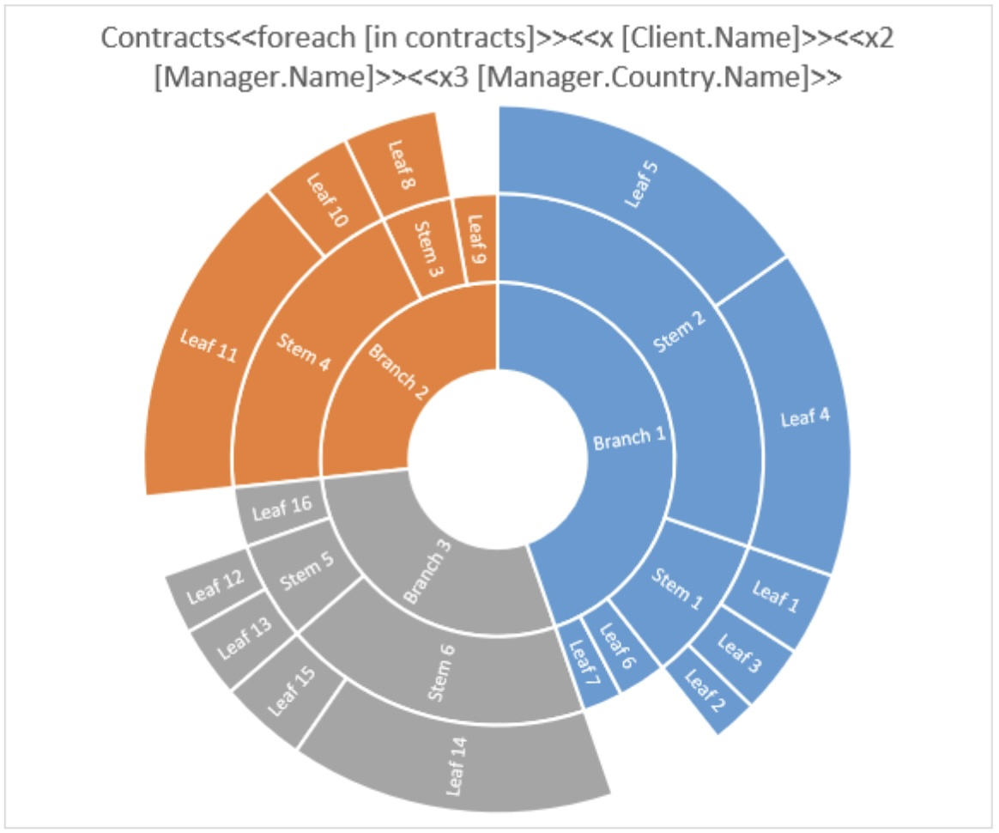

**Initial Chart Series Data**

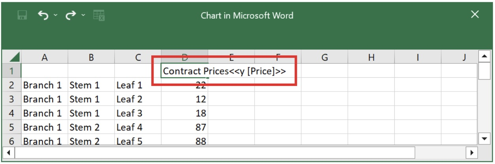

**Report Example**

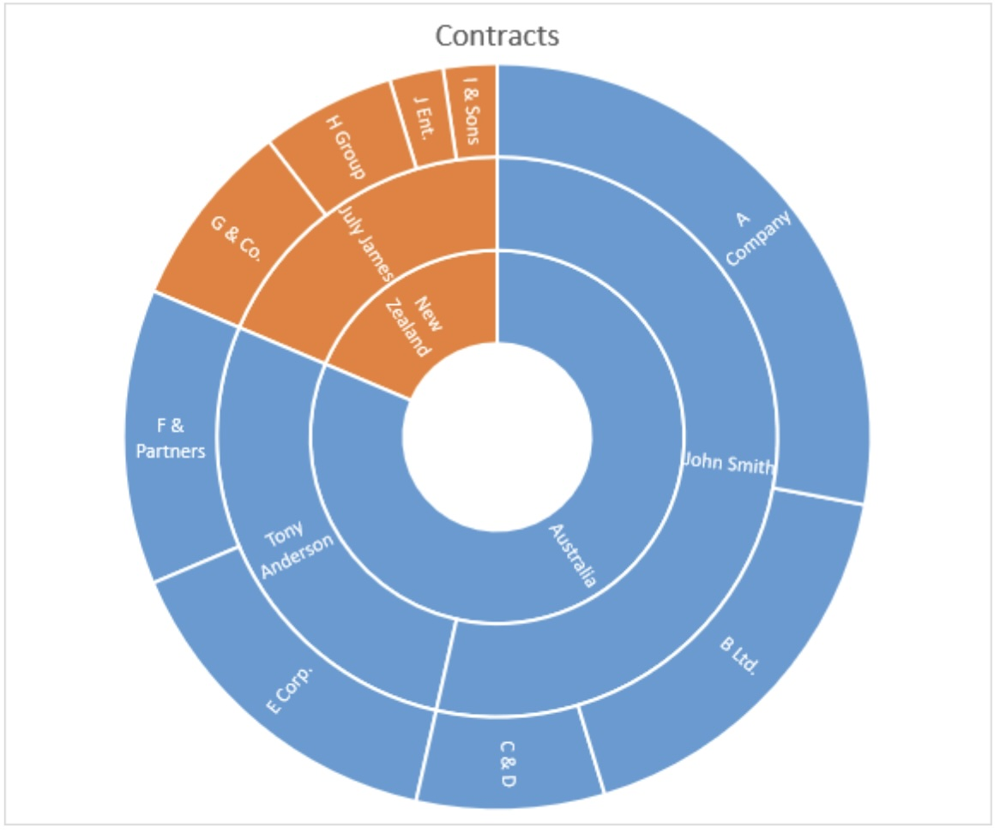

## Treemap Chart Template

**Template Example**

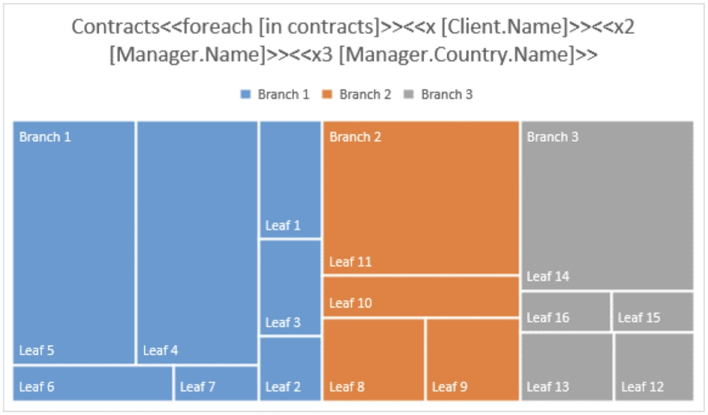

**Initial Chart Series Data**

**Report Example**

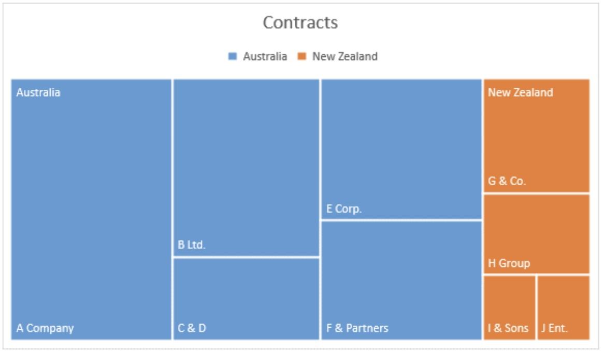

## Histogram Chart Template

**Template Example**

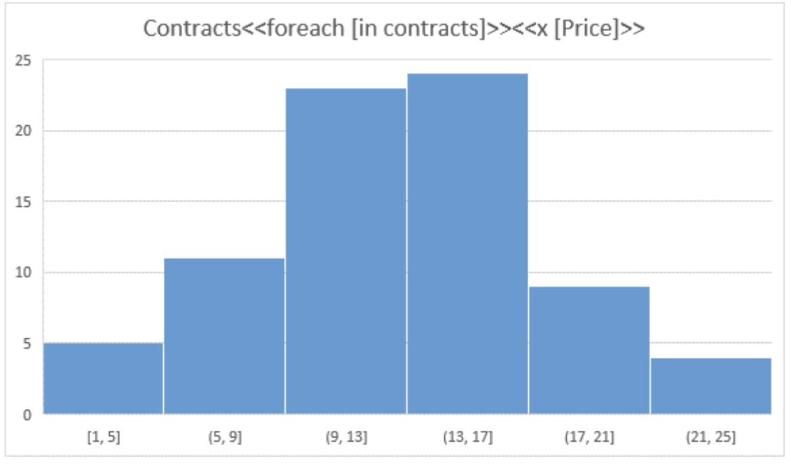

**Report Example**

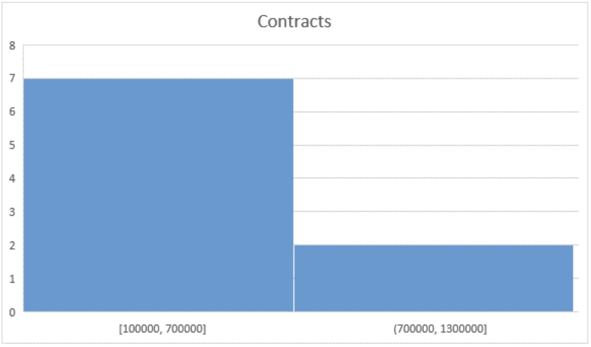

## Scatter Chart Template

**Template Example**

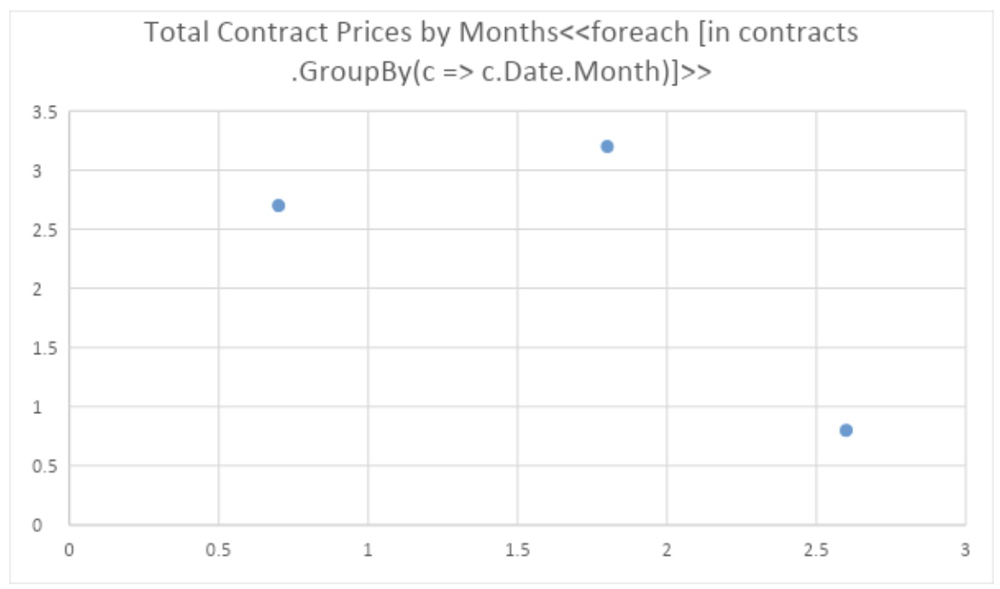

**Initial Chart Series Data**

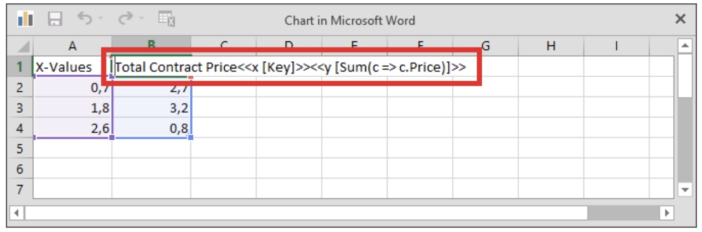

**Report Example**



## Bubble Chart Template

**Template Example**

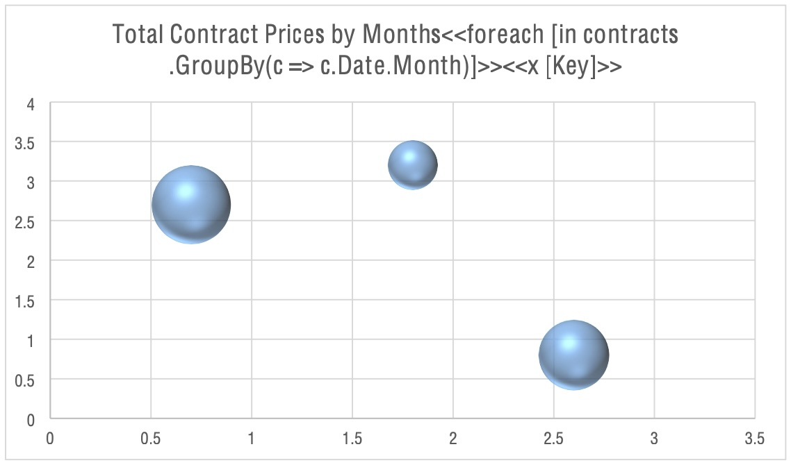

**Initial Chart Series Data**

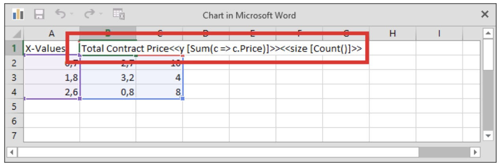

**Report Example**

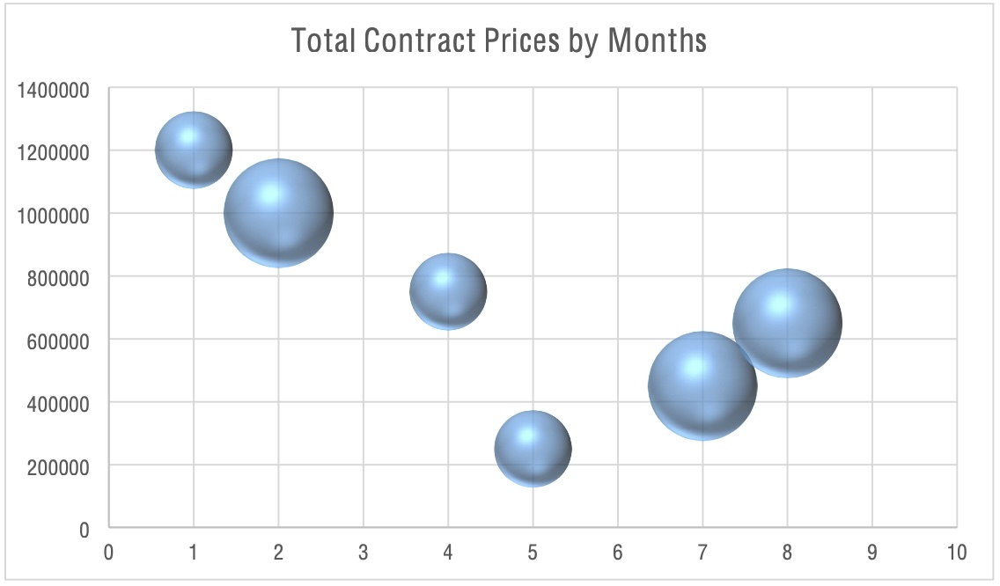

## In-Table Template with Filtering, Grouping, and Ordering

**Template Example**

| **Manager**                                                  | **Contract Price**                                           |
| ------------------------------------------------------------ | ------------------------------------------------------------ |
| <<foreach [in contracts .Where(c => c.Date.Year == 2015).GroupBy(c => c.Manager).OrderBy(g => g.Key.Name)]>><<[Key.Name]>> | <<[Sum(c => c.Price)]>><</foreach>> |

**Report Example**

| Manager |Contract Price|
| :- | :- |
|**John Smith**|2300000|
|**July James**|800000|
|**Tony Anderson**|1200000|

## Chart Template with Filtering, Grouping, and Ordering

**Template Example**

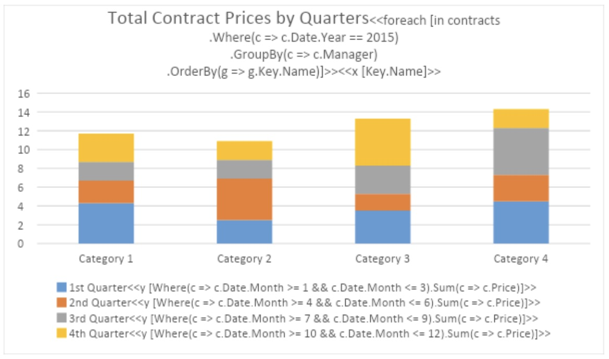

**Report Example**

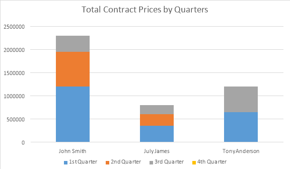