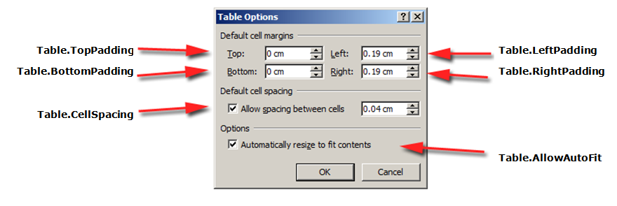
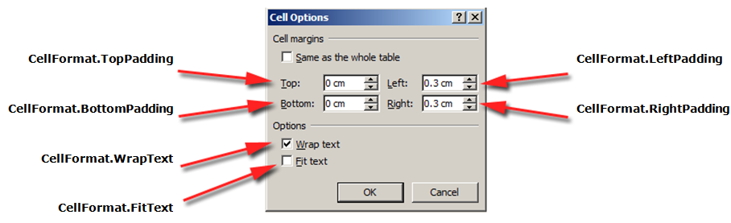
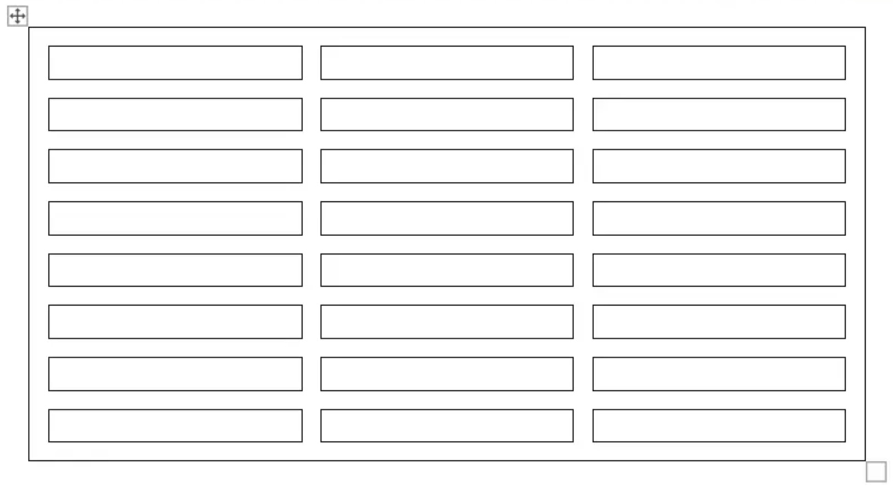

Each element of a table can be applied with different formatting. For example, table formatting will be applied to the entire table, row formatting to only particular rows, cell formatting to only certain cells.

Aspose.Words provides a rich API to retrieve and apply formatting to a table. You can use the [Table](https://reference.aspose.com/words/net/aspose.words.tables/table/), [RowFormat](https://reference.aspose.com/words/net/aspose.words.tables/rowformat/), and [CellFormat](https://reference.aspose.com/words/net/aspose.words.tables/cellformat/) nodes to set the formatting.

In this article, we will talk about how to apply formatting to different table nodes and what table formatting settings Aspose.Words supports.

## Apply Formatting to Different Nodes

In this section, we will look at applying formatting to various table nodes.

### Table Level Formatting

To apply formatting to a table, you can use the properties available on the corresponding **Table** node using the [Table](https://reference.aspose.com/words/net/aspose.words.tables/table/), [PreferredWidth](https://reference.aspose.com/words/net/aspose.words.tables/preferredwidth/), and [TableCollection](https://reference.aspose.com/words/net/aspose.words.tables/tablecollection/) classes.

{}

Note that the table must have at least one row before the table properties can be applied. This means that when building a table with the [DocumentBuilder](https://reference.aspose.com/words/net/aspose.words/documentbuilder/), this formatting must be done after the first call to [InsertCell](https://reference.aspose.com/words/net/aspose.words/documentbuilder/insertcell/), or after the first row is added to the table, or when nodes are inserted directly into the DOM.

{}

The pictures below show a representation of the **Table** formatting features in Microsoft Word and their corresponding properties in Aspose.Words.

The following code example shows how to apply an outline border to a table:



{}

You can download the sample file of this example from [Aspose.Words GitHub](https://github.com/aspose-words/Aspose.Words-for-.NET/blob/master/Examples/Data/Tables.docx).

{}

The following code example shows how to build a table with all borders enabled (grid):



{}

You can download the sample file of this example from [Aspose.Words GitHub](https://github.com/aspose-words/Aspose.Words-for-.NET/blob/master/Examples/Data/Tables.docx).

{}

### Row Level Formatting

**Row-level** formatting can be controlled using the [Row](https://reference.aspose.com/words/net/aspose.words.tables/row/), [RowFormat](https://reference.aspose.com/words/net/aspose.words.tables/rowformat/), and [RowCollection](https://reference.aspose.com/words/net/aspose.words.tables/rowcollection/) classes.

{}

Note that a **Row** can only be a child node of a **Table**. At the same time, there must be at least one **Cell** in the **Row** so that formatting can be applied to it.

{}

The pictures below show a representation of the **Row** formatting features in Microsoft Word and their corresponding properties in Aspose.Words.

The following code example shows how to modify the table row formatting:



{}

You can download the sample file of this example from [Aspose.Words GitHub](https://github.com/aspose-words/Aspose.Words-for-.NET/blob/master/Examples/Data/Tables.docx).

{}

### Cell Level Formatting

Cell-level formatting is controlled by the [Cell](https://reference.aspose.com/words/net/aspose.words.tables/cell/), [CellFormat](https://reference.aspose.com/words/net/aspose.words.tables/cellformat/), and [CellCollection](https://reference.aspose.com/words/net/aspose.words.tables/cellcollection/) classes.

{}

Note that a **Cell** can only be a child node of a **Row**. At the same time, there must be at least one [Paragraph](https://reference.aspose.com/words/net/aspose.words/paragraph/) in the **Cell** so that formatting can be applied to it.

In addition to the **Paragraph**, you can also insert a **Table** into a **Cell**.

{}

The pictures below show a representation of the **Cell** formatting features in Microsoft Word and their corresponding properties in Aspose.Words.

The following code example shows how to modify the formatting of a table cell:



{}

You can download the sample file of this example from [Aspose.Words GitHub](https://github.com/aspose-words/Aspose.Words-for-.NET/blob/master/Examples/Data/Tables.docx).

{}

The following code example shows how to set the amount of space (in points) to add to the left/top/right/bottom of the contents of the cell:



## Specify Row Heights

The simplest way to set the row height is to use the **DocumentBuilder**. Using the appropriate **RowFormat** properties, you can set the default height setting or apply a different height for each row in the table.

In Aspose.Words, table row height is controlled by:

- the row height property – [Height](https://reference.aspose.com/words/net/aspose.words.tables/rowformat/height/)
- the height rule property for the given row – [HeightRule](https://reference.aspose.com/words/net/aspose.words.tables/rowformat/heightrule/)

At the same time, a different height can be set for each row – this allows you to widely control the table settings.

{}

Rule options for specifying the height of an object can be set using the [HeightRule](https://reference.aspose.com/words/net/aspose.words/heightrule/) enumeration.

{}

The following code example shows how to create a table that contains a single cell and apply row formatting:



## Specify Table and Cell Widths

A table in a Microsoft Word document provides several different ways to resize the table and individual cells. These properties allow considerable control over the appearance and behavior of the table, so that Aspose.Words supports the behavior of tables, as in Microsoft Word.

It is important to know that table elements present several different properties that can affect how the widths of the overall table, as well as individual cells, is calculated:

- Preferred width on the table
- Preferred width on individual cells
- Allowing autofit on the table

This article details how the various table width calculation properties work and how to get full control over table width calculation. This is 
especially useful to know in such cases where the table layout does not appear as expected.

{}

In most cases, the preferred cell is recommended than the table width. The preferred cell width is more in line with the DOCX format specification as well as the Aspose.Words model.

The cell width is actually a calculated value for the DOCX format. The actual cell width can depend on many things. For example, changing the page margins or the preferred table width can affect the actual cell width.

The preferred cell width is a cell property that is stored in the document. It does not depend on anything and does not change when you change the table or other properties of the cell.

{}

{}

All properties and methods described in this article are related to how tables work in Microsoft Word. So in most cases, if you are building your table programmatically but are finding it hard to create the desired table, you can instead try visually creating it in Microsoft Word first and then simply copy the formatting values into your application.

{}

### How to Use Preferred Width

The desired width of a table or individual cells is defined through the preferred width property, which is the size that an element strives to fit. That is, the preferred width can be specified  for the entire table or for individual cells. In some situations it may not be possible to fit this width exactly, but the actual width will be close to this value in most cases.

The appropriate preferred width type and value are set using the methods of the [PreferredWidth](https://reference.aspose.com/words/net/aspose.words.tables/preferredwidth/) class:

* the [Auto](https://reference.aspose.com/words/net/aspose.words.tables/preferredwidth/auto/) method to specify auto or “no preferred width”
* the [FromPercent](https://reference.aspose.com/words/net/aspose.words.tables/preferredwidth/frompercent/) method to specify a percentage width
* the [FromPoints](https://reference.aspose.com/words/net/aspose.words.tables/preferredwidth/frompoints/) method to specify the width in points

The pictures below show a representation of the *preferred width setting features* in Microsoft Word and their corresponding properties in Aspose.Words.

An example of how these options are applied to a real table in a document can be seen in the picture below.

{}

Before you can use the preferred width in a table, you must ensure that the table contains at least one row. This is because such table formatting in a Microsoft Word document or in a document created in Aspose.Words is stored in the rows of the table.

{}

#### Specify the Preferred Table or Cell Width

In Aspose.Words, table and cell widths are set using the [Table.PreferredWidth](https://reference.aspose.com/words/net/aspose.words.tables/table/preferredwidth/) property and the [CellFormat.PreferredWidth](https://reference.aspose.com/words/net/aspose.words.tables/cellformat/preferredwidth/) property, with options available in the [PreferredWidthType](https://reference.aspose.com/words/net/aspose.words.tables/preferredwidthtype/) enumeration:

- **Auto**, which is equivalent to no preferred width set
- **Percent**, which fits the element relative to the available space in the window or container size, and recalculates the value when the available width changes
- **Points**, which corresponds to an element of the specified width in points

{}

By default, a table can be described as being fitted to 100% of the available space on the page. In this case, this means the table will try to take up the space between the left and right page margins.

{}

Using the [Table.PreferredWidth](https://reference.aspose.com/words/net/aspose.words.tables/table/preferredwidth/) property will adjust its preferred width relative to its container: page, text column, or outer table cell if it is a nested table.

The following code example shows how to set the table to auto-fit to 50% of the page width:



Using the [CellFormat.PreferredWidth](https://reference.aspose.com/words/net/aspose.words.tables/cellformat/preferredwidth/) property on a given cell will adjust its preferred width.

The following code example shows how to set the different preferred width settings:



#### Find Preferred Width Type and Value

You can use the [Type](https://reference.aspose.com/words/net/aspose.words.tables/preferredwidth/type/) and [Value](https://reference.aspose.com/words/net/aspose.words.tables/preferredwidth/value/) properties to find the preferred width details of the desired table or cell.

The following code example shows how to retrieve the preferred width type of a table cell:



{}

You can download the sample file of this example from [Aspose.Words GitHub](https://github.com/aspose-words/Aspose.Words-for-.NET/blob/master/Examples/Data/Tables.docx).

{}

### How to Set Autofit

The [AllowAutoFit](https://reference.aspose.com/words/net/aspose.words.tables/table/allowautofit/) property allows cells in a table to grow and shrink according to a selected criterion. For example, you can use the **AutoFit to Window** option to fit the table to the width of the page, and the **AutoFit to Content** option to allow each cell to grow or shrink according to its content.

{}

Additionally, the **AllowAutoFit** property can be used in conjunction with a preferred cell width to format a cell that automatically fits its content, but also has an initial width. If necessary, the cell width can then grow past this width.

{}

By default, Aspose.Words inserts a new table using **AutoFit to Window**. The table will be sized according to the available page width. To resize a table, you can call the [AutoFit](https://reference.aspose.com/words/net/aspose.words.tables/table/autofit/) method. This method accepts an [AutoFitBehavior](https://reference.aspose.com/words/net/aspose.words.tables/autofitbehavior/) enumeration that specifies what type of autofit is applied to the table.

It is important to know that the autofit method is actually a shortcut that applies different properties to the table at the same time. These are properties that actually give the table the observed behavior. We will discuss these properties for each autofit option.

The following code example shows how to set a table to shrink or grow each cell according to its contents:



#### AutoFit Table to Window

When autofitting to a window is applied to a table, the following operations are actually performed behind the scenes:

1. The **Table.AllowAutoFit** property is enabled to automatically resize columns to fit the available content, using a **Table.PreferredWidth** value of 100%
2. **CellFormat.PreferredWidth** is removed from all table cells
   {}
   Note that this is slightly different from the Microsoft Word behavior, where each cell's preferred width is set to appropriate values based on their current size and content. Aspose.Words does not update the preferred width so they just get cleared instead.
   {}
3. Column widths are recalculated for the current table content – the end result is a table that occupies the entire available width
4. The width of the columns in the table changes automatically as the user edits the text

The following code example shows how to autofit a table to the page width:



{}

You can download the sample file of this example from [Aspose.Words GitHub](https://github.com/aspose-words/Aspose.Words-for-.NET/blob/master/Examples/Data/Tables.docx).

{}

#### AutoFit Table to Content

When the table is autofitted the content, the following steps are actually performed behind the scenes:

1. The **Table.AllowAutoFit** property is enabled to automatically resize each cell according to its content

2. The preferred table width is removed from **Table.PreferredWidth**, **CellFormat.PreferredWidth** is removed for each table cell
   {}

   Note that this autofit option removes the preferred width from cells, just like in Microsoft Word. If you want to keep the column sizes and increase or decrease the columns to fit the content, you should set the **Table.AllowAutoFit** property to **True** on its own rather than using the autofit shortcut.{}

3. Column widths are recalculated for the current table content – the end result is a table where the column widths and the width of the entire table are automatically resized to best fit the content as the user edits the text

The following code example shows how to autofit a table to its content:



{}

You can download the sample file of this example from [Aspose.Words GitHub](https://github.com/aspose-words/Aspose.Words-for-.NET/blob/master/Examples/Data/Tables.docx).

{}

#### Disable AutoFit in Table and Use Fixed Column Widths

If a table has autofit disabled and fixed column widths are used instead, the following steps are performed:

1. **Table.AllowAutoFit** property is disabled so columns do not grow or shrink to their content

2. The preferred width of the entire table is removed from **Table.PreferredWidth**, **CellFormat.PreferredWidth** is removed from all table cells
3. The end result is a table whose column widths are determined by the [CellFormat.Width](https://reference.aspose.com/words/net/aspose.words.tables/cellformat/width/) property, and whose columns are not automatically resized when the user enters text or when the page is resized

{}

Note that if no width is specified for **CellFormat.Width**, the default value of one inch (72 points) is used.

{}

The following code example shows how to disable autofit and enable fixed width for the specified table:



{}

You can download the sample file of this example from [Aspose.Words GitHub](https://github.com/aspose-words/Aspose.Words-for-.NET/blob/master/Examples/Data/Tables.docx).

{}

### Order of Precedence when Calculating Cell Width

Aspose.Words allows users to define the width of a table or cell through multiple objects, including [CellFormat](https://reference.aspose.com/words/net/aspose.words.tables/cellformat/) – its [Width](https://reference.aspose.com/words/net/aspose.words.tables/cellformat/width/) property is mostly left over from previous versions, however, it is still useful for simplifying setting the cell width.

It is important to know that the **CellFormat.Width** property works differently depending on which of the other width properties already exist in the table.

Aspose.Words uses the following order for calculating cell widths:

| Order | Property                                                     | Description |
| ----- | ------------------------------------------------------------ | ------------------------------------------------------------ |
| 1     | [AllowAutoFit](https://reference.aspose.com/words/net/aspose.words.tables/table/allowautofit/) is determined | If **AutoFit** is enabled: - the table may grow past the preferred width to accommodate the content – it usually does not shrink below the preferred width - any change to the **CellFormat.Width** value is ignored and the cell will fit to its contents instead |
| 2     | [PreferredWidthType](https://reference.aspose.com/words/net/aspose.words.tables/preferredwidthtype/) with a value of **Points** or **Percent** | **CellFormat.Width** is ignored                              |
| 3     | [PreferredWidthType](https://reference.aspose.com/words/net/aspose.words.tables/preferredwidthtype/) with a value of **Auto** | The value from **CellFormat.Width** is copied and becomes the cell's preferred width (in points) |

{}

Any changes to the width property are not updated in the preferred width and must instead be applied to the preferred width instead.

{}

{}

While creating a fixed table layout, specify the cell width. A cell without width cannot be saved to DOC format. Document formats other than DOC, such as DOCX, allow, in principle, saving cells without width in a fixed table layout.

{}

## Allow Spacing Between Cells

You can get or set any additional space between table cells similar to the "Сell spacing" option in Microsoft Word. This can be done using the [AllowCellSpacing](https://reference.aspose.com/words/net/aspose.words.tables/table/allowcellspacing/) property.

An example of how these options are applied to a real table in a document can be seen in the picture below.

The following code example shows how to set the spacing between cells:



## Apply Borders and Shading

Borders and shading can be applied either to the entire table using [Table.SetBorder](https://reference.aspose.com/words/net/aspose.words.tables/table/setborder/), [Table.SetBorders](https://reference.aspose.com/words/net/aspose.words.tables/table/setborders/) and [Table.SetShading](https://reference.aspose.com/words/net/aspose.words.tables/table/setshading/), or only to specific cells using [CellFormat.Borders](https://reference.aspose.com/words/net/aspose.words.tables/cellformat/borders/) and [CellFormat.Shading](https://reference.aspose.com/words/net/aspose.words.tables/cellformat/shading/). Additionally, row borders can be set using [RowFormat.Borders](https://reference.aspose.com/words/net/aspose.words.tables/rowformat/borders/), however shading cannot be applied in this way.

The pictures below show the border and shadow settings in Microsoft Word and their corresponding properties in Aspose.Words.

The following code example shows how to format a table and cell with different borders and shadings:

