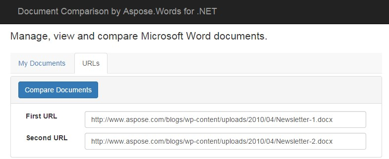

---
title: Document Comparison Features
second_title: Aspose.Words for .NET
articleTitle: Document Comparison Features
linktitle: Document Comparison Features
description: "Aspose.Words allows you to compare two Word documents using files or URLs to these files and show the differences. You can also view your document in a browser."
type: docs
weight: 20
url: /net/document-comparison-features/
---

In this article, we will take a look at the most popular document comparison features.

## Compare Text in Word Documents and Highlight Changes

Text comparison is the core feature of Document Comparison project. You can select two documents from the list and it will show you the differences between them.

Summary of changes is displayed on top, showing what is added and deleted. Newly added text is formatted in the red-underlined font. Deleted text is formatted in red color and strike-through font settings.

### How Document Comparison Works

Document comparison works as follows:

1. **HTML**. Click on the "Compare Documents" button on a page to call the jQuery *compareDocuments* method.
2. **jQuery**. Sends an AJAX request to the server (ASP.NET page) and posts the names of two documents. As a result, it receives the path to the output document and summary, and then displays them on the screen. See *Default.js, compareDocuments()* method in the source code tab.

3.  **ASP.NET Web Method** handles server requests. It calls the utility method to do the actual comparison. It also prepares the summary, number of additions and deletions. Finally, it sends the output document path and summary back to the calling client. See *Default.aspx.cs* tab below.

### Compare Documents Using Aspose.Words for .NET

The core functionality is implemented in the `DocumentComparisonUtil` class, see **DocumentComparisonUtil.cs** on the source tab. It uses Aspose.Words for .NET to parse the documents and find the differences between them. We also need to visually show the differences, so a new document is required to contain the highlighted changes.

To create the output document, we load the first document into Aspose.Words. Then go through the list of changes one by one, keep adding the changes to it:

- **Newly added text:** It is appended to the existing text and red underline font setting is applied to it.
- **Deleted text:** It is also appended to the existing text. The red color and strikethrough font are applied to it.

**Default.js**



// This is generic method that will take URL of two documents for comparison (WEB or File)
function compareDocuments(document1, document2) {
    resetDocumentViewerModalData();

    // Call server side method to compare the documents
    $.ajax({
        type: "POST",
        url: "Default.aspx/CompareDocuments",
        data: '{ document1: "' + document1 + '" , document2: "' + document2 + '" }',
        contentType: "application/json; charset=utf-8",
        dataType: "json",
        success: function (data) {
            // If there is error
            if (data.d[0].substr(0, 5) == error) {
                // Show error message
            }
            else {
                // In case call is successful, pass data to success method
                var comparisonDocument = data.d[1];
                viewDocument(comparisonDocument, "False", data.d[2], data.d[3]);
            }
        },
        failure: function (data) {
            alert('error');
        }
    });
}


**Default.aspx.cs**


[WebMethod]
public static ArrayList CompareDocuments(string document1, string document2)
{
    ArrayList result = new ArrayList();
    try
    {
        // Create a temporary folder
        string comparisonDocument = GetCompareDocumentName(document1, document2);

        // Call the util class for comparison
        DocumentComparisonUtil docCompUtil = new DocumentComparisonUtil();
        int added = 0, deleted = 0;
        docCompUtil.Compare(document1, document2, comparisonDocument, ref added, ref deleted);
        result.Add(Common.Success); // 0. Result
        result.Add((comparisonDocument)); // 1. Path of the comparison document
        result.Add(added); // 2. Number of additions
        result.Add(deleted); // 3. Number of deletions
    }
    catch (Exception ex)
    {
        result.Clear();
        result.Add(Common.Error + ": " + ex.Message); // 0. Result
    }
    return result;
}


**DocumentComparisonUtil.cs**



// Compare the text in two Word documents
public void Compare(string document1, string document2, string comparisonDocument, ref int added, ref int deleted)
{
    added = 0;
    deleted = 0;

    // Load both documents in Aspose.Words
    Document doc1 = new Document(document1);
    Document doc2 = new Document(document2);
    Document docComp = new Document(document1);
    DocumentBuilder builder = new DocumentBuilder(docComp);
    doc1.Compare(doc2, "a", DateTime.Now);
    
    foreach (Revision revision in doc1.Revisions)
    {
        switch (revision.RevisionType)
        {
            case RevisionType.Insertion:
                added++;
                break;
            case RevisionType.Deletion:
                deleted++;
                break;
        }
        Console.WriteLine(revision.RevisionType + ": " + revision.ParentNode);
    }
    Debug.WriteLine("Revisions: " + doc1.Revisions.Count);
    doc1.Save(comparisonDocument);
}


## Compare Word Documents using URLs

If you have web URLs of the documents, you can compare them directly, without uploading them. Just specify the URLs and hit the Compare Documents button. After comparison, you will see the result.

Behind the scenes, it uses the same process as when comparing files. This is the Aspose.Words.Document class that automatically downloads the document from the web `URL` if we pass the `URL` instead of the local file path. See the [Compare Documents](/words/net/compare-documents/) article for details.

## Web-Based Word Document Viewer

You can click any document from the list to view it in a browser:

- The document is rendered as an image
- The document name is displayed at the top
- Page numbers are displayed as links, you can navigate through the pages by clicking on the page number

By default, the viewer will show the first page of the document.

### How Web-Based Document Viewer Works

Document web-based document viewer works as follows:

1. **jQuery.** The **getDocumentData()** method sends an AJAX request to the server to convert the selected Word document to images, see **Default.js**. It sends the path to the document as an argument. As a result, the server returns two items: one is the path to the images folder and the other one is the total number of pages in the document.
2. **ASP.NET web method** converts the document into images. It loads the selected document using Aspose.Words and saves each page in image format in a loop. It returns the number of pages and the path to the image folder to the calling jQuery method. See **Default.aspx.cs**, **getDocumentData()** method.
3. **jQuery** renders Word document and page navigation. The calling method in jQuery now has the page count and the folder path. The folder contains images, each image represents a page in the Word document. Now, it is easy to display an image using jQuery and HTML.

### View Documents in Web-based Viewer

By default, there is an image with a white background. Initially, we set the SRC attribute of the IMG tag to the first image. This is done in the **getDocumentData_Success()** method, see **Default.js** in source tab below.

For the page numbering, we used Bootstrap navigation bar. In jQuery, we just add new list items LI to the navbar list tag UL in a loop, from 1 to page count. We already have the path of image folder, so we added an A tag as well and set its src to the image. As a result, when you click on the page number in the browser, it will load the image.

**Default.js**


// Send document path to server and receive page count and image path
function getDocumentData(filePath) {
    filePath = filePath.replace(/\\/g, "\\\\");
    $.ajax({
        type: "POST",
        url: "Default.aspx/GetDocumentData",
        data: '{ filePath: "' + filePath + '" , sessionID: "' + $("#txtSessionID").val() + '" }',
        contentType: "application/json; charset=utf-8",
        dataType: "json",
        success: function (data) {
            // If there is error
            if (data.d[0].substr(0, 5) == error) {
                $("#DocumentViewerAlert").addClass("alert-danger");
                $("#DocumentViewerAlert").removeClass("hidden");
                $("#DocumentViewerAlert").text(data.d);
            }
            else {
                // In case call is successful, pass data to success method
                getDocumentData_Success(data.d);
            }
        },
        failure: function (data) {
            alert('error');
        }
    });
}

// Load first page (image) of document and set page navigation bar
function getDocumentData_Success(result) {
    var totalPages = result[1];
    var imageFolder = result[2];
    //alert(totalPages);
    // Show the first page
    $("#CurrentDocumentPage").attr("src", imageFolder + "/0.png");

    // Show pagination
    $("#DocumentViewerPagination").removeClass("hidden");
    
    // Add pages in pagination
    for (var iPage = 1 ; iPage <= totalPages ; iPage++) {
        var currentPage = 'setCurrentPage(&quot;' + imageFolder + '/' + (iPage - 1) + '.png' + '&quot;)';
        //alert(currentPage);
        $("#DocumentViewerPaginationUL li:nth-child(" + iPage + ")")
            .after('<li class="DocumentViewerPaginationLI"><a onclick="' + currentPage + '" href="#">' + iPage + '</a></li>');
    }
}


**Default.aspx.cs**


// Convert the document to images and send page count and folder path to calling method
[WebMethod]
public static ArrayList GetDocumentData(string filePath, string sessionID)
{
    ArrayList result = new ArrayList();
    try
    {
        // Create a temporary folder
        string documentFolder = CreateTempFolders(filePath, sessionID);

        // Load the document in Aspose.Words
        Document doc = new Document(filePath);
    
        // Convert the document to images
        ImageSaveOptions options = new ImageSaveOptions(SaveFormat.Jpeg);
        options.PageCount = 1;
    
        // Save each page of the document as image.
        for (int i = 0; i < doc.PageCount; i++)
        {
            options.PageIndex = i;
            doc.Save(string.Format(@"{0}\{1}.png", documentFolder, i), options);
        }
        result.Add(Common.Success); // 0. Result
        result.Add(doc.PageCount.ToString()); // 1. Page count
        result.Add(MapPathReverse(documentFolder)); // 2. Images Folder path
    }
    catch (Exception ex)
    {
        result.Clear();
        result.Add(Common.Error + ": " + ex.Message); // 0. Result
    }
    return result;
}

