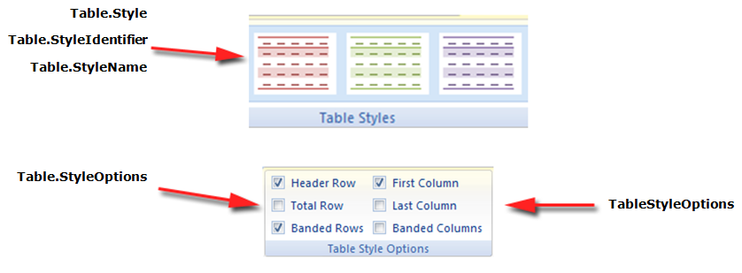

A table style defines a set of formatting that can be easily applied to a table. Formatting such as borders, shading, alignment, and font can be set in a table style and applied to many tables for a consistent appearance.

Aspose.Words supports applying a table style to a table and also reading properties of any table style. Table styles are preserved during loading and saving in the following ways:

- Table styles in DOCX and WordML formats are preserved when loading and saving to these formats
- Table styles are preserved when loading and saving in  DOC format (but not to any other format)
- When exporting to other formats, rendering or printing, table styles are expanded to direct formatting in the table, so all formatting is preserved

## Create a Table Style

The user can create a new style and add it to style collection. The [Add](https://reference.aspose.com/words/python-net/aspose.words/stylecollection/add/) method is used to create a new table style.

The following code example shows how to create a new user defined table style:



## Copy an Existing Table Style 

If necessary, you can copy a table style that already exists in a certain document into your style collection using the `AddCopy` method.

It is important to know that with this copying, the linked styles are also copied.

The following code example shows how to import a style from one document to another document:



## Apply an Existing Table Style

Aspose.Words provides a [TableStyle](https://reference.aspose.com/words/python-net/aspose.words/tablestyle/) inherited from the [Style](https://reference.aspose.com/words/python-net/aspose.words/style/) class. **TableStyle** facilitates the user to apply different style options like as shading, padding, indentation, [CellSpacing](https://reference.aspose.com/words/python-net/aspose.words/tablestyle/cell_spacing/) and [Font](https://reference.aspose.com/words/python-net/aspose.words/style/font/), etc.

In addition, Aspose.Words provides the [StyleCollection](https://reference.aspose.com/words/python-net/aspose.words/stylecollection/) class and a few properties of the `Table` class to specify which table style we will work with: [Style](https://reference.aspose.com/words/python-net/aspose.words.tables/table/style/), [StyleIdentifier](https://reference.aspose.com/words/python-net/aspose.words.tables/table/style_identifier/), [StyleName](https://reference.aspose.com/words/python-net/aspose.words.tables/table/style_name/), and [StyleOptions](https://reference.aspose.com/words/net/aspose.words.tables/table/styleoptions/).

Aspose.Words also provides [ConditionalStyle](https://reference.aspose.com/words/python-net/aspose.words/conditionalstyle/) class that represents special formatting applied to some area of a table with an assigned table style, and the [ConditionalStyleCollection](https://reference.aspose.com/words/python-net/aspose.words/conditionalstylecollection/) that represents a collection of **ConditionalStyle** objects. This collection contains a permanent set of items representing one item for each value of the [ConditionalStyleType](https://reference.aspose.com/words/python-net/aspose.words/conditionalstyletype/) enumeration type. The **ConditionalStyleType** enumeration defines all possible table areas to which conditional formatting may be defined in a table style.

In this case, conditional formatting can be defined for all possible table area defined under the ConditionalStyleType enumeration type.

The following code example shows how to define conditional formatting for header row of the table:



You can also choose which table parts to apply styles to, such as first column, last column, banded rows. They are listed in the [TableStyleOptions](https://reference.aspose.com/words/python-net/aspose.words.tables/tablestyleoptions/) enumeration and are applied through the [StyleOptions](https://reference.aspose.com/words/python-net/aspose.words.tables/table/style_options/) property. The **TableStyleOptions** enumeration allows a bitwise combination of these features.

The following code example shows how to create a new table with a table style applied:



The pictures below show a representation of the **Table Styles** in Microsoft Word and their corresponding properties in Aspose.Words.

## Working with Table Styles

A table style defines a set of formatting that can be easily applied to a table. Formatting such as borders, shading, alignment and font can be set in a table style and applied to many tables for a consistent appearance.

Aspose.Words supports applying a table style to a table and also reading properties of any table style. Table styles are preserved during loading and saving in the following ways:

- Table styles in DOCX and WordML formats are preserved when loading and saving to these formats.
- Table styles are preserved when loading and saving in the DOC format (but not to any other format).
- When exporting to other formats, rendering or printing, table styles are expanded to direct formatting on the table so all formatting is preserved.

Currently, you cannot create new table styles. You can only apply in-built table styles or custom table styles which already exist in the document to a table. 

## Take Formatting from Table Style and Apply it as Direct Formatting

Aspose.Words also provides the [ExpandTableStylesToDirectFormatting](https://reference.aspose.com/words/python-net/aspose.words/document/expand_table_styles_to_direct_formatting/#default) method to take formatting found on a table style and expands it onto the rows and cells of the table as direct formatting. Try combining formatting with table style and cell style.

{}

This method will not override any other formatting already applied to the table through a row or cell format.

{}

The following code example shows how to expand the formatting from styles onto table rows and cells as direct formatting:

