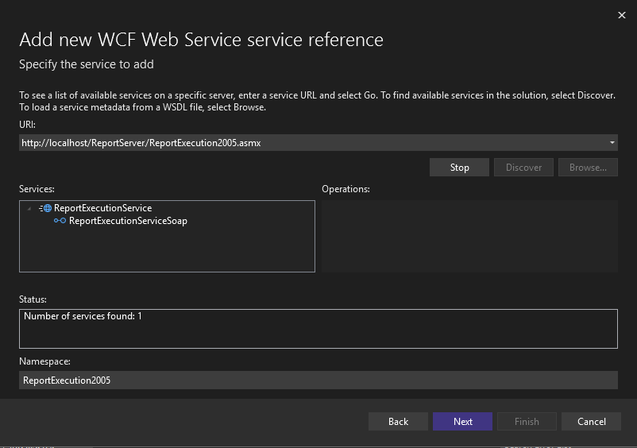

{}

Sometimes you need to render reports programmatically instead of using the Report Manager or Report Viewer interface. This might happen, for example, if you need to include report rendering in your application where the user may want to export the report to Microsoft Word document by clicking a button on the form. The following code samples demonstrate how to render reports programmatically in your application.

{}

## Rendering via Reporting Services Web Service

If you have a Report Server running with Aspose.Words for Reporting Services installed on it, you can render reports to Microsoft Word documents using the Reporting Service Web Service. Follow these steps to achieve that on .Net 6 or higher version (assuming you use Reporting Services 2022):

### Step 1. Add a reference to the ReportingService2005 Web service.

Open your project in Visual Studio, right click on the **Dependencies** folder and select **Manage Connected Services**. Then select "Add service reference" and use "WCF Web services" to add the reference. Enter the `URL` of the **ReportingService2005** Web service (http://<your server>/ReportServer/ReportService2005.asmx). Once the service is found, enter “ReportingService2005” in the **Namespace** textbox.

**Adding a reference to the ReportingService2005 Web service in Visual Studio.**

### Step 2. Add a reference to the ReportExecutionService Web service.

Repeat Step 1 for the **ReportExecutionService** (http://<your server>/ReportServer/ReportExecution2005.asmx) Web service. Once the service is found, enter “ReportExecution2005“ in the **Namespace** textbox.

**Adding a reference to the ReportExecutionService Web service in Visual Studio.**

### Step 3. Add required packages.

Install package System.ServiceModel.Primitives.

Also may be required to update packages which were added with service references on steps 1 and 2 (by default packages may be with old versions).

### Step 4. Implement creating SSRS client.

Add the following class to your application:

**C#**


using ReportExecution2005;
using System.ServiceModel;
using System.Security.Principal;

/// 

/// Implements SSRS client creation.
/// 

public static class ServiceClientUtils
{
    public static ReportExecutionServiceSoapClient CreateClient(this string executionEndPointUrl, string userName, string password)
    {
        var rsBinding = new BasicHttpBinding();

        rsBinding.Security.Mode = BasicHttpSecurityMode.TransportCredentialOnly;
        rsBinding.Security.Transport.ClientCredentialType = HttpClientCredentialType.Ntlm;

        rsBinding.MaxBufferSize = int.MaxValue;
        rsBinding.MaxBufferPoolSize = int.MaxValue;
        rsBinding.MaxReceivedMessageSize = int.MaxValue;

        var rsEndpointAddress = new EndpointAddress(executionEndPointUrl);
        var rsClient = new ReportExecutionServiceSoapClient(rsBinding, rsEndpointAddress);

        rsClient.ClientCredentials.Windows.ClientCredential.UserName = userName;
        rsClient.ClientCredentials.Windows.ClientCredential.Password = password;
        rsClient.ClientCredentials.Windows.AllowedImpersonationLevel = TokenImpersonationLevel.Impersonation;

        return rsClient;
    }
}


### Step 5. Implement scenario logic.

Add the following code to your application and fill required settings according to comments:

**C#**

using ReportExecution2005;
using RenderingUsingWebService;

// Settings

const string relativeReportPath = "Secify relative path to a report."; // For example: "/Report1"

const string userName = "Windows user login."; // For example: "Administrator".
const string password = "Windows user password."; // For example: "123".

const string renderingExtensionName = "AWDOCX"; // One of extension name as specified here: https://docs.aspose.com/words/reportingservices/installing-on-the-server-manually/#step-3-register-asposewords-for-reporting-services-as-a-rendering-extension
const string ouputFilePath = "Path to ouput report file path."; // For example: "C:\Temp\out.docx"

const string execution2005EndPointUrl = "Execution end point."; // For example: http://localhost/ReportServer/ReportExecution2005.asmx

// Settings end.

// 1. Create client.
var client = execution2005EndPointUrl.CreateClient(userName, password);

// 2. Load report.
var trustedHeader = new TrustedUserHeader();
var loadReponse = await client.LoadReportAsync(trustedHeader, relativeReportPath, null);

// 3. Render report using specified extension.
var renderRequest = new RenderRequest(loadReponse.ExecutionHeader, trustedHeader, renderingExtensionName, null);
var renderResponse = await client.RenderAsync(renderRequest);

// 4. Save received report document to the file.
using var fileStream = File.OpenWrite(ouputFilePath);
await fileStream.WriteAsync(renderResponse.Result, 0, renderResponse.Result.Length);

Console.WriteLine($"Report saved to the file: \"{ouputFilePath}\".");


## Rendering via Report Viewer Working in Local Mode

If you use the Microsoft Report Viewer control in your application, you can use its capabilities to render local reports (RDL and RDLC) to Microsoft Word documents programmatically. Follow these steps (assuming you use Report Viewer 2005):

### Step 1. Integrate Aspose.Words for Reporting Services with Report Viewer.

Follow the instructions described in the section [Integrate with Microsoft Report Viewer in Local Mode](/words/reportingservices/configure-aspose-words-for-reporting-services/)

### Step 2. Implement the rendering method.

Implement the following method in your application:

**C#**


using System;
using System.Collections;
using System.Collections.Generic;
using System.Data;
using System.IO;
using System.Reflection;
using System.Windows.Forms;
using Aspose.Words.ReportingServices;
using Microsoft.Reporting.WinForms;
using Microsoft.ReportingServices.ReportRendering;
/// 

/// Renders a local (RDL or RDLC) reports to a Microsoft Word document on disk.
/// 

/// <param name="viewer">A ReportViewer instance with Aspose.Words for Reporting Services export formats integrated.</param>
/// <param name="reportName">The name (including path) of the local report.</param>
/// <param name="documentName">The name (including path) of the resulting document.</param>
/// <param name="format">
/// The export format, should be:
/// "AWDOC" for DOC
/// "AWDOCX" for DOCX
/// "AWRTF" for RTF
/// "AWWML" for WordML
/// "AWHTML" for HTML
/// "AWMHTML" for MHTML
/// "AWODT" for ODT
/// "AWTXT" for TXT
/// "AWXPS" for XPS
/// "AWEPUB" for EPUB
/// </param>
/// <param name="deviceInfo">
/// The device info string as it would appear in rsreportserver.config, for example
/// "<DeviceInfo><PageBreaksMode>OnEachPage</PageBreaksMode></DeviceInfo>". May be null.
/// </param>
private static void RenderReportToFile(
    ReportViewer viewer,
    string reportName,
    string documentName,
    string format,
    string deviceInfo)
{
    string extension;
    string mimeType;
    string encoding;
    Warning[] warnings;
    string[] streamIds;
    LocalReport report = viewer.LocalReport;

    // Load and set up the report.
    report.ReportPath = reportName;
    report.EnableExternalImages = true;
    report.EnableHyperlinks = true;

    // Get the information about report's parameters.
    ReportParameterInfoCollection parameterInfos = report.GetParameters();
    if (parameterInfos.Count > 0)
    {
        // If the report requires parameters set, add them as the following pattern shows:
        List<Microsoft.Reporting.WinForms.ReportParameter> parameters = new List<Microsoft.Reporting.WinForms.ReportParameter>();

        // Repeat this until all parameters are set.
        Microsoft.Reporting.WinForms.ReportParameter parameter = new Microsoft.Reporting.WinForms.ReportParameter(
            "name",
            "value");
        parameters.Add(parameter);
        report.SetParameters(parameters);
    }

    // We have to specify data sources for local report rendering. GetDataTables() returns a list of DataTable objects
    // populated with real report data.
    List<DataTable> tables = GetDataTables();

    // Add the data sources.
    foreach (DataTable table in tables)
        report.DataSources.Add(new ReportDataSource(table.TableName, table));

    // Render to appropriate format using Aspose extensions
    ReportViewerHelper asposeHelper = new ReportViewerHelper(reportViewer);
    asposeHelper.AddExtensions();
    byte[] reportBytes = asposeHelper.Render(format);

    // Write document bytes to a file.
    using (FileStream stream = File.OpenWrite(documentName))
        stream.Write(reportBytes, 0, reportBytes.Length);
}


### Step 3. Call the `RenderReportToFile` method.

You can call the **RenderReportToFile** method from any point of your application. The call might look like the following:

**C#**


RenderReportToFile(
    reportViewer1,
    @"C:\Work\MyReport.rdlc",
    @"C:\Work\MyReport.doc",
    "AWDOC",
    null);

