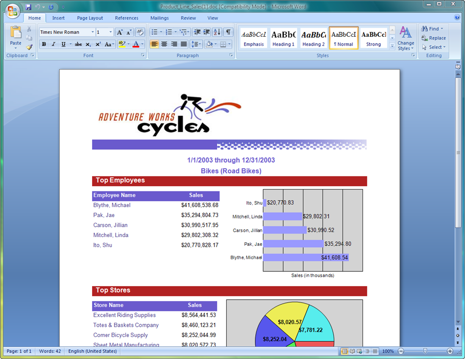
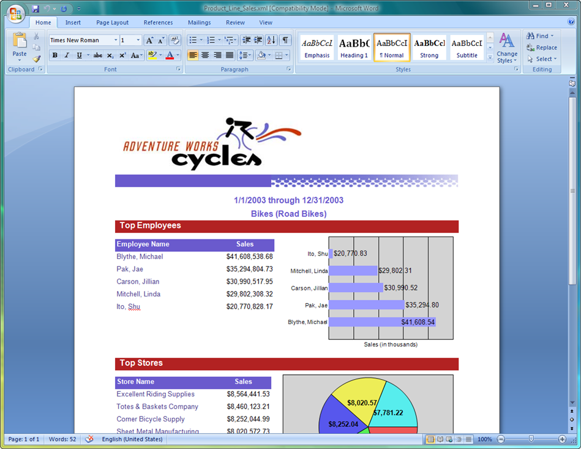

{}

Aspose.Words for Reporting Services is a rendering extension for Microsoft SQL Server Reporting Services and Microsoft Report Viewer. After installing Aspose.Words for Reporting Services, you will get access to the following additional export formats:

- DOC - Microsoft Word documents
- DOCX - Office Open XML documents
- RTF - Rich Text Format documents
- XML - WordprocessingML documents
- HTML - Hypertext Markup Language documents
- MHTML – Web Archive (MIME HTML) documents
- ODT – OpenOffice/StarOffice documents
- TXT - Plain Text documents
- XPS – XML Paper Specification
- EPUB – Electronic Publications

To generate reports, Aspose.Words for Reporting Services relies on a built-in version of [Aspose.Words for .NET](https://products.aspose.com/words/net/) , the market leading document-processing component from Aspose. DOC, OOXML, RTF and WordprocessingML copies of the same report will look identical to each other, thanks to the high degree of support for the underlying file formats, provided by Aspose.Words. Microsoft Word is not used to generate documents.

{}

**A report exported by Aspose.Words for Reporting Services to a Microsoft Word (DOC) document.**

**A report exported by Aspose.Words for Reporting Services to a Rich Text Format (RTF) document.**

**A report exported by Aspose.Words for Reporting Services to a WordprocessingML (XML) document.**

**A report exported by Aspose.Words for Reporting Services to an Office Open XML (DOCX) document.**

