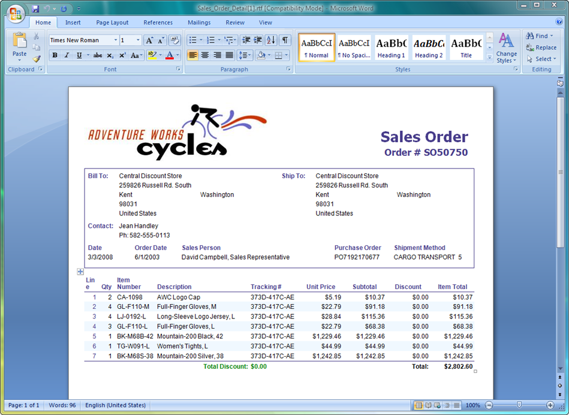

---
title: Product Overview
second_title: Aspose.Words for Reporting Services
articleTitle: Product Overview
linktitle: Product Overview
description: "List of supported components and common overview of the Aspose.Words for Reporting Services."
type: docs
weight: 10
url: /reportingservices/product-overview/
---

Welcome to Aspose.Words for Reporting Services!

Have you ever wished you could export RDL and RDLC reports as OOXML, DOC, RTF and WordprocessingML documents from within Microsoft SQL Server Reporting Services? With Aspose.Words for Reporting Services, you can. Aspose.Words for Reporting Services is a rendering extension aimed at software developers. It supports Microsoft SQL Server 2012, 2014, 2016, 2017, 2019 and 2022 Reporting Services, as well as in Microsoft Report Viewer 2010, 2012, 2015, and Microsoft.ReportingServices.ReportViewerControl of 140.X.X and 150.X.X.

## Supported Formats

Aspose.Words for Reporting Services is a unique solution that makes it possible to generate reports into Microsoft Word document formats (and more):

- DOC – Microsoft Word documents
- OOXML – Office Open XML documents
- RTF – Rich Text Format documents
- XML – WordprocessingML documents
- HTML – Hypertext Markup Language documents
- MHTML – Web Archive (MIME HTML) documents
- ODT – OpenOffice/StarOffice documents
- TXT – Plain Text documents
- XPS – XML Paper Specification
- EPUB – Electronic Publications

Aspose.Words for Reporting Services makes new export formats are available in Microsoft SQL Server Reporting Services.

The screenshot below shows an RTF report generated by Aspose.Words for Reporting Services.

## Supported Applications and Controls

Aspose.Words for Reporting Services is designed to be used with the following applications and controls:

- Microsoft SQL Server 2012 Reporting Services (32-bit and 64-bit)
- Microsoft SQL Server 2014 Reporting Services (32-bit and 64-bit)
- Microsoft SQL Server 2016 Reporting Services (64-bit)
- Microsoft SQL Server 2017 Reporting Services (64-bit)
- Microsoft SQL Server 2019 Reporting Services (64-bit)
- Microsoft Report Viewer 2010/ 2012/ 2015 (local and remote mode)
- Microsoft.ReportingServices.ReportViewerControl.Winforms, Microsoft.ReportingServices.ReportViewerControl.WebForms controls of 140.X.X and 150.X.X versions
- Microsoft Visual Studio 2012/2013/2015/2017/2019/2022 Report Designer
