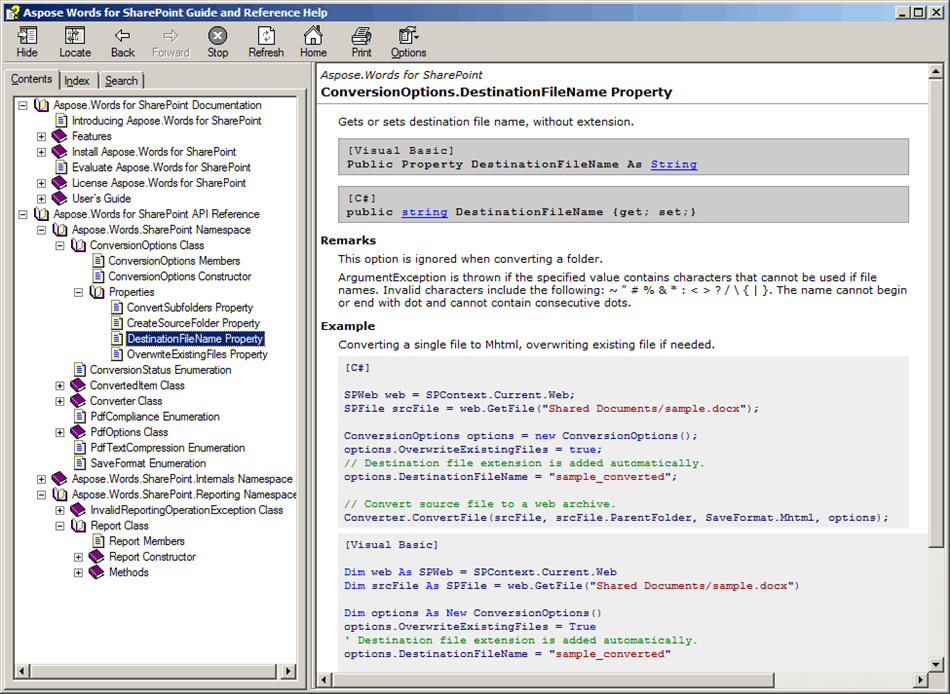

Customers developing their own SharePoint solution can access our conversion and reporting engine via public API. This includes all supported file formats and conversion options. Both single and multiple files conversions are available. You can save the converted document to stream and specify additional PDF saving options. You can build a report once and save many times to different formats and locations. The detailed interface specification in our API Reference is accompanied with dozens of C# and VB samples.

**Usage of each class member is accompanied with C# and VB samples.** 

