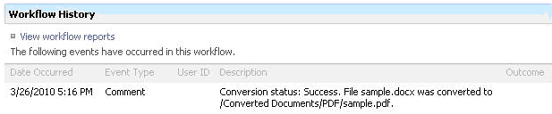

You can use Aspose.Words for SharePoint from a document workflow. Upon installation, these new workflow activities will appear in SharePoint Designer:

- Convert via Aspose.Words.
- Make a Report via Aspose.Words.
- Inserting a Watermark.

Use them in workflows to convert documents or build reports.

**An entry for the conversion activity logged in the workflow history.** 

