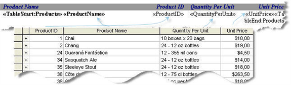
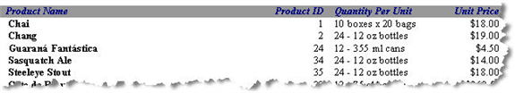

Every merge field in a report template must belong to a *region*. A region corresponds to a table in the report data source. A region also marks the part of the template, which is repeated for every data row in that table.

To specify a merge region in a document you need to insert two merge fields to mark the beginning and the end of the region:

1. To mark the beginning of a merge region, insert a merge field with the name **TableStart:MyTable**, where **MyTable** corresponds to the name of the table.
1. To mark the end of the merge region, insert another merge field with the name **TableEnd:MyTable**.
1. Between these marking fields, place merge fields that correspond to the fields of your data source (table columns).

The merge fields are populated with data from the first row of the data source, then the whole region is repeated, and the new fields are populated with data from the second row, and so on. Follow these simple rules when marking a region:

- TableStart and TableEnd fields must be inside the same section in the document.
- If used inside a table, TableStart and TableEnd must be inside the same row in the table.
- You should always have a pair of matching TableStart and TableEnd fields with the same table name.
- You can nest one region inside the other. In this case, the inner region should end before the outer region ends. Use the [Relations](/words/sharepoint/relations-element/) element to describe table relationships in report the data source definition.

Here is an example of a region in a report template:

**Merge regions in a document** 

You can see a merge region defined for populating with data from the Products table. Note that both the marking fields **TableStart:Products** and **TableEnd:Products** are placed inside the same row of the Word table. After the report is filled with data, here is the result: 

**A report with data** 

