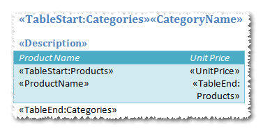
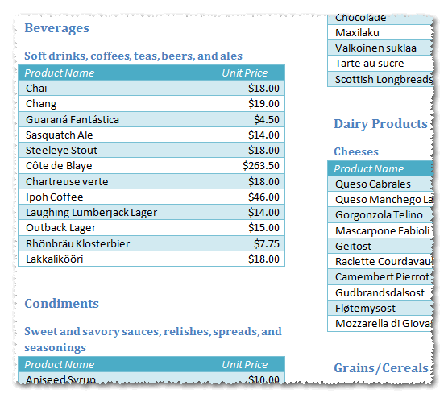

You can use nested regions when there is a relationship between data tables in the data source. Here is an example of a report template for listing product by category. There are two tables: **Products** and **Categories** linked by the **CategoryID** field. The outer region is for category description and the inner region lists products for each category: 

**Nested regions defined** 

The result is products grouped by categories: 
**Nested regions in the final report** 

See how to define related tables in a report data source in the [TableRelation](/words/sharepoint/tablerelation-element/) element description.
