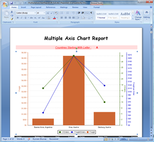
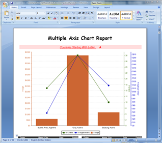
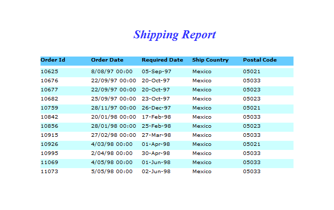
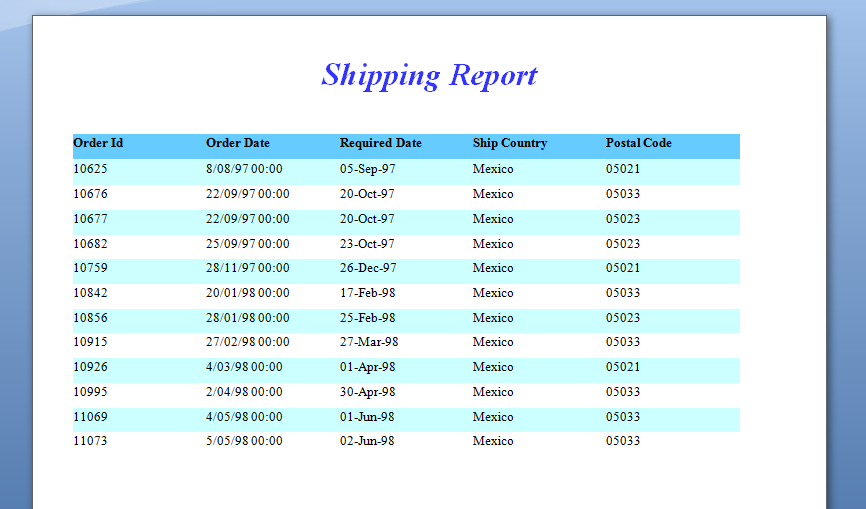

---
title: High Fidelity to the Report Design
articleTitle: High Fidelity to the Report Design
linktitle: High Fidelity to the Report Design
description: "Aspose.Words for JasperReports exports reports as Microsoft Word documents in such a way that they look identical to reports exported by the built-in exporters of JasperReports."
type: docs
weight: 30
url: /jasperreports/high-fidelity-to-the-report-design/
---

{} 

Aspose.Words for JasperReports exports reports as Microsoft Word documents in such a way that they look identical to reports exported by the built-in exporters of JasperReports. 

{} 

|The Bubble Chart Report rendered by JasperReports built-in report exporter (RTF). |The Bubble Chart Report rendered by Aspose.Words for JasperReports (DOC). |
| :- | :- |
|||
|**The Shipping Report viewed in the standard JasperReport viewer.** |**The Shipping Report rendered by Aspose.Words for JasperReports exporter (DOCX).** |
|||

