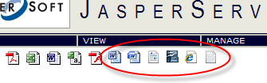

{} 

Aspose.Words for JasperReports works with JasperReports and JasperServer. This article explains how to integrate the exporter.

{} 

## Integration with JasperReports

To use Aspose.Words for JasperReports from your application, you should copy a single appropriate **.jar** file from the \lib folder of **Aspose.Words.JasperReports-xx.x.zip** to the JasperReports\lib directory or to a library folder of your application. After that, you can access the exporters programmatically.

Starting from release **1.9.0** there are several versions of jar library (necessary for better support of older versions of JasperReports):

- for JasperReports 6.5.0 ... 6.11.0 (**aspose.words.jasperreports-7.1.0-7.5.0.jar**)
- for JasperReports 6.4.2 ... 6.4.21 (**aspose.words.jasperreports-6.4.2-6.4.3.jar**)
- for JasperReports 6.3.0 ... 6.4.1 (**aspose.words.jasperreports-6.3.0-6.4.0.jar**)
- for JasperReports 6.0.0 ... 6.2.2 (**aspose.words.jasperreports-6.0.0-6.2.1.jar**)

Please copy **ONLY ONE** jar library according to the version of installed JasperReports.

The following example shows typical code needed to export a report to a DOC file using Aspose.Words for JasperReports. More examples can be found in the demo reports included in the product download.

**Java**


   import com.aspose.words.jasperreports.*;
   AWDocExporter exporter = new AWDocExporter();
   File sourceFile = new File(fileName);
   JasperPrint jasperPrint = (JasperPrint)JRLoader.loadObject(sourceFile);
   exporter.setParameter(JRExporterParameter.JASPER_PRINT, jasperPrint);
   File destFile = new File(sourceFile.getParent(), jasperPrint.getName() + ".doc");
   exporter.setParameter(JRExporterParameter.OUTPUT_FILE_NAME, destFile.toString());
   exporter.exportReport();


## Integration with JasperServer

To add DOC, DOCX, RTF, ODT, HTML and TXT export formats to JasperServer, perform the following steps. In all of the following steps **<InstallDir>** stands for the JasperServer installation directory.

**Step 0**

Stop JasperReports Server. It is recommended also to clean **<InstallDir>\apache-tomcat\logs** directory after stopping.

**Step 1**

Before <util:map id="exporterConfigMap"> item, add the following new exporter properties to the **<InstallDir>\apache-tomcat\webapps\jasperserver\WEB-INF\flows\viewReportBeans.xml** file.

Following properties - <property name="iconSrc" ... /> are only applied to JasperReports Server 3.x and 4.x, these properties are not required for JasperReports Server 5.x, 6.x and 7.x.

**XML**


<bean id="aw_reportDocExporter" class="com.aspose.words.jasperreports.AWReportDocExporter" parent="baseReportExporter">
   <property name="exportParameters" ref="aw_exportParameters"/>
   <property name="setResponseContentLength" value="true"/>
</bean>
<bean id="aw_reportDocxExporter" class="com.aspose.words.jasperreports.AWReportDocxExporter" parent="baseReportExporter">
   <property name="exportParameters" ref="aw_exportParameters"/>
   <property name="setResponseContentLength" value="true"/>
</bean>
<bean id="aw_reportRtfExporter" class="com.aspose.words.jasperreports.AWReportRtfExporter" parent="baseReportExporter">
   <property name="exportParameters" ref="aw_exportParameters"/>
   <property name="setResponseContentLength" value="true"/>
</bean>
<bean id="aw_reportOdtExporter" class="com.aspose.words.jasperreports.AWReportOdtExporter" parent="baseReportExporter">
   <property name="exportParameters" ref="aw_exportParameters"/>
   <property name="setResponseContentLength" value="true"/>
</bean>
<bean id="aw_reportHtmlExporter" class="com.aspose.words.jasperreports.AWReportHtmlExporter" parent="baseReportExporter">
   <property name="exportParameters" ref="aw_exportParameters"/>
   <property name="setResponseContentLength" value="true"/>
</bean>
<bean id="aw_reportTxtExporter" class="com.aspose.words.jasperreports.AWReportTxtExporter" parent="baseReportExporter">
   <property name="exportParameters" ref="aw_exportParameters"/>
   <property name="setResponseContentLength" value="true"/>
</bean>
<bean id="aw_docExporterConfiguration" class="com.jaspersoft.jasperserver.war.action.ExporterConfigurationBean">
   <property name="descriptionKey" value="DOC - Word Document via Aspose.Words"/>
   <property name="iconSrc" value="/images/aw_doc.gif"/>
   <property name="parameterDialogName" value=""/>
   <property name="exportParameters" ref="aw_exportParameters"/>
   <property name="currentExporter" ref="aw_reportDocExporter"/>
</bean>
<bean id="aw_docxExporterConfiguration" class="com.jaspersoft.jasperserver.war.action.ExporterConfigurationBean">
   <property name="descriptionKey" value="OOXML - Office Open Document via Aspose.Words"/>
   <property name="iconSrc" value="/images/aw_docx.gif"/>
   <property name="parameterDialogName" value=""/>
   <property name="exportParameters" ref="aw_exportParameters"/>
   <property name="currentExporter" ref="aw_reportDocxExporter"/>
</bean>
<bean id="aw_rtfExporterConfiguration" class="com.jaspersoft.jasperserver.war.action.ExporterConfigurationBean">
   <property name="descriptionKey" value="RTF - Rich Text Format via Aspose.Words"/>
   <property name="iconSrc" value="/images/aw_rtf.gif"/>
   <property name="parameterDialogName" value=""/>
   <property name="exportParameters" ref="aw_exportParameters"/>
   <property name="currentExporter" ref="aw_reportRtfExporter"/>
</bean>
<bean id="aw_odtExporterConfiguration" class="com.jaspersoft.jasperserver.war.action.ExporterConfigurationBean">
   <property name="descriptionKey" value="ODT - OpenDocument Text via Aspose.Words"/>
   <property name="iconSrc" value="/images/aw_odt.gif"/>
   <property name="parameterDialogName" value=""/>
   <property name="exportParameters" ref="aw_exportParameters"/>
   <property name="currentExporter" ref="aw_reportOdtExporter"/>
</bean>
<bean id="aw_htmlExporterConfiguration" class="com.jaspersoft.jasperserver.war.action.ExporterConfigurationBean">
   <property name="descriptionKey" value="HTML - Web Page via Aspose.Words"/>
   <property name="iconSrc" value="/images/aw_html.gif"/>
   <property name="parameterDialogName" value=""/>
   <property name="exportParameters" ref="aw_exportParameters"/>
   <property name="currentExporter" ref="aw_reportHtmlExporter"/>
</bean>
<bean id="aw_txtExporterConfiguration" class="com.jaspersoft.jasperserver.war.action.ExporterConfigurationBean">
   <property name="descriptionKey" value="TXT - Plain Text via Aspose.Words"/>
   <property name="iconSrc" value="/images/aw_txt.gif"/>
   <property name="parameterDialogName" value=""/>
   <property name="exportParameters" ref="aw_exportParameters"/>
   <property name="currentExporter" ref="aw_reportTxtExporter"/>
</bean>


**Step 2.**

Locate the <util:map id=”exporterConfigMap> element in the **<InstallDir>\apache-tomcat\webapps\jasperserver\WEB-INF\flows\viewReportBeans.xml** file and add the following lines:

**XML**


<util:map id="exporterConfigMap">
   <entry key="pdf" value-ref="pdfExporterConfiguration"/>
   <entry key="xls" value-ref="xlsExporterConfiguration"/>
   <entry key="rtf" value-ref="rtfExporterConfiguration"/>
   <entry key="csv" value-ref="csvExporterConfiguration"/>
   <entry key="swf" value-ref="swfExporterConfiguration"/>
<!-- START of ADDED LINES -->
   <entry key="aw_doc" value-ref="aw_docExporterConfiguration"/>
   <entry key="aw_docx" value-ref="aw_docxExporterConfiguration"/>
   <entry key="aw_rtf" value-ref="aw_rtfExporterConfiguration"/>
   <entry key="aw_odt" value-ref="aw_odtExporterConfiguration"/>
   <entry key="aw_html" value-ref="aw_htmlExporterConfiguration"/>
   <entry key="aw_txt" value-ref="aw_txtExporterConfiguration"/>
<!-- END of ADDED LINES -->
</util:map>


**Step 3.**

Copy all GIF images from the \lib_ folder in **Aspose.Words.JasperReports-xx.x.zip** to **<InstallDir>**\apache-tomcat\webapps\jasperserver\images\.

This step is only applied to JasperReports Server 3.x and 4.x, not required for JasperReports Server 5.x, 6.x, and 7.x versions.

**Step 4.**

Copy a single **.jar** file from the \lib folder of **Aspose.Words.JasperReports-xx.x.zip** to **<InstallDir>**\apache-tomcat\webapps\jasperserver\WEB-INF\lib.

If you are using JasperReports v6.0.0 ... v6.2.1, copy **aspose.words.jasperreports-6.0.0-6.2.1.jar** file.

If you are using JasperReports v6.3.0 ... v6.4.0, copy **aspose.words.jasperreports-6.3.0-6.4.0.jar** file.

` `If you are using JasperReports v6.4.2 ... v6.4.3, copy **aspose.words.jasperreports-6.4.2-6.4.3.jar** file.

If you are using JasperReports v7.1.0 and higher copy **aspose.words.jasperreports-7.1.0.jar** file.

NOTE: You need to copy **ONLY ONE** jar file.

**Step 5a.**

Add the following lines to the **<InstallDir>\apache-tomcat\webapps\jasperserver\WEB-INF\applicationContext.xml** file.

This bean may contain various configuration settings intended to configure the export. For example, you can use the JasperReports font mapping feature or specify the location of the Aspose.Words for JasperReports license file.

**XML**


<bean id="aw_exportParameters" class="com.aspose.words.jasperreports.AWExportParametersBean">
  <property name="fontMap">
    <util:map id="fontMap">
      <entry key="sansserif" value="Arial"/>
      <entry key="serif" value="Times New Roman"/>
      <entry key="monospaced" value="Courier"/>
    </util:map>
  </property>
<!-- Uncomment to apply a license. Check the license path.
<property name="licenseFile" value="C:/jasperserver-3.0/apache-tomcat/webapps/jasperserver/WEB-INF/Aspose.Words.JasperReports.lic"/>
-->
</bean>


**Step 5b.**

In order to enable Aspose exporters with the Web Services of Jasper Report Server addthefollowing lines to the **<InstallDir>\apache-tomcat\webapps\jasperserver\WEB-INF\applicationContext-web-services.xml** file.

Note that starting from JasperReports Server 5.6 SOAP Web Services feature is NOT supported, please use REST Web Services instead (*see Step 5c below*).

**XML**


...
    <bean id="xmlExporter" class="com.jaspersoft.jasperserver.ws.axis2.XmlWSExporter" scope="prototype">
        <property name="jasperReportsContext" ref="${bean.jasperReportsContext}"/>
    </bean>
    <!-- Aspose.Words for JasperReports START -->
    <bean id="awDocExporter" class="com.aspose.words.jasperreports.ws.AWDocWSExporter" scope="prototype">
        <property name="exportParams" ref="aw_exportParameters"/>
    </bean>
    <bean id="awDocxExporter" class="com.aspose.words.jasperreports.ws.AWDocxWSExporter" scope="prototype">
        <property name="exportParams" ref="aw_exportParameters"/>
    </bean>
    <bean id="awHtmlExporter" class="com.aspose.words.jasperreports.ws.AWHtmlWSExporter" scope="prototype">
        <property name="exportParams" ref="aw_exportParameters"/>
    </bean>
    <bean id="awOdtExporter" class="com.aspose.words.jasperreports.ws.AWOdtWSExporter" scope="prototype">
        <property name="exportParams" ref="aw_exportParameters"/>
    </bean>
    <bean id="awRtfExporter" class="com.aspose.words.jasperreports.ws.AWRtfWSExporter" scope="prototype">
        <property name="exportParams" ref="aw_exportParameters"/>
    </bean>
    <bean id="awTxtExporter" class="com.aspose.words.jasperreports.ws.AWTxtWSExporter" scope="prototype">
        <property name="exportParams" ref="aw_exportParameters"/>
    </bean>
    <!-- Aspose.Words for JasperReports END -->
...


**XML**


    <util:map id="exportersMap">
        ...
        <!-- Aspose.Words for JasperReports START -->
        <entry key="aw_doc" value-ref="awDocExporter"/>
        <entry key="aw_docx" value-ref="awDocxExporter"/>
        <entry key="aw_html" value-ref="awHtmlExporter"/>
        <entry key="aw_odt" value-ref="awOdtExporter"/>
        <entry key="aw_rtf" value-ref="awRtfExporter"/>
        <entry key="aw_txt" value-ref="awTxtExporter"/>
        <!-- Aspose.Words for JasperReports END -->
    </util:map>


**XML**


<util:map id="exportParametersMap">
    ...
    <!-- Aspose.Words for JasperReports START -->
    <entry key="aw_doc" value-ref="aw_exportParameters"/>
    <entry key="aw_docx" value-ref="aw_exportParameters"/>
    <entry key="aw_html" value-ref="aw_exportParameters"/>
    <entry key="aw_odt" value-ref="aw_exportParameters"/>
    <entry key="aw_rtf" value-ref="aw_exportParameters"/>
    <entry key="aw_txt" value-ref="aw_exportParameters"/>
    <!-- Aspose.Words for JasperReports END -->
</util:map>


**Step 5c.**

In order to enable Aspose exporters with the **REST API** services of Jasper ReportServeradd the following lines to the **<InstallDir>**\apache-tomcat\webapps\jasperserver\WEB-INF\applicationContext-remote-services.xml file.

**XML**


...
    <bean id="localizedErrorDescriptorBuilder" class="com.jaspersoft.jasperserver.remote.exception.builders.LocalizedErrorDescriptorBuilder">
        <constructor-arg ref="messageSource" />
    </bean>
    <!-- Aspose.Words for JasperReports START -->
    <bean id="remoteAwDocExporter" class="com.aspose.words.jasperreports.remote.AWDocRemoteExporter" scope="prototype">
        <property name="exportParams" ref="aw_exportParameters"/>
    </bean>
    <bean id="remoteAwDocxExporter" class="com.aspose.words.jasperreports.remote.AWDocxRemoteExporter" scope="prototype">
        <property name="exportParams" ref="aw_exportParameters"/>
    </bean>
    <bean id="remoteAwHtmlExporter" class="com.aspose.words.jasperreports.remote.AWHtmlRemoteExporter" scope="prototype">
        <property name="exportParams" ref="aw_exportParameters"/>
    </bean>
    <bean id="remoteAwOdtExporter" class="com.aspose.words.jasperreports.remote.AWOdtRemoteExporter" scope="prototype">
        <property name="exportParams" ref="aw_exportParameters"/>
    </bean>
    <bean id="remoteAwRtfExporter" class="com.aspose.words.jasperreports.remote.AWRtfRemoteExporter" scope="prototype">
        <property name="exportParams" ref="aw_exportParameters"/>
    </bean>
    <bean id="remoteAwTxtExporter" class="com.aspose.words.jasperreports.remote.AWTxtRemoteExporter" scope="prototype">
        <property name="exportParams" ref="aw_exportParameters"/>
    </bean>
    <!-- Aspose.Words for JasperReports END -->
...


**XML**


<util:map id="remoteExportersMap">
        ...
        <!-- Aspose.Words for JasperReports START -->
        <entry key="aw_doc" value-ref="remoteAwDocExporter"/>
        <entry key="aw_docx" value-ref="remoteAwDocxExporter"/>
        <entry key="aw_html" value-ref="remoteAwHtmlExporter"/>
        <entry key="aw_odt" value-ref="remoteAwOdtExporter"/>
        <entry key="aw_rtf" value-ref="remoteAwRtfExporter"/>
        <entry key="aw_txt" value-ref="remoteAwTxtExporter"/>
        <!-- Aspose.Words for JasperReports END -->
    </util:map>


**XML**


<util:map id="exportParametersMap">
    ...
    <!-- Aspose.Words for JasperReports START -->
    <entry key="aw_doc" value-ref="aw_exportParameters"/>
    <entry key="aw_docx" value-ref="aw_exportParameters"/>
    <entry key="aw_html" value-ref="aw_exportParameters"/>
    <entry key="aw_odt" value-ref="aw_exportParameters"/>
    <entry key="aw_rtf" value-ref="aw_exportParameters"/>
    <entry key="aw_txt" value-ref="aw_exportParameters"/>
    <!-- Aspose.Words for JasperReports END -->
</util:map>


**Step 6.**

Note: this is applied to JasperServer 4.7.0 and higher. Change the following line in the **<InstallDir>\apache-tomcat\webapps\jasperserver\WEB-INF\classes\esapi\security-config.properties** file:

from
security.validation.input.on=true
to
security.validation.input.on=false

**Step 7.**

Restart JasperReports Server and open any report to view. If the previous steps were performed properly, you will see the additional formats icons available (for JasperReports Server 3.x and 4.x) or additional choices in the list of export formats (for JasperReports Server 5.x, 6.x and 7.x).

For JasperReports Server 3.x and 4.x -

For JasperReports Server 5.x -

For JasperReports Server 6.x and 7.x -

If you do not see additional formats (icons or choices), please check log files in **<InstallDir>**\apache-tomcat\logs directory.
