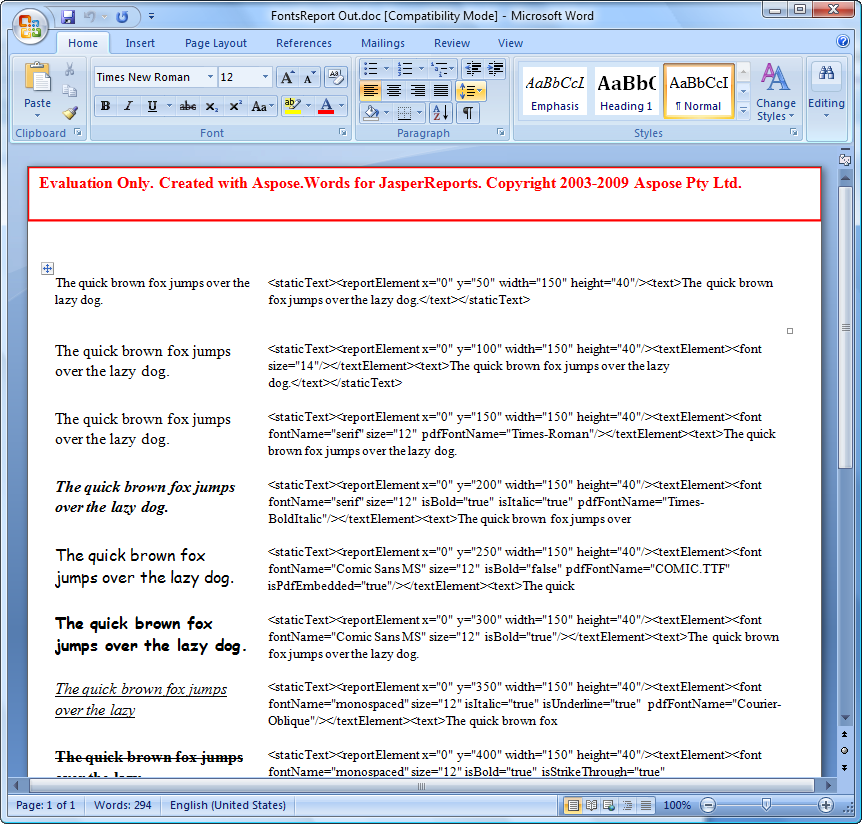

{}

Aspose.Words for JasperReports is available for download from the [downloads page](https://downloads.aspose.com/words/jasperreports). The evaluation and licensed versions of the product is the same download.

When you are happy with the evaluation version, [purchase a license](https://www.aspose.com/purchase/default.aspx). Make sure you understand and agree to the license terms.

{}

The license is available for download from the order page after the order was paid. The license is a clear text, digitally signed XML file. The license contains information such as the client name, the purchased product and the type of the license. Do not modify the content of the license file: it invalidates the license.

There are several ways to activate a license:

- [Call setLicense](/words/jasperreports/licensing/).
- [Set an exporter parameter in the code](/words/jasperreports/licensing/).
- [Set an exporter parameter in **applicationContext.xml**](/words/jasperreports/licensing/).

The first two are used with JasperReports, the last with JasperServer. Each method is described below.

## Call setLicense

{}

This is the first way used with JasperReports. 

{}

1. Download the license to your computer and copy it to the appropriate folder (for example your application's folder or JasperReports\lib).
1. Add the following code to your project: 

**Java**


   import com.aspose.words.jasperreports.*;

   // Create a stream object containing the license file
   FileInputStream fstream = new FileInputStream("C:\\Aspose.Words.JasperReports.lic");

   // Set the license through the stream object
   License license = new License();
   license.setLicense(fstream);


## Set the licenseFile Exporter Parameter in Code

{}

This is the second way used with JasperReports.

{}

1. Download the license to your computer and copy it to the appropriate folder (for example your application’s folder or JasperReports\lib).
1. Add the following code to your project: 

**Java**


   import com.aspose.words.jasperreports.*;
   AWDocExporter exporter = new AWDocExporter();
   exporter.setParameter(AWExporterParameter.LICENSE, "Aspose.Words.JasperReports.lic");
   exporter.exportReport();


## Set the licenseFile Exporter Parameter in applicationContext.xml

{}

This method is used with JasperServer.

{}

1. Download the license to your computer and copy it to the <InstallDir>\apache-tomcat\webapps\jasperserver\WEB-INF folder, where <InstallDir> stands for the JasperServer installation directory.
1. Locate the **<InstallDir>\apache-tomcat\webapps\jasperserver\WEB-INF\applicationContext.xml** file and add the following lines: 

**XML**


<bean id="aw_exportParameters" class="com.aspose.words.jasperreports.AWExportParametersBean">
    <property name="licenseFile" value="C:/jasperserver-3.0/apache-tomcat/webapps/jasperserver/WEB-INF/Aspose.Words.JasperReports.lic"/>
</bean>


## Verify that the License Works

Export any report to DOC or DOCX format and check if the report contains an evaluation message. If there is no evaluation message, then the license is working properly.

**Aspose.Words for JasperReports injects a watermark when working in the evaluation mode.** 

**When a valid license is activated, there will be no evaluation watermark.** 

