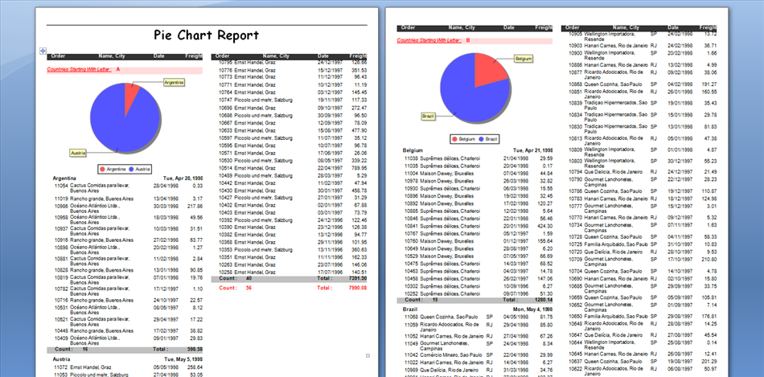

{}

## Welcome to the Aspose.Words for JasperReports documentation!

Aspose.Words for JasperReports is the only known solution on the market that makes possible exporting reports from JasperReports and JasperServer to Microsoft Word document formats. All report features are converted with the highest degree of precision to Microsoft Word documents.

{}

## Product Overview

[JasperReports](https://sourceforge.net/projects/jasperreports/) and [JasperServer](https://sourceforge.net/projects/jasperserver/) do not have built-in abilities to export reports as Microsoft Word documents (apart from the RTF format that uses positioned items), but using Aspose.Words for JasperReports, you get access to the following additional export formats:

- DOC – Word document via Aspose.Words
- DOCX – Office Open XML (OOXML) document via Aspose.Words
- RTF – Rich Text Format via Aspose.Words
- ODT – OpenDocument Text via Aspose.Words
- HTML – Web page via Aspose.Words
- TXT – Plain text via Aspose.Words

Aspose.Words for JasperReports is built on top of Aspose.Words for Java, the world-class library for server-side Microsoft Word documents processing.

## Use with JasperReports

Aspose.Words for JasperReports provides a set of classes that extend the `JRAbstractExporter` class. Aspose.Words exporter classes can be used in the same way as all other standard exporters in your application.

**A DOC file generated by Aspose.Words for JasperReports from the Pie Chart sample report** 

Aspose.Words for JasperReports can be integrated with JasperServer to add DOC, DOCX, HTML, and TXT to the list of available formats. Simply configure JasperServer as [described in Installation](/words/jasperreports/installation/). After that, additional export format buttons are available when viewing reports.

**Additional export formats (icons on the right) available after installing Aspose.Words for JasperReports on JasperServer.** 

