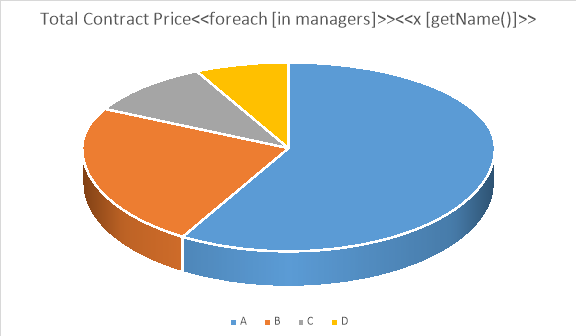
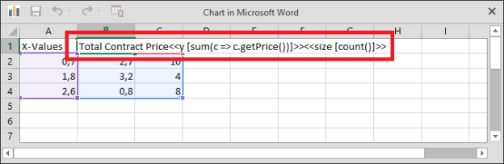
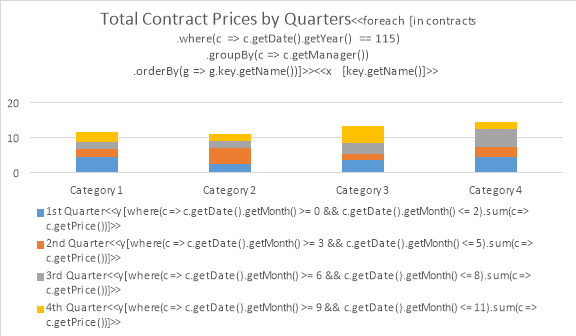
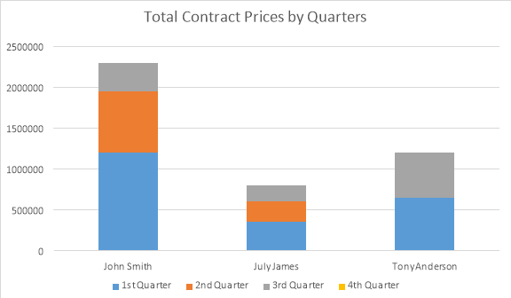

{} 

This section contains examples of templates for typical scenarios. Every example is given using one of the following data source objects:

- manager, an instance of the Manager class
- managers, an enumeration of instances of the Manager class
- contracts, an enumeration of instances of the Contract class
- clients, an enumeration of instances of the Client class

The Manager, Contract, and Client classes are defined as follows.

public class Manager
{
public String getName() { ... }
public int getAge() { ... }
public byte[] getPhoto() { ... }
public Iterable<Contract> getContracts() { ... }
...
}

public class Contract
{
public Manager getManager() { ... }
public Client getClient() { ... }
public float getPrice() { ... }
public Date getDate() { ... }
...
}

public class Client
{
public String getName() { ... }
...
}


This article explains following topics:

- [Single-Row Template](/words/java/appendix-c-typical-templates/)
- [In-Paragraph List Template](/words/java/appendix-c-typical-templates/)
- [Bulleted List Template](/words/java/appendix-c-typical-templates/)
- [Numbered List Template](/words/java/appendix-c-typical-templates/)
- [Multicolored Numbered List Template](/words/java/appendix-c-typical-templates/)
- [Common List Template](/words/java/appendix-c-typical-templates/)
- [In-Table List Template](/words/java/appendix-c-typical-templates/)
- [In-Table List Template with Running (Progressive) Total](/words/java/appendix-c-typical-templates/)
- [In-Table List Template with Highlighted Rows](/words/java/appendix-c-typical-templates/)
- [In-Table List Template with Alternate Content](/words/java/appendix-c-typical-templates/)
- [Common Master-Detail Template](/words/java/appendix-c-typical-templates/)
- [In-Table Master-Detail Template](/words/java/appendix-c-typical-templates/)
- [Pie Chart Template](/words/java/appendix-c-typical-templates/)
- [Scatter Chart Template](/words/java/appendix-c-typical-templates/)
- [Bubble Chart Template](/words/java/appendix-c-typical-templates/)
- [In-Table Template with Filtering, Grouping, and Ordering](/words/java/appendix-c-typical-templates/)
- [Chart Template with Filtering, Grouping, and Ordering](/words/java/appendix-c-typical-templates/)

{} 
## **Single-Row Template**
### **Template Example**

| | **Name:** **<<[manager.getName()]>>**   **Age:** <<[manager.getAge()]>> |
| :- | :- |

### **Report Example**

||**Name:** **John Smith**   **Age:** 37 |
| :- | :- |

## **In-Paragraph List Template**
### **Template Example**

|We provide support for the following clients: <<foreach [in clients]>><<[indexOf() != 0 ? ", " : ""]>><<[getName()]>><</foreach>>|
| :- |

### **Report Example**

|We provide support for the following clients: A Company, B Ltd., C & D, E Corp., F & Partners, G & Co., H Group, I & Sons, J Ent.|
| :- |

## **Bulleted List Template**
### **Template Example**

We provide support for the following clients:
    * <<foreach [in clients]>><<[getName()]>>
<</foreach>>


### **Report Example**

We provide support for the following clients:
    * A Company
    * B Ltd.
    * C & D
    * E Corp.
    * F & Partners
    * G & Co.
    * H Group
    * I & Sons
    * J Ent.


## **Numbered List Template**
### **Template Example**

We provide support for the following clients:
    1. <<foreach [in clients]>><<[getName()]>>
<</foreach>>


### **Report Example**

We provide support for the following clients:
    1. A Company
    2. B Ltd.
    3. C & D
    4. E Corp.
    5. F & Partners
    6. G & Co.
    7. H Group
    8. I & Sons
    9. J Ent.


## **Multicolored Numbered List Template**
### **Template Example**

We provide support for the following clients:
    1. <<foreach [in clients]>><<if [indexOf() % 2 == 0]>><<[getName()]>>
    2. <<else>><<[getName()]>>
<</if>><</foreach>>


### **Report Example**

We provide support for the following clients:
    1. A Company
    2. B Ltd.
    3. C & D
    4. E Corp.
    5. F & Partners
    6. G & Co.
    7. H Group
    8. I & Sons
    9. J Ent.


## **Common List Template**
### **Template Example**

|<<foreach [in managers]>>      <<[getName**()**]>>**   &lt;&lt;/foreach&gt;&gt;|
| :- |

### **Report Example**

|   **John Smith**      **Tony Anderson**      **July James**|
| :- |

## **In-Table List Template**
### **Template Example**

|**Manager**|**Contract Price**|
| :- | :- |
| <<foreach [in managers]>><<[getName()]>>  |  <<[getContracts().sum(c => c.getPrice())]>><</foreach>>  |
| Total:  |  <<[sum(m => m.getContracts().sum(c => c.getPrice()))]>>  |

### **Report Example**

|**Manager**|**Contract Price**|
| :- | :- |
| John Smith  |  2300000  |
| Tony Anderson  |  1200000  |
| July James  |  800000  |
| Total:  |  4300000  |

## **In-Table List Template with Running (Progressive) Total**
**Template Example**

&lt;&lt;var [total = 0.0]&gt;&gt;

|**Client**|**Total Contract Price**|
| :- | :- |
|**&lt;&lt;foreach [in contracts]&gt;&gt;&lt;&lt;[getClient().getName()]&gt;&gt;**|&lt;&lt;var [total = total + getPrice()]&gt;&gt;&lt;&lt;[total]&gt;&gt;&lt;&lt;/foreach&gt;&gt;|

**Report Example**

|**Client**|**Total Contract Price**|
| :- | :- |
|**A Company**|1200000|
|**B Ltd.**|1950000|
|**C & D**|2300000|
|**E Corp.**|2950000|
|**F & Partners**|3500000|
|**G & Co.**|3850000|
|**H Group**|4100000|
|**I & Sons**|4200000|
|**J Ent.**|4300000|

## **In-Table List Template with Highlighted Rows**
### **Template Example**

|**Client**|**Contract Price**|
| :- | :- |
|**&lt;&lt;foreach [in contracts]&gt;&gt;&lt;&lt;if [getPrice() >= 1000000]&gt;&gt;&lt;&lt;[getClient().getName()]&gt;&gt;**|&lt;&lt;[getPrice()]&gt;&gt;|
|**&lt;&lt;else&gt;&gt;&lt;&lt;[getClient().getName()]&gt;&gt;**|&lt;&lt;[getPrice()]&gt;&gt;&lt;&lt;/if&gt;&gt;&lt;&lt;/foreach&gt;&gt;|
|**Total:**|&lt;&lt;[sum(c => c.getPrice())]&gt;&gt;|

### **Report Example**

|**Client**|**Contract Price**|
| :- | :- |
|**A Company**|1200000|
|**B Ltd.**|750000|
|**C & D**|350000|
|**E Corp.**|650000|
|**F & Partners**|550000|
|**G & Co.**|350000|
|**H Group**|250000|
|**I & Sons**|100000|
|**J Ent.**|100000|
|**Total:**|4300000|

## **In-Table List Template with Alternate Content**
### **Template Example**

|**Client**|**Contract Price**|
| :- | :- |
|**<<if [!any()]>>No data**||
|**<<else>><<foreach [in contracts]>><<[getClient().getName()]>>**|<<[getPrice()]>><</foreach>>|
|**Total:**|<<[sum(c => c.getPrice())]>><</if>>|

### **Report Example 1**

|**Client**|**Contract Price**|
| :- | :- |
|**No data**||

### **Report Example 2**

|**Client**|**Contract Price**|
| :- | :- |
|**A Company**|1200000|
|**B Ltd.**|750000|
|**C & D**|350000|
|**E Corp.**|650000|
|**F & Partners**|550000|
|**G & Co.**|350000|
|**H Group**|250000|
|**I & Sons**|100000|
|**J Ent.**|100000|
|**Total:**|4300000|

## **Common Master-Detail Template**
### **Template Example**

|<<foreach [in managers]>>      **<<[getName**()**]>>**   **Clients: <<foreach [in getContracts**()** ]>><<[indexOf() != 0 ? ", " : ""]>><<[getClient**()**.getName**()**]>><</foreach>>**   &lt;&lt;/foreach&gt;&gt;|
| :- |

### **Report Example**

|   **John Smith**   **Clients: A Company, B Ltd., C & D**      **Tony Anderson**   **Clients: E Corp., F & Partners**      **July James**   **Clients: G & Co., H Group, I & Sons, J Ent.**|
| :- |

## **In-Table Master-Detail Template**
### **Template Example**

|**Manager/Client**|**Contract Price**|
| :- | :- |
| <<foreach [in managers]>><<[getName()]>>  |  <<[getContracts().sum(c => c.getPrice())]>> |
| <<foreach [in getContracts()]>> <<[getClient().getName()]>>  |  <<[getPrice()]>><</foreach>><</foreach>> |
| Total:  |  <<[sum(m => m.getContracts().sum(c => c.getPrice()))]>> |

### **Report Example**

|**Manager/Client**|**Contract Price**|
| :- | :- |
| John Smith  |  2300000 |
| A Company  |  1200000 |
| B Ltd.  |  750000

|
| C & D  |  350000

|
| Tony Anderson  |  1200000

|
| E Corp.  |  650000

|
| F & Partners  |  550000

|
| July James  |  800000

|
| G & Co.  |  350000

|
| H Group  |  250000

|
| I & Sons  |  100000

|
| J Ent.  |  100000

|
| Total:  |  4300000

|
   
## **Pie Chart Template**

**Template Example**

**Initial Chart Series Data**

**Report Example**

## **Scatter Chart Template**

**Template Example**

**Initial Chart Series Data**

**Report Example**

## **Bubble Chart Template**

**Template Example**

**Initial Chart Series Data**

**Report Example**

## **In-Table Template with Filtering, Grouping, and Ordering**

**Template Example**

|**Manager**|**Contract Price**|
| :- | :- |
| <<foreach [in contracts
.where(c => c.getDate().getYear() == 115)
.groupBy(c => c.getManager())
.orderBy(g => g.key.getName())]>>
<<[key.getName()]>>  | <<[sum(c => c.getPrice())]>><</foreach>>|

**Report Example**

|**Manager**|**Contract Price**|
| :- | :- |
|**John Smith**|2300000|
|**July James**|800000|
|**Tony Anderson**|1200000|

## **Chart Template with Filtering, Grouping, and Ordering**

**Template Example**

**Report Example**

