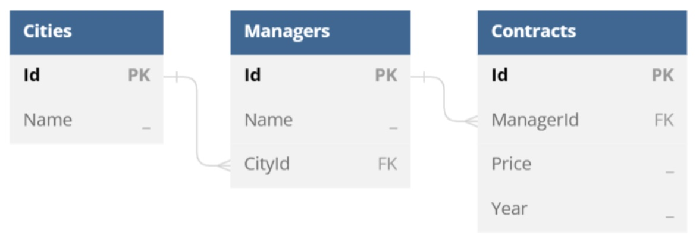

*A cross or pivot table* is a document table growing in the both directions – vertically and horizontally – depending on bound data. You can build a cross (pivot) table by nesting a table-column data band into a table-row data band as follows.

| **<<foreach ...>><<foreach ... -horz>> ...** | **...** | **...**                          |
| -------------------------------------------- | ------- | -------------------------------- |
| **...**                                      | **...** | **...**                          |
| **...**                                      | **...** | **... <</foreach>><</foreach>>** |

**Note –** It is not necessary to start (or end) an outer table-row data band and a nested table-column one within the same cell, but this case is also supported.

Let us consider concrete examples using years, an array of integers ranging from 2020 to 2023, and `ds`, a `DataSet` instance containing `DataTable` and `DataRelation` objects according to the following data model.

The most basic scenario is filling a document table with data in two directions. You can use a template like the following one to achieve this.

| **Managers**                                   | **<<foreach [y in years] -horz>><<[y]>><</foreach>>**        |
| ---------------------------------------------- | ------------------------------------------------------------ |
| **<<foreach [m in ds.Managers]>><<[m.Name]>>** | **<<foreach [y in years] -horz>><<[m.Contracts.where(c => c.Year == y).sum(c => c.Price)]>><</foreach>><</foreach>>** |

**Note –** Table-row and table-column regions cannot cross, that is why two table-column data bands bound to the same enumeration are required here.

In this case, the engine produces a report as follows.

| **Managers**     | **2020**   | **2021**   | **2022**   | **2023**   |
| ---------------- | ---------- | ---------- | ---------- | ---------- |
| **James Atkins** | **545000** | **340000** | **620000** | **510000** |
| **John Lee**     | **120000** | **320000** | **565000** | **495000** |
| **Thelma Green** | **310000** | **290000** | **485000** | **530000** |
| **Ted LeMark**   | **0**      | **110000** | **345000** | **380000** |

It is quite typical for cross (pivot) tables to contain totals for every row and column. You can add the totals by altering the template as follows.

| **Managers**                                   | **<<foreach [y in years] -horz>><<[y]>><</foreach>>**        | **Total**                                           |
| ---------------------------------------------- | ------------------------------------------------------------ | --------------------------------------------------- |
| **<<foreach [m in ds.Managers]>><<[m.Name]>>** | **<<foreach [y in years] -horz>><<[m.Contracts.where(c => c.Year == y).sum(c => c.Price)]>><</foreach>>** | **<<[m.Contracts.sum(c => c.Price)]>><</foreach>>** |
| **Total**                                      | **<<foreach [y in years] -horz>><<[ds.Contracts.where(c => c.Year == y).sum(c => c.Price)]>><</foreach>>** | **<<[ds.Contracts.sum(c => c.Price)]>>**            |

In this case, the engine produces a report as follows.

| **Managers**     | **2020**   | **2021**    | **2022**    | **2023**    | **Total**   |
| ---------------- | ---------- | ----------- | ----------- | ----------- | ----------- |
| **James Atkins** | **545000** | **340000**  | **620000**  | **510000**  | **2015000** |
| **John Lee**     | **120000** | **320000**  | **565000**  | **495000**  | **1500000** |
| **Thelma Green** | **310000** | **290000**  | **485000**  | **530000**  | **1615000** |
| **Ted LeMark**   | **0**      | **110000**  | **345000**  | **380000**  | **835000**  |
| **Total**        | **975000** | **1060000** | **2015000** | **1915000** | **5965000** |

Since cross (pivot) tables can contain large amounts of data, it is quite usual to group parts of information within these tables using merged cells, in order to simplify further search of necessary information. For this purpose, you can apply cellMerge tags (see “Merging Table Cells Dynamically” for more information) as shown in the following template.

| **Cities**                                                   | **Managers**     | **<<foreach [y in years] -horz>>Years<<cellMerge -horz>>**   |
| ------------------------------------------------------------ | ---------------- | ------------------------------------------------------------ |
| **<<[y]>><</foreach>>**                                      |                  |                                                              |
| **<<foreach [m in ds.Managers]>><<[m.Cities.Name]>><<cellMerge>>** | **<<[m.Name]>>** | **<<foreach [y in years] -horz>><<[m.Contracts.where(c => c.Year == y).sum(c => c.Price)]>><</foreach>><</foreach>>** |

In this case, the engine produces a report as follows.

| **Cities**     | **Managers**     | **Years**  |            |            |            |
| -------------- | ---------------- | ---------- | ---------- | ---------- | ---------- |
| **2020**       | **2021**         | **2022**   | **2023**   |            |            |
| **Seattle**    | **James Atkins** | **545000** | **340000** | **620000** | **510000** |
| **John Lee**   | **120000**       | **320000** | **565000** | **495000** |            |
| **Ottawa**     | **Thelma Green** | **310000** | **290000** | **485000** | **530000** |
| **Ted LeMark** | **0**            | **110000** | **345000** | **380000** |            |

Combining all the described approaches, you can create cross (pivot) tables of almost any complexity.