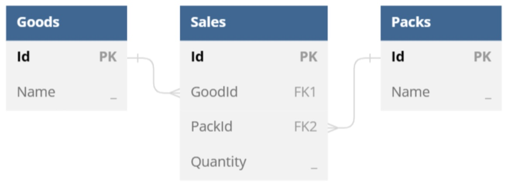

You can build tables growing horizontally rather than vertically by using table-column data bands.

A table-column data band represents a data band, which body occupies a rectangular area of cells of a single document table. The body of such a band starts at the beginning of the top-left cell of a corresponding area and ends at the end of its bottom-right cell. Typically, this area consists of one or several table columns as follows.

<table class="outputting-sequential-data">
	<tbody>
		<tr>
			<td>...</td>
      <td>&lt;&lt;foreach ... -horz>> ...</td>
      <td>...</td>
      <td>...</td>
      <td>...</td>
		</tr>
    <tr>
			<td>...</td>
      <td>...</td>
      <td>...</td>
      <td>...</td>
      <td>...</td>
		</tr>
    <tr>
			<td>...</td>
      <td>...</td>
      <td>...</td>
      <td>... &lt;&lt;/foreach>></td>
      <td>...</td>
		</tr>
	</tbody>
</table>

**Note** – The horz switch instructs the engine to affect table columns rather than rows.

However, unlike table-row data bands able to capture only whole rows, table-column data bands can occupy columns even partially as shown in the following template snippet.

<table class="outputting-sequential-data">
	<tbody>
    <tr>
			<td>...</td>
      <td>...</td>
      <td>...</td>
      <td>...</td>
      <td>...</td>
		</tr>
		<tr>
			<td>...</td>
      <td>&lt;&lt;foreach ... -horz>> ...</td>
      <td>...</td>
      <td>...</td>
      <td>...</td>
		</tr>
    <tr>
			<td>...</td>
      <td>...</td>
      <td>...</td>
      <td>...</td>
      <td>...</td>
		</tr>
    <tr>
			<td>...</td>
      <td>...</td>
      <td>...</td>
      <td>... &lt;&lt;/foreach>></td>
      <td>...</td>
		</tr>
    <tr>
			<td>...</td>
      <td>...</td>
      <td>...</td>
      <td>...</td>
      <td>...</td>
		</tr>
	</tbody>
</table>

Let us consider typical use cases for table-column data bands at first defining `ds`, a `DataSet` instance containing `DataTable` and `DataRelation` objects according to the following data model.

The most common scenario for a table-column data band is building of a document table that represents a list of items side by side. You can use a template like the following one to achieve this.

<table class="outputting-sequential-data">
	<tbody>
		<tr>
			<td><strong>Good</strong></td>
			<td>&lt;&lt;foreach [s in ds.Sales] -horz>>&lt;&lt;[s.Goods.Name]>></td>
			<td rowspan="2" style="vertical-align: middle"><strong>Total:</strong></td>
		</tr>
		<tr>
			<td><strong>Pack</strong></td>
			<td>&lt;&lt;[s.Packs.Name]>></td>
		</tr>
    <tr>
			<td><strong>Sold Quantity</strong></td>
      <td>&lt;&lt;[s.Quantity]>>&lt;&lt;/foreach>></td>
			<td>&lt;&lt;[ds.Sales.sum(s => s.Quantity)]>></td>
		</tr>
	</tbody>
</table>

In this case, the engine produces a report as follows.

| **Good**          | **Drinking Water** | **Drinking Water** | **Mineral Water** | **Mineral Water** | **Total:** |
| ----------------- | ------------------ | ------------------ | ----------------- | ----------------- | ---------- |
| **Pack**          | **1.5 L**          | **500 ml**         | **1.5 L**         | **500 ml**        |            |
| **Sold Quantity** | **12**             | **27**             | **5**             | **13**            | **57**     |

To grow a document table horizontally by filling it with master-detail data, you can use nested table-column data bands like in the following template.

<table class="outputting-sequential-data">
	<tbody>
		<tr>
			<td><strong>Good</strong></td>
			<td>&lt;&lt;foreach [g in ds.Goods] -horz>>&lt;&lt;[g.Name]>></td>
      <td>&lt;&lt;foreach [s in g.Sales]>>&lt;&lt;[s.Packs.Name]>></td>
      <td><strong>Total:</strong></td>
		</tr>
		<tr>
			<td><strong>Sold Packs</strong></td>
			<td>&lt;&lt;[g.Sales.sum(s => s.Quantity)]>></td>
      <td>&lt;&lt;[s.Quantity]>>&lt;&lt;/foreach>>&lt;&lt;/foreach>></td>
      <td>&lt;&lt;[ds.Sales.sum(s => s.Quantity)]>></td>
		</tr>
	</tbody>
</table>

In this case, the engine produces a report as follows.

| **Good / Pack**   | **Drinking Water** | **1.5 L** | **500 ml** | **Mineral Water** | **1.5 L** | **500 ml** | **Total:** |
| ----------------- | ------------------ | --------- | ---------- | ----------------- | --------- | ---------- | ---------- |
| **Sold Quantity** | **39**             | **12**    | **27**     | **18**            | **5**     | **13**     | **57**     |

You can normally use common data bands nested to table-column data bands as well like in the following template.

<table class="outputting-sequential-data">
	<tbody>
		<tr>
			<td><strong>Good</strong></td>
			<td>&lt;&lt;foreach [g in ds.Goods] -horz>>&lt;&lt;[g.Name]>></td>
		</tr>
		<tr>
			<td><strong>Sold Packs</strong></td>
			<td>&lt;&lt;foreach [s in g.Sales]>>&lt;&lt;[s.Packs.Name]>> &lt;&lt;/foreach>>&lt;&lt;/foreach>></td>
		</tr>
	</tbody>
</table>

In this case, the engine produces a report as follows.

| **Good**       | **Drinking Water**   | **Mineral Water**    |
| -------------- | -------------------- | -------------------- |
| **Sold Packs** | **1.5 L** **500 ml** | **1.5 L** **500 ml** |

**Note** – Table-column data bands can themselves be nested to table-row data bands (see “Working with Cross (Pivot) Tables” for details), but not conversely: Nesting of table-row data bands into table-column data bands is forbidden.

For more examples of templates for typical scenarios involving table-column data bands, see “Appendix C. Typical Templates”.